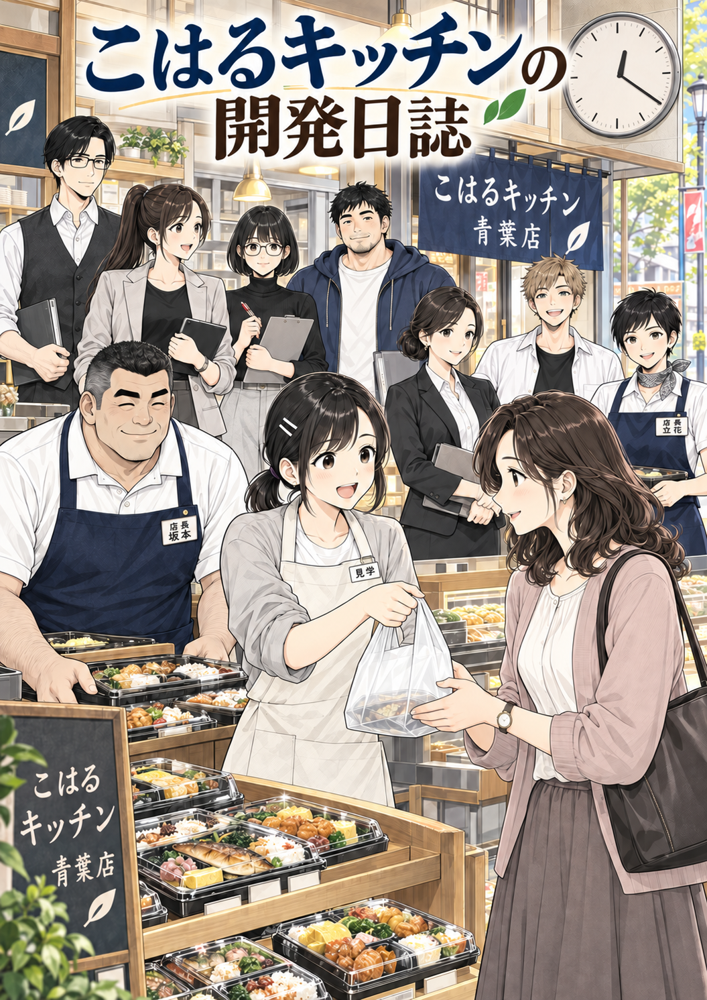
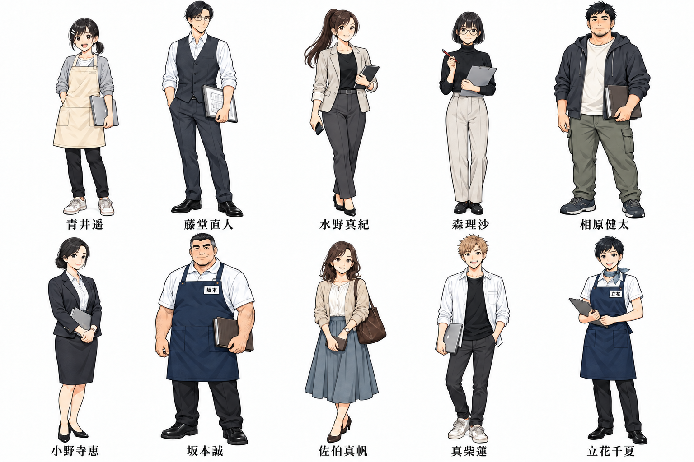
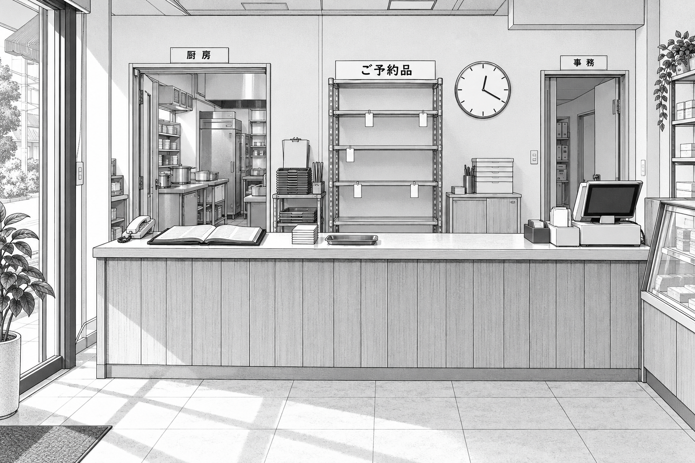
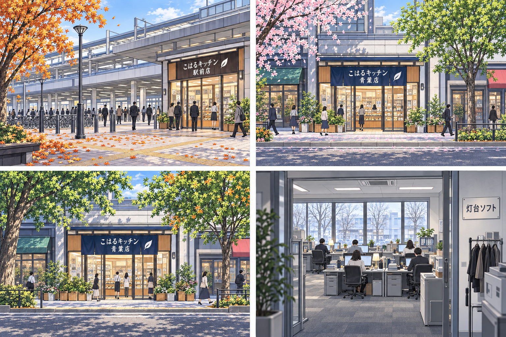
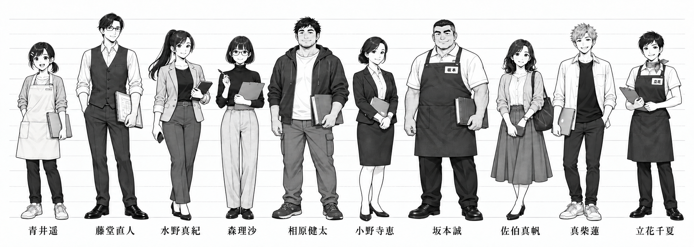
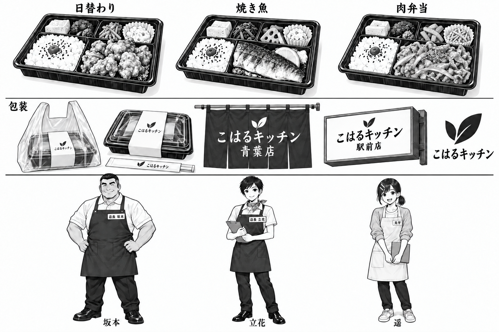

# 美術設定の目次

『こはるキッチンの開発日誌』の人物・街・店・小道具を、同じ物語として描き続けるための資料集です。[作品の方針](../../README.md)と[台本の目次](../../script/README.md)を入口に、必要な設定へ進んでください。

## 設定の優先順位

**[story-bible](../story-bible.md) → [character-design](../character-design.md) → docs/art** の順に優先します。作品全体の思想はリポジトリのREADMEを基準とします。各話の出演・事件・台詞・時刻・道具の状態は完成台本で確認し、美術補足で出来事を追加しません。

`docs/art` は未指定の配色、季節、方角、家具配置などを補います。画像に偶然描かれた文字・色・配置は、文書の設定を変更する根拠にしません。下位資料が上位資料と衝突した場合は上位資料を保ち、差を本ページに記録します。

| 文書 | 確認できること | 主な画像 |
| --- | --- | --- |
| [世界観 — world.md](world.md) | 街とブランド、店と開発会社の空気、十八か月と季節の対応 | [キービジュアル](../../art/key-visual/01-key-visual-color.png)、[季節ボード](../../art/key-visual/02-seasons.png) |
| [人物 — characters.md](characters.md) | 主要10人の顔・髪・体格、表情、身長、カラー配色、衣装の継続 | [人物画像一覧](../../art/characters/)、[身長比較](../../art/characters/00-height-lineup.png)、[カラー設定](../../art/characters/00-color-reference.png) |
| [舞台 — locations.md](locations.md) | 街の位置関係、青葉店・駅前店・本部・中央調理・灯台ソフトの配置、時期による変化 | [背景画像一覧](../../art/backgrounds/) |
| [小道具 — props.md](props.md) | 時計、袋、ペン、札、台帳、弁当、電話、名札の形と登場時期 | [小道具](../../art/props/01-props-sheet.png)、[弁当・制服](../../art/props/02-bento-and-uniform.png) |
| [画風 — style-guide.md](style-guide.md) | 判型、線・トーン、読む順、吹き出し、共通プロンプト、生成と検査 | [既存REQ-01](../../manga/pages/01-REQ-01.png) |

## 代表画像

クリックすると元画像を開きます。表示幅だけを指定したサムネイルで、縮小画像ファイルの作成や画像加工はしていません。

| 世界観・季節 | 人物 | 店・小道具 |
| --- | --- | --- |
|  |  |  |
| [世界観](world.md)：集合構図と光 | [人物](characters.md)：配色と識別 | [舞台](locations.md)：カウンターの配置 |
|  |  |  |
| [季節の対応表](world.md#十八か月の季節)と合わせて使う | 数cmの差は[身長表](characters.md#身長とシルエット)を優先 | 袋は無地、焼き魚は切り身、店長制服は濃紺 |

## 制作時の参照先

1. 台本で出演者・時期・場所と、袋の中身や札の状態を確認します。[第1部](../../script/part-01.md)では初月の紙・電話中心の青葉店を描きます。青い床テープや本番予約端末はまだ置きません。
2. 顔・髪・体格は `character-design` と個人設定画、人物の色は [characters の配色表](characters.md#カラー扉表紙の共通色)、家具と方角は [locations](locations.md)を参照します。集合キービジュアルや季節ボードから間取りを取り直しません。
3. 小道具の形と前後の状態は [props](props.md)、暦月の美術補足は [world](world.md)、本文の線と読む順は [style-guide](style-guide.md)を使います。カラー指定の扉・表紙には人物配色を適用します。
4. 画像生成には参照画像そのものを渡し、各画像の役割をプロンプトに書きます。試行ごとにプロンプトと生成記録を保存し、画像内の文字・人物・時計・道具を目視で確認します。

## 整合性の確認記録（2026-09-23）

対象は `docs/art` の5文書、上位のバイブル・人物設定、第1部台本、および `art` 以下の画像26枚です。軽微な文書の食い違いは次のとおり修正しました。既存の美術画像は変更していません。

| 分類 | 食い違い・曖昧さ | 対応と今後の基準 |
| --- | --- | --- |
| 季節 | world は「1か月目＝4月」の共通表を持つ一方、locations は季節の断定を台本指定のある回だけに限定していた。 | **修正済み**：locations の共通ルールと青葉店外観を世界観の表へ接続。暦月は美術補足、具体的な台本の季節・天候は優先、西暦・曜日は未固定。 |
| 色の適用範囲 | style-guide はカラーをキービジュアル・季節ボードだけに限定し、characters のカラー設定・扉・表紙の配色規則と範囲が合っていなかった。 | **修正済み**：人物カラー設定と、カラー指定の扉・表紙を許可する記述へ。漫画本文と白黒設定画の運用は継続。 |
| 間取り | world の「間取りの正本にはしない」が背景資料全体にも読め、locations の固定する配置との関係が不明瞭だった。 | **修正済み**：world に locations への導線を追加。方角・家具配置は locations の美術補完、キービジュアルと季節ボードは間取りの更新根拠にしない。 |
| 電話の見た目 | props は店の電話を有線卓上機として一括説明し、locations の事務机の親機／カウンターの子機という区別が抜けていた。オフィスの記述もスマートフォンだけに読めた。 | **修正済み**：props に親機・子機・充電台と配置先を追記。オフィスの卓上電話と携帯端末も区別。 |

画像には以下の差が残ります。再制作では右欄を基準にし、文書を画像の揺れに合わせて変更しません。

| 分類 | 確認した画像上の差 | 採用する基準・扱い |
| --- | --- | --- |
| 人物の色 | キービジュアルの佐伯はピンク寄りの上着・灰茶のスカート、相原は紺寄りのパーカー。characters の色表・カラー設定とは差がある。 | [人物配色表](characters.md#カラー扉表紙の共通色)：佐伯は淡いベージュと青灰、相原は炭色。第1部扉もこの表を使用。照明による濃淡と衣装の基本色を区別する。 |
| 間取り | 季節ボードの青葉店は入口・ガラス区画が背景外観と異なり、灯台ソフトの机も専用背景の配置とは異なる。 | [舞台設定](locations.md)の方角・家具配置と該当背景を参照。季節ボードは外光・植生の参考。 |
| ロゴ | 背景看板・のれん・キービジュアル・季節ボードには一枚葉が残り、world と弁当・制服図の二枚葉と異なる。 | [弁当・制服図](../../art/props/02-bento-and-uniform.png)の大小二枚葉を基準にする。第1部扉は二枚葉へ再生成で修正。 |
| 焼き魚 | 小道具図は頭付き、弁当・制服図は切り身。 | [props](props.md)の切り身を基準にする。小道具図は容器・仕切り・蓋の参照に使用。 |
| ペン | 森の個人設定画の拡大ペンはノック式に見えるが、props はキャップ式で、台本にもキャップを閉じる動作がある。 | キャップ式、クリップ、白帯2本を保持。[小道具図](../../art/props/01-props-sheet.png)と台本の開閉を参照。 |
| 名札・見学証 | 個人設定画の店長名札は姓のみ、キービジュアルは役職と姓が二段。props は「店長 坂本」「店長 立花」。第1話の遥の証票には所属と氏名も指定される。 | 姓のみは設定画の文字制約。本文は台本の役割表示を保持。文字組の差を役職の変更にしない。 |
| 電話 | 青葉店カウンターの背景画像には有線の受話器とコードが見え、文書のコードレス子機と一致しない。 | 本文の新規作画は子機と充電台。事務机の有線親機と区別。背景画像を機種の精密見本にはしない。 |
| PCの印 | 蓮の個人設定画では携行PCにリンゴ状の印が残る。 | 無地のPC。同じ設定画の小道具拡大を参照し、実在ブランドを引き継がない。 |

台帳の「予約台帳／二冊目」は同じ旧台帳の使用中／保管時の見本です。人物設定画の無地の札と本文の番号付き札も用途の差であり、別の設定ではありません。身長比較やトーン・配色は目視の作画見本で、厳密な寸法・濃度・色値の測定資料には使いません。

## 第1部の扉と制作記録

[第1部「腹ぺこの約束」の台本を読む](../../script/part-01.md)。扉はREQ-01の空袋に代替の焼き魚弁当を入れる直前を題材にしたカラー一枚絵です。佐伯が同じ回で昼食を受け取る本編の流れにつながります。

- 扉：[000-cover.png](../../manga/part-01/000-cover.png)
- プロンプト：[初回](../../manga/part-01/prompts/000-cover.txt)／[二枚葉の修正](../../manga/part-01/prompts/000-cover-revision1.txt)／[タイトルの修正](../../manga/part-01/prompts/000-cover-revision2.txt)
- 生成・目視検査・残る差：[log-c.json](../../manga/part-01/log-c.json)
- 美術資料の既存ログ：[世界観・小道具](../../art/log-world.json)／[人物](../../art/log-characters.json)／[舞台](../../art/log-locations.json)

扉は組み込み `image_gen` で生成し、採用元をそのままコピーしています。描画・合成・文字の後付け・リサイズは行っていません。本文画像と log-a／log-b は別担当の制作物です。
