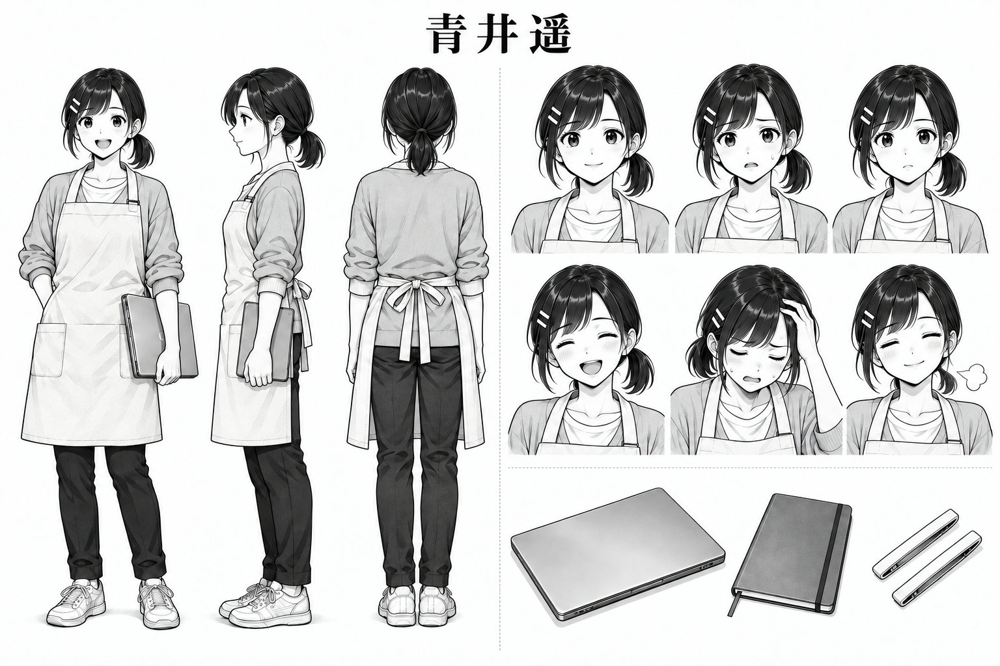
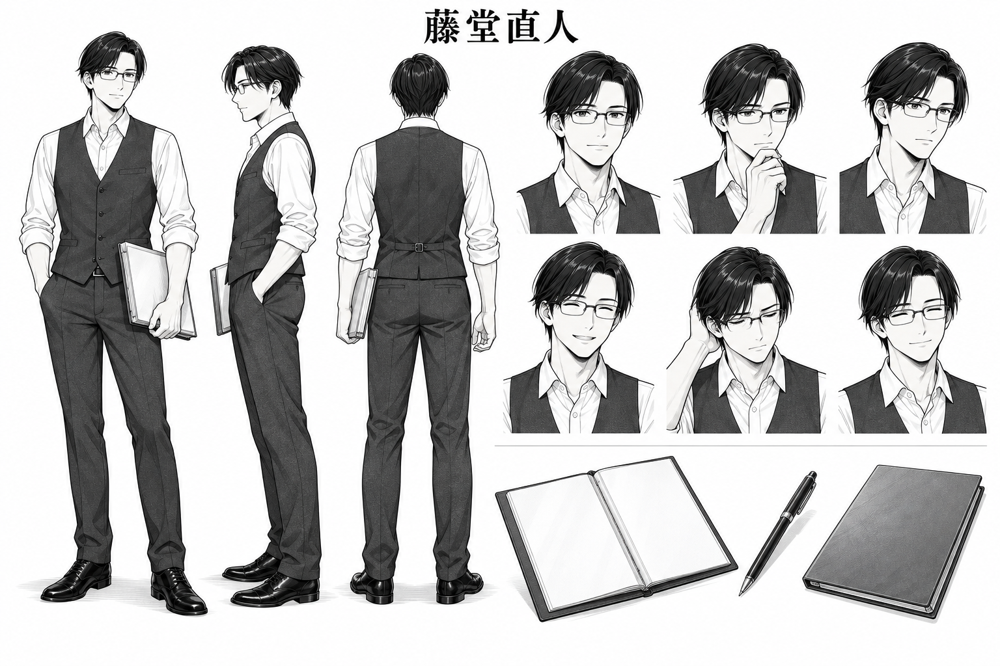
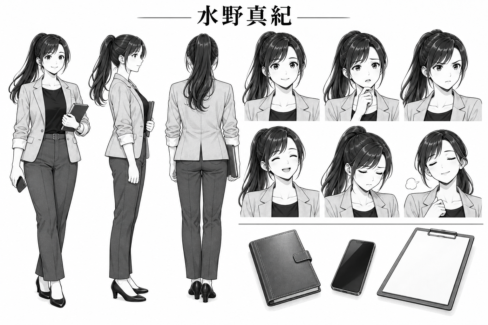
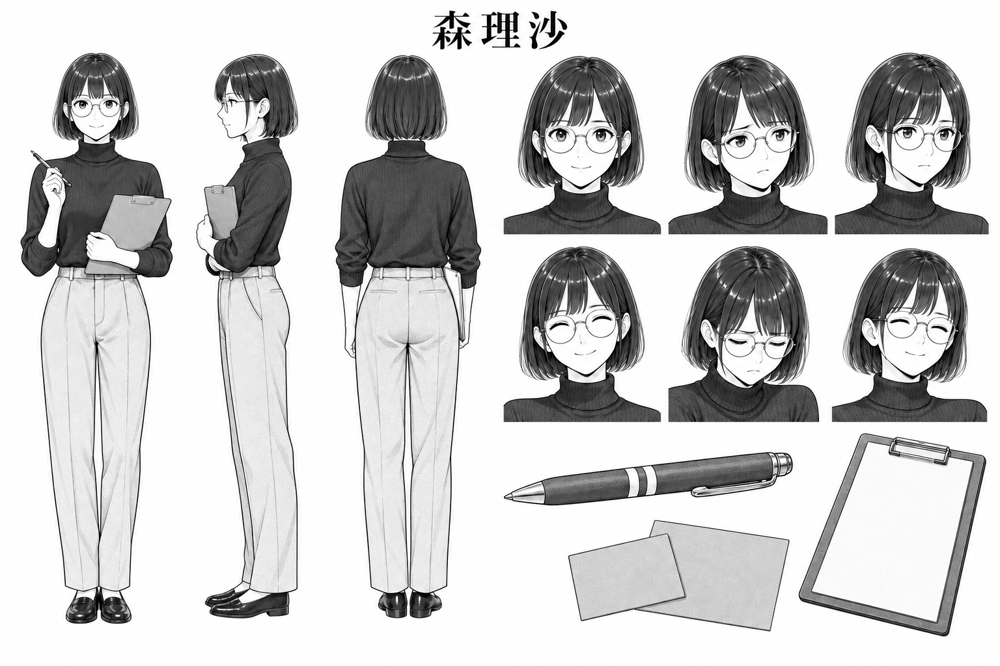
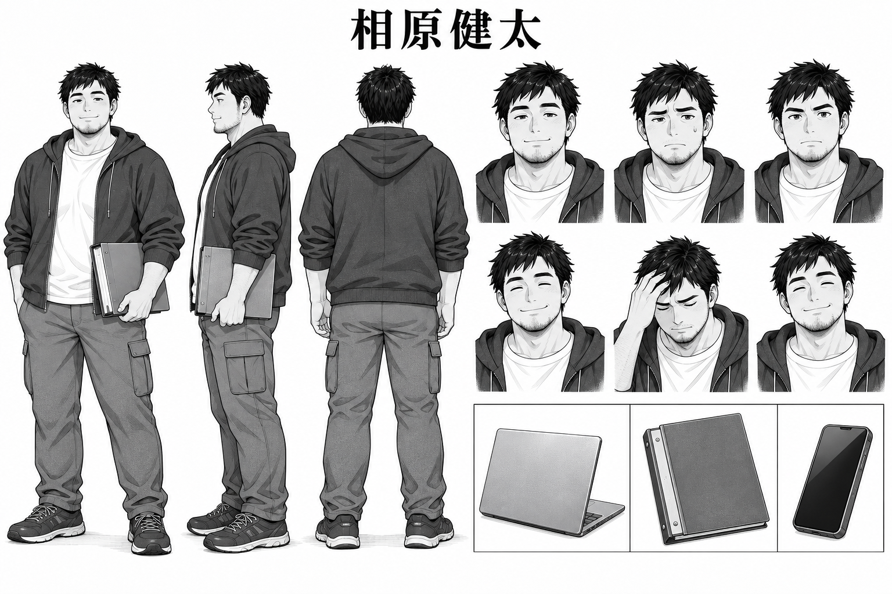
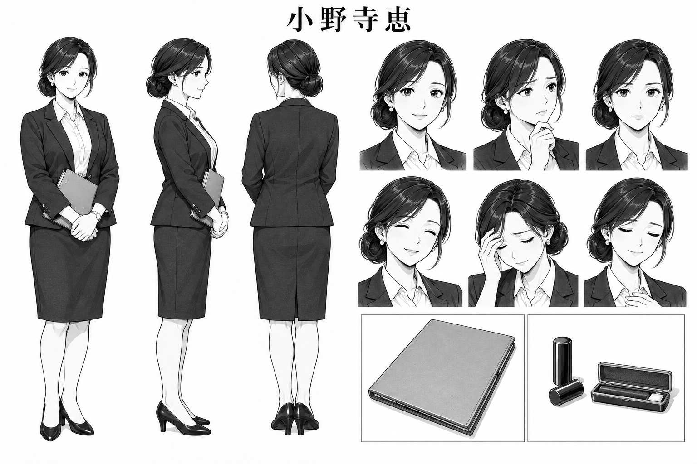
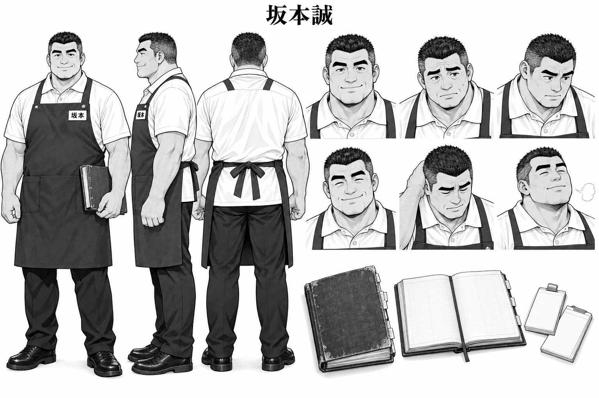
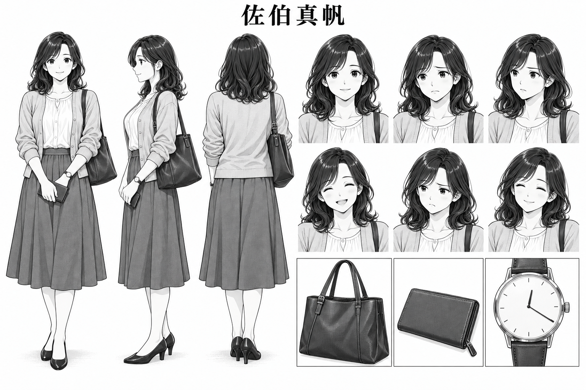
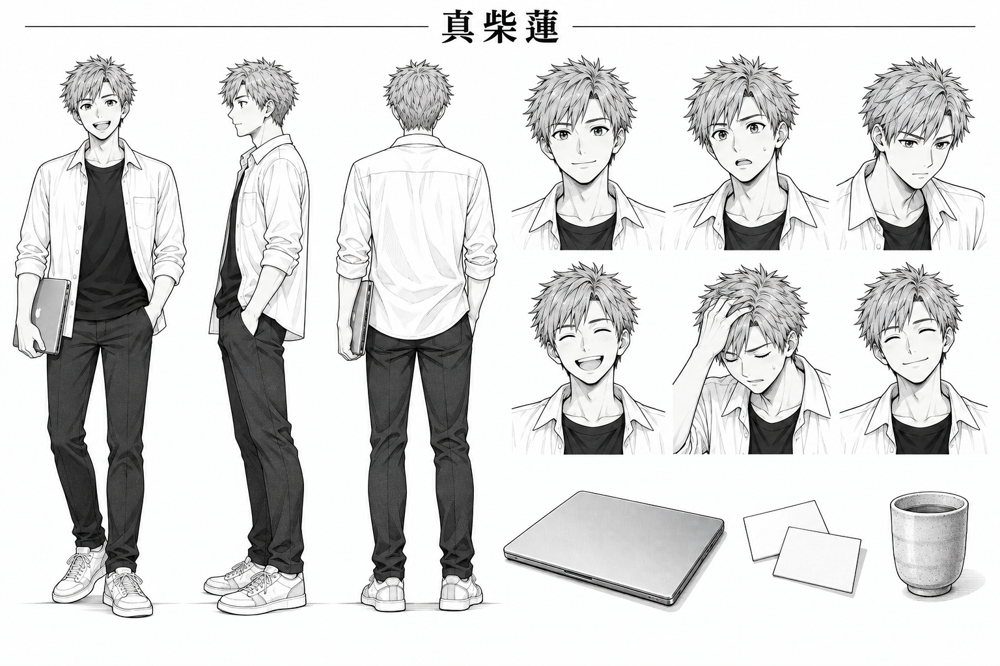
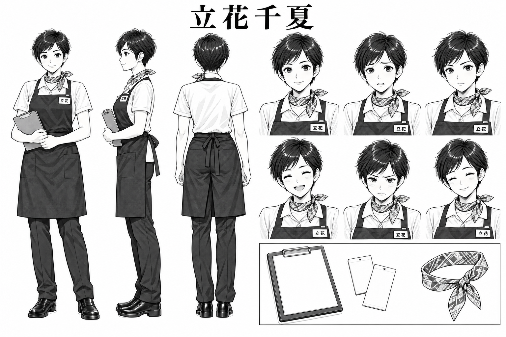

# 人物美術設定

## 基準と使い方

[作品思想](../../README.md)、[ストーリーバイブル](../story-bible.md)、[既存の外見設定](../character-design.md)を基準とする。[既存人物ラインナップ](../../manga/00-character-sheet.png)から顔・髪・服装を継承し、[第1話](../../manga/pages/01-REQ-01.png)の明瞭な白黒線画とスクリーントーンに合わせる。全員成人。年齢感は原作の確定年齢ではない。特定の作品・作家の絵柄を模倣しない。

本書の身長、顔の言語化、未指定部分の色、季節衣装は、既存設定を補う作画用指定。既存設定に優先しない。成長しても骨格、目の形、髪の基本形、固定の目印は変えない。対立の場面では相手を見る目と、守ろうとする仕事を描く。悪人の記号で対立を説明しない。

各個人画像は左に正面・横・背面の全身三面図、右に表情6種（上段左から普段／困る／真剣、下段左から笑う／悔しい／安堵）、その下に持ち物の拡大を配置する。画像の文字は氏名と制服の氏名表示に限定し、表情名・身長数値・色コード・業務文章は本文側に置く。小道具の無地の紙面は設定画用。漫画本文では各話に指定された番号や記録を描く。

## 身長とシルエット

身長は靴・髪の盛り上がりを除いた目安。集合画は同じ床・同じ縮尺を使う。1〜2cmの差より、肩幅、髪、服の外形で見分ける。身長比較画でも通常の靴を履くため、頭頂の厳密な位置は下表で判断する。

| 人物 | 身長の目安 | 遠景で見分ける外形 |
| --- | ---: | --- |
| 青井遥 | 156cm | 小柄、襟足の短い結び髪、角ポケットの生成りエプロン |
| 藤堂直人 | 182cm | 最も高く細長い、ベストと細い長方形眼鏡 |
| 水野真紀 | 165cm | 長いポニーテール、明るいジャケット |
| 森理沙 | 162cm | 顎で切れるボブ、丸眼鏡、暗い上半身と明るいパンツ |
| 相原健太 | 178cm | 広い肩、フード、ゆとりのある実用パンツ |
| 小野寺恵 | 164cm | 低い丸いシニヨン、端正なジャケットと膝丈スカート |
| 坂本誠 | 180cm | 幅のある肩と腕、角刈り、濃紺エプロン |
| 佐伯真帆 | 160cm | 肩までの内巻き、広がる膝下スカート、肩掛けバッグ |
| 真柴蓮 | 174cm | 上に跳ねる短髪、開いた白シャツ、細いパンツ |
| 立花千夏 | 166cm | 耳の出る短髪、首元の細い結び布、引き締まった制服姿 |

## カラー扉・表紙の共通色

カラー設定だけに着色を用いる。漫画本文と各人物設定画・身長比較は白黒。下記のコードは塗りの基準値であり、照明の演出で少し変わってよい。肌は自然な暖色の明暗、瞳は黒〜濃い茶を共通とし、人物の善悪や能力を肌色で表さない。

| 対象 | 基準色 |
| --- | --- |
| 黒髪 | 自然な黒 #252426 |
| 水野・佐伯の暗い茶髪 | #49372F |
| 蓮の明るい茶髪 | #AC8258 |
| 白シャツ・白ポロ | #F8F7F2 |
| 店長共通の胸当てエプロン | 濃紺 #202E46 |
| 遥のエプロン | 生成り #E8DDC7 |
| 遥のカーディガン | 薄い灰色 #C5C7C9 |
| 藤堂のベスト・スラックス | チャコール #34383D |
| 水野のジャケット／パンツ | ライトグレージュ #D5D0C7／チャコール #45464B |
| 森のハイネック／パンツ | 墨黒 #292B30／薄い灰ベージュ #D8D3C8 |
| 相原のパーカー／Tシャツ／パンツ | 炭色 #383C42／淡い灰 #E7E7E2／灰オリーブ #73796B |
| 小野寺のスーツ／耳飾り | 深いチャコール #34353C／小さな真珠色 #EEE9DE |
| 佐伯のブラウス／カーディガン／スカート | オフ白 #F3EEE7／淡いベージュ #DDD1C0／くすんだ青灰 #6E7D87 |
| 蓮のTシャツ／パンツ | 黒 #24252A／チャコール #3C3D42 |
| 立花の結び布 | 落ち着いた青灰 #8093A0 |
| 森の赤ペン・赤札 | 赤 #B64242。ペンの白帯2本とクリップを残す |
| 坂本の古い台帳 | 濃い焦げ茶の布 #51433B |
| 佐伯のバッグ／時計 | 焦げ茶 #59493F／銀色ケースと茶のベルト |

靴は既存画像と同形とし、遥と蓮は明るいスニーカー、ほかは黒〜濃灰。遥の白いピン2本、白い名札、森のペンの白帯2本は白黒・カラーの両方で識別できる。黒髪を人物ごとの派手な色に置き換えない。店長の制服色は両店共通。

## 01 青井遥

**役割**：灯台ソフトの若手開発者。作る速さから、相手の仕事を理解して託す力へ成長する視点人物。

**性格と演技の芯**：自分の作ったもので役に立ちたい。初期は身を乗り出して答えを急ぎ、行き詰まると手元のノートに目を落とす。後半は相手の目を見て具体的に頼む。失敗の根には善意と自作への愛着があり、現場を見下す人物にしない。万能な天才にも、質問するだけの人物にもしない。

**顔の作り**：小さめの柔らかな卵形。顎を尖らせすぎない。目は丸みのある大きな形、眉は細すぎない緩い弧。目と眉の上下で反応を出し、後半も同じ顔にする。

**髪・服装・目印**：黒髪を襟足で小さく結ぶ短いポニーテール。本人の右こめかみに平行な白いピン2本（正面では画面左）。白い丸首シャツ、薄灰の袖まくりカーディガン、濃色パンツ、スニーカー。手伝い時だけ生成りの胸当てエプロンと大きな角ポケット。見学時は見学証、店長名札は付けない。

**身長・シルエット**：156cm、小柄で細身。短い結び髪と明るい角形エプロンが目印。水野の長いポニーテールと混同しない。

**表情6種**：普段＝目がよく開き相手へ身を向ける。困る＝眉尻が下がり口が少し開く。真剣＝眉を寄せて相手を見る。笑う＝頬が上がる素直な笑顔。悔しい＝自分の早合点を噛みしめ唇を結ぶ。安堵＝肩を下ろし息を吐く。**禁止**：現場への嘲笑、勝ち誇る悪人顔、成長を示すための別人化、幼児化。

**18か月の変化**：初期の前のめりから、後半は立ち止まって聞ける姿勢へ。夏はカーディガンを脱ぐ場面、冬の外出は淡灰のコートを追加し、屋内では基準衣装に戻す。髪・ピンは維持。ENG-01は昼食を買う客なのでエプロンを外す。

**小道具**：ノートPC、小さなノート、見学証。袋を広げる場面では無地の持ち手付き弁当袋。終盤の新しいノートは次の問いを引き受ける道具。

## 02 藤堂直人

**役割**：灯台ソフトの技術リーダー。遥が越えたい先輩であり、判断を譲って学び直す仲間。

**性格と演技の芯**：筋の通った長く使える設計を好む。考えると顎に手を添え、短い問いを返す。大きすぎる案にも愛着があるが、却下の理由を隠さず残す。現場を支配したいから対立するのではなく、長く使いたい思いが先走る。失敗したときの間を描く。

**顔の作り**：縦に少し長い卵形、細いが丸みを残す顎。穏やかな横長の目、細めでほぼ水平の眉。細い長方形眼鏡越しに瞳が見える。

**髪・服装・目印**：黒髪の横分けと少し長い前髪。白い開襟シャツを袖まくりし、濃いベストとスラックス、黒い革靴。ネクタイは基準衣装に加えない。

**身長・シルエット**：182cm、高く細い縦長の姿。眼鏡の長方形とベストのV字を遠景にも残す。

**表情6種**：普段＝穏やかな目。困る＝顎に手を添えて考える。真剣＝視線を図から相手へ移す。笑う＝目尻が緩む控えめな笑み。悔しい＝目を伏せ、案への未練を飲み込む。安堵＝眉がほどける。**禁止**：眼鏡が光って目が消える威圧顔、万能の先生の見下ろし、裏切りを暗示する邪笑。

**18か月の変化**：夏は薄手の同形ベストとシャツ、冬は外出時にチャコールのコート。後半は遥と同じ目線で資料を開く。別案件への異動と引き継ぎを描き、死亡・失踪・急な老化で不在を説明しない。

**小道具**：図入りの薄いファイル、筆記具、却下理由を残した紙。設定画の白い紙面は本文で図に置き換える。

## 03 水野真紀

**役割**：灯台ソフトのプロジェクトマネージャー。チームと本部をつなぎ、危機では連絡を引き受ける。

**性格と演技の芯**：頼られたい思いから曖昧に引き受けてしまう。紙を相手にも見えるように開く動作を成長の印にする。相手の落胆を避けたい弱さであり、納期で人を追い詰めるための対立ではない。山場では正面を向いて短く言い切り、相手の返答を待つ。

**顔の作り**：やや縦長の卵形。柔らかなアーモンド形の目、緩く弧を描く眉。困ると眉の内側が上がる。眼鏡なし。

**髪・服装・目印**：暗い茶髪、後頭部で結ぶ長いポニーテール、横に流す前髪。明るいジャケット、黒いインナー、パンツ、落ち着いたパンプス。

**身長・シルエット**：165cm、中背。長い髪の流れとジャケットの明るい外形で識別。遥より落ち着いた重心。

**表情6種**：普段＝柔らかい眉。困る＝返事を探し口元が止まる。真剣＝正面を見る明確な視線。笑う＝相手へ開いた笑顔。悔しい＝約束の食い違いを認め眉を下げる。安堵＝連絡先の返答を聞いて息を吐く。**禁止**：納期を絶叫する鬼上司顔、責任逃れの薄笑い、交渉成功だけで万能化。

**18か月の変化**：夏は同じ明色の薄手ジャケット、冬の外出はグレージュのコート。長髪の結び位置と前髪は維持。後半は電話と資料を抱え込む姿から、役割を分けて手渡す姿へ。

**小道具**：手帳、電話、クリップボード。森の赤札を一緒に示す際は森の道具として扱う。

## 04 森理沙

**役割**：灯台ソフトの品質・テスト担当。お客さんより先に困る条件を見つける、初期からの仲間。

**性格と演技の芯**：観察と乾いた冗談。全部確かめたくて一人で止め役を背負う。指摘は誰かに勝つためでなく、客が困る前に見つけたいから。自分の見落としではペンを止め、後半は他人へ試験を任せる。

**顔の作り**：小ぶりな卵形と穏やかな細い顎。水平に相手を見る落ち着いた目、細く直線的な眉。細い丸眼鏡で藤堂と区別する。

**髪・服装・目印**：黒髪、顎までの直線的なボブ、揃えた前髪。濃色ハイネック、明るいパンツ、黒い歩きやすい靴。赤ペンはクリップと軸の白帯2本が固定。

**身長・シルエット**：162cm、細身。ボブの直線、丸眼鏡、暗い上半身と明るい脚の組合せ。

**表情6種**：普段＝静かな観察。困る＝眉間をわずかに寄せる。真剣＝条件を追うまっすぐな目。笑う＝小さな誠実な笑顔。悔しい＝見落としを認め唇を結ぶ。安堵＝確認を仲間に渡して眉を緩める。**禁止**：嘲笑、嫌味な検査官の吊り目、口角だけを吊り上げた悪人顔、眼鏡で瞳を隠す威圧。

**18か月の変化**：夏は薄手の同じハイネック、冬は厚手の同形ニットと外出用コート。顔とボブの長さは維持。終盤はペンを握り続けず、受領確認後にしまう。ENG-01では赤ペンを食卓へ出さない。

**小道具**：赤ペン、試験札、クリップボード。白黒ではペン軸と赤札を中濃度トーン、白帯は抜きで描く。設定画では札に試験番号を印刷しない。

## 05 相原健太

**役割**：灯台ソフトの運用・基盤担当。戻り道を準備し、一人に集中した仕事を分ける守備役。

**性格と演技の芯**：短く乾いた反応。夜に呼び戻されない生活と、店の次の正午を守りたい。不安な仕事を抱え込んで変更に慎重になるが、仲間の挑戦を妨害したい人物ではない。危機では視線を上げ、手順と役割を確認する。

**顔の作り**：幅のある、角を丸めた四角形。普段は半開きの目、太めで水平に近い眉。顎に薄い無精髭。眠そうな目の形を、恒常的な過労の隈に置き換えない。

**髪・服装・目印**：少し無造作な黒い短髪。濃いジップパーカー、淡色Tシャツ、実用的なパンツ、濃色スニーカー。

**身長・シルエット**：178cm、肩幅のあるがっしりした体格。フードと広い肩が藤堂の細長い姿と対になる。

**表情6種**：普段＝半開きの目。困る＝眉を寄せて短く息を吐く。真剣＝目を開き集中。笑う＝乾いた小さな笑み。悔しい＝抱え込みを振り返り目を伏せる。安堵＝当番へ渡して肩が下がる。**禁止**：徹夜で目を血走らせた英雄顔、無許可操作を楽しむ笑い、変更する人への敵意。

**18か月の変化**：夏は薄手パーカーを開ける、冬は厚手の同系色にする。髪と無精髭を伸ばして消耗を誇張しない。後半は電話を抱える片手を空け、食事や交代へ向かえる姿にする。

**小道具**：PC、手順ファイル、連絡用端末。復旧時には確認済み手順を開く。祝いの席では当番への引き継ぎを済ませる。

## 06 小野寺恵

**役割**：こはるキッチンの事業責任者。機会と制約を渡し、投資の決定と費用の責任を持つ。

**性格と演技の芯**：こはるを長く続けたい。完成画面や見やすい数字に期待し、払った費用への愛着もある。判断前の迷いと、不利な資料も開く手元を描く。利益だけを求めて現場を切り捨てる悪役にしない。

**顔の作り**：成熟した卵形。落ち着いた細めのアーモンド形の目、ほどよい角度のある明確な眉。年齢の線は控えめに、険しい深い溝で権力を表さない。

**髪・服装・目印**：黒髪を低い丸いシニヨンにまとめ、前髪は横へ流す。濃いテーラードジャケット、膝丈スカート、白ブラウス、小さな丸い耳飾り、黒いパンプス。

**身長・シルエット**：164cm、中背で姿勢がよい。襟足の丸い髪と、膝で収まる細いスカートが固定の外形。

**表情6種**：普段＝静かな落ち着き。困る＝資料と相手の間で視線が止まる。真剣＝判断を引き受ける眉。笑う＝控えめな温かい笑み。悔しい＝投資への未練を認める伏し目。安堵＝決断後の柔らかい目。**禁止**：冷酷な女王顔、金銭に目を輝かせる戯画、部下を見下す薄笑い。

**18か月の変化**：夏は薄手の同形スーツ、冬は外出時の濃色コート。顔立ち、髪の結び方、耳飾りは維持。後半は資料を胸元で閉じる姿から、現場と同じ紙を開く姿へ。決定権を開発者に丸投げする演出にしない。

**小道具**：比較資料、承認印とケース。承認印を威圧する武器のように掲げない。

## 07 坂本誠

**役割**：こはるキッチン青葉店店長。昼の混雑をさばき、遥に現場の仕事を教える最初の強敵と相棒。

**性格と演技の芯**：目の前の客を待たせたくない。自分が走れば間に合うという自負から、他店も同じだと思ってしまう。手を動かしながら短く話し、後半は知っている例外を言葉にする。IT嫌いの壁ではなく、客と店を守る熟練者。

**顔の作り**：幅のある丸みを帯びた四角い輪郭、太い首。太い眉と真剣な目。頬と目尻が緩むと温かさが出る。小野寺と同様、年齢感を怒り皺に置き換えない。

**髪・服装・目印**：短い黒の角刈り、こめかみに白髪。白い半袖ポロ、濃紺の胸当てエプロン、黒パンツ、実用的な黒い靴。本人の左胸に横長の白い名札。本文の名札は「店長 坂本」、今回の設定画では文字制約に合わせ氏名部分「坂本」を表示。

**身長・シルエット**：180cm、大柄で肩と腕が太い。角刈り、太い腕、広いエプロンの面で識別。相原と比べてフードがなく、腕が見える。

**表情6種**：普段＝作業へ集中。困る＝客へ眉を下げて詫びる。真剣＝一食の行方を追う目。笑う＝頬が持ち上がる小さな笑顔。悔しい＝自分の思い込みを認める口元。安堵＝受け渡し後に息を吐く。**禁止**：怒鳴る悪役顔、ITへの嫌悪を誇張した顔、休めないことを誇る表情。

**18か月の変化**：店内の制服は維持。冬の通勤には上着、夏は汗を少量に留め清潔さを保つ。後半は自分だけが走る構図を減らし、店員と分担して立つ。台帳を閉じる時も白髪を急増させない。

**小道具**：角が擦れた濃い布張りの厚い予約台帳、紙の見出し、伝票、注文札。ECO-15で台帳を廃棄しない。記録と控えを残してから二重入力を終える。

## 08 佐伯真帆

**役割**：青葉店の予約客。普通に昼食を受け取る目的から、開発側の達成感を問い直す。

**性格と演技の芯**：十二時二十分に受け取り、座って食べたい。技術や開発の努力がその日の昼食の代わりにならないことを、短い問いと自然な反応で示す。困惑や失望には時間の事情がある。要求の多い悪役の客にも、全顧客を代表する教師にもしない。

**顔の作り**：頬に柔らかさのある卵形、丸い顎。自然な丸みの目、控えめな眉。困ると眉尻を下げる。眼鏡なし。遥より落ち着いた目と口の動き。

**髪・服装・目印**：暗い茶髪、肩につくゆるい内巻き、横分け。薄いブラウス、淡いカーディガン、膝下スカート、低めのパンプス。本人の左手の腕時計、財布、肩掛けバッグ。

**身長・シルエット**：160cm、平均的な体格。肩までの髪と裾が広がるスカート、肩のバッグが目印。

**表情6種**：普段＝静かに待つ。困る＝眉を下げ短く尋ねる。真剣＝相手をまっすぐ見る。笑う＝受領時の小さな笑顔。悔しい＝予定が崩れ口元を結ぶ程度の失望。安堵＝昼食の時間が戻り顔が緩む。**禁止**：激昂する客の戯画、開発者を論破して嘲笑する顔、大げさな感動泣き。

**18か月の変化**：夏は薄いブラウス、冬は淡色カーディガンと外出用のベージュコート。バッグと左手の時計、髪型は維持。最後は普通に袋を受け取って帰る。18か月ずっと昼食を得られなかったようには描かない。

**小道具**：左手の腕時計、財布、肩掛けバッグ、無地の持ち手付き弁当袋。REQ-01とENG-01の時計は12:20。設定画の拡大時計は数字を省き、針の方向で示す。初回も代替の焼き魚弁当を受け取る。

## 09 真柴蓮

**役割**：灯台ソフトの別案件担当開発者。短期の試作・レビューで協力する遥の好敵手。

**性格と演技の芯**：速く形にして腕を認められたい。軽口と率直な評価で相手に同じ条件を求める。速い試作を店での成功と取り違えるが、接点が壊れれば一緒に直す。外部競合の妨害役ではなく、長所を保ったまま価値まで見届ける競争相手。

**顔の作り**：細い卵形と少しだけ尖る自然な顎。明るいアーモンド形の目、活発で角度のある眉。助ける場面でも目つきや輪郭を別人にしない。

**髪・服装・目印**：明るい茶髪、上へ短く跳ねる束感。黒い丸首Tシャツ、白い開いたシャツ、細身パンツ、明るいスニーカー。

**身長・シルエット**：174cm、細身で遥より高い。跳ねる髪、開いた白い外衣と黒い内側、細い脚で識別。

**表情6種**：普段＝興味を向ける目。困る＝予想外の結果に眉が上がる。真剣＝接点を追う集中。笑う＝歯を少し見せる率直な笑顔。悔しい＝自分の失敗に口を結ぶ。安堵＝仲間を見て力が抜ける。**禁止**：嘲笑、邪悪な勝ち誇り、助力時だけ善人顔へ変える演出。

**18か月の変化**：夏は同形の薄い白シャツを袖まくり、冬は白シャツの上に濃灰の上着。髪色と束感は維持。後半も競争心を残し、他人の作業を待つ姿を増やす。常勤6人目として居続けず、協力は水野の調整で入る。

**小道具**：ノートPC、試験注文札、温かいお茶。試験札の「101」は該当話だけで使い、実注文番号へ流用しない。設定画の札は無地。

## 10 立花千夏

**役割**：こはるキッチン駅前店店長。坂本と同格の熟練者として、異なる現場の条件を示す好敵手。

**性格と演技の芯**：初めての客が迷わず受け取り、駅に間に合う店を回したい。歯切れよく返し、自店の速さにも自信がある。坂本を負かすためでなく、自店の客を守るために違いを示す。客と従業員の扱いを雑にして速さを演出しない。

**顔の作り**：すっきりした卵形、顎にわずかな角。きびきびしたアーモンド形の目、少し上向く明確な眉。引き締まった表情と温かさを同居させる。

**髪・服装・目印**：黒髪の耳が出る短いピクシーカット。白い半袖ポロ、濃紺の胸当てエプロン、黒パンツ、黒い実用靴。首元に細い結び布。本文の名札は「店長 立花」、今回の設定画では氏名部分「立花」を表示。

**身長・シルエット**：166cm、中背で引き締まった体格。短髪、首元の小さな結び布、坂本より細いエプロン外形。制服色は両店共通。

**表情6種**：普段＝きびきびした目。困る＝具体的な支障に眉が寄る。真剣＝受取口へ注意を向ける。笑う＝率直で明るい笑顔。悔しい＝競争心を抑え口を結ぶ。安堵＝客を見送り目が緩む。**禁止**：坂本への侮蔑、客を急かす鬼の形相、勝利だけを喜ぶ意地悪な顔。

**18か月の変化**：店内の制服と結び布は継続。夏は同じ半袖ポロ、冬は通勤時に濃色の上着。後半は坂本と確認表を並べ、条件を持ち寄る姿へ。駅前店は既存8店舗の一つで、9店舗目の新設として扱わない。

**小道具**：店舗確認表、注文札、クリップボード。店の違いを示す際は、札と実際の受取動作を同じコマに置く。

## 制作と確認記録

組み込み image_gen で各画像を生成し、出力元の ~/.codex/generated_images/ からコピーする。画像の描画・合成・加工は行わない。プロンプトは [art/prompts](../../art/prompts/)、各回の出力元・目視確認・再生成回数は [担当ログ](../../art/log-characters.json) に記録する。背景、左右の目印、三面図、表情数、小道具、名前、人数を目視で確認する。再生成は各画像につき最大2回。

今回の採用画像は計12枚。遥・森・立花・身長比較・カラー設定を各1回再生成し、ほかは初回を採用した（合計17回生成、再生成5回）。全採用画像を目視確認済み。人物の取り違えや大きな身体の崩れは見当たらない。身長比較の数cm単位の差は近似であり、本文の数値を優先する。蓮の携行PCには参照画像由来の小さなリンゴ状のマークが残るため、無地のPCを描くときは同画像の拡大小道具を参照する。
