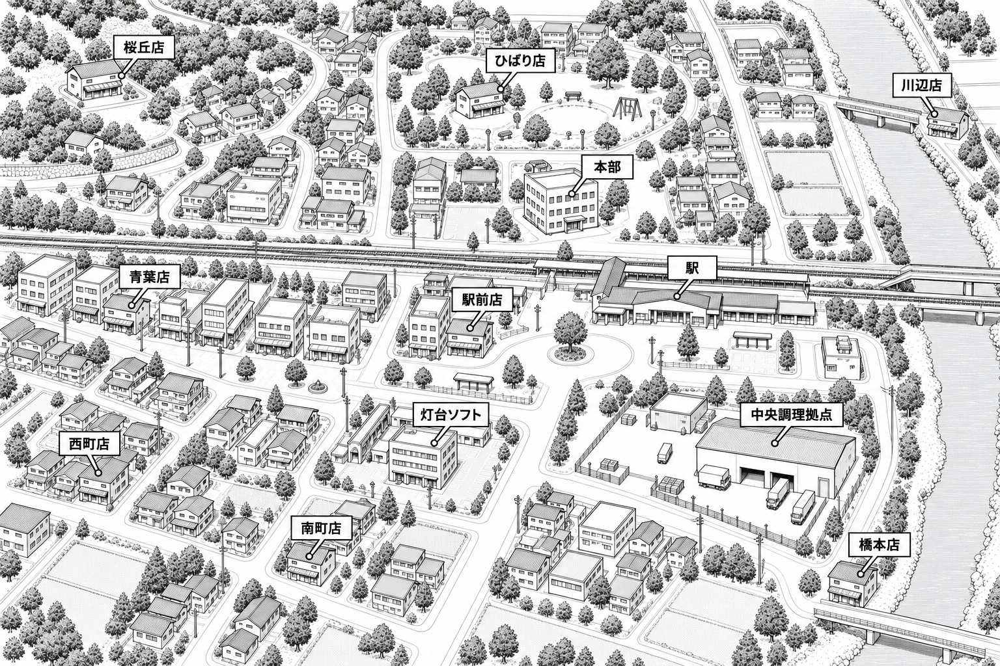
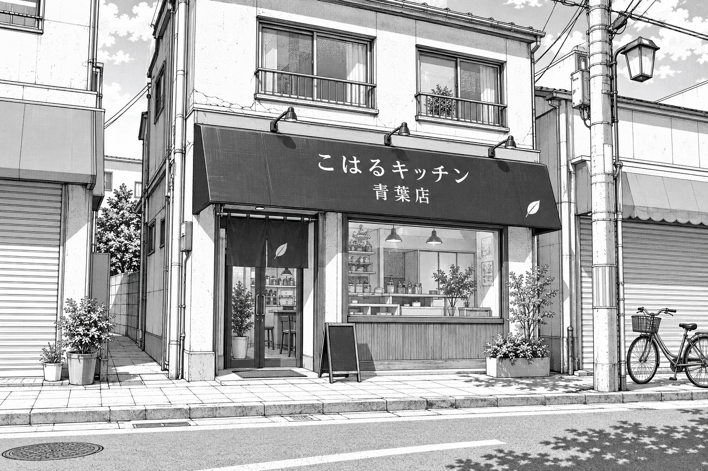
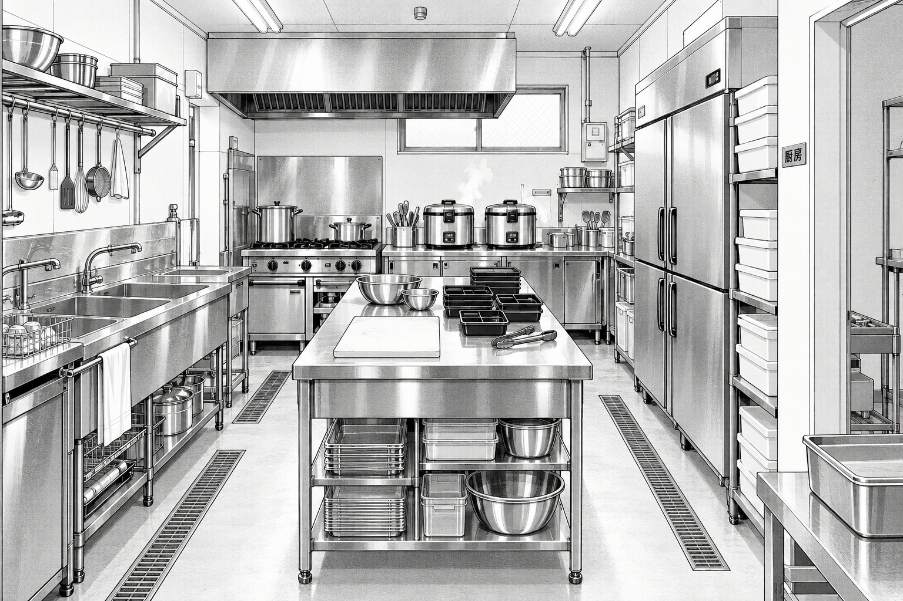
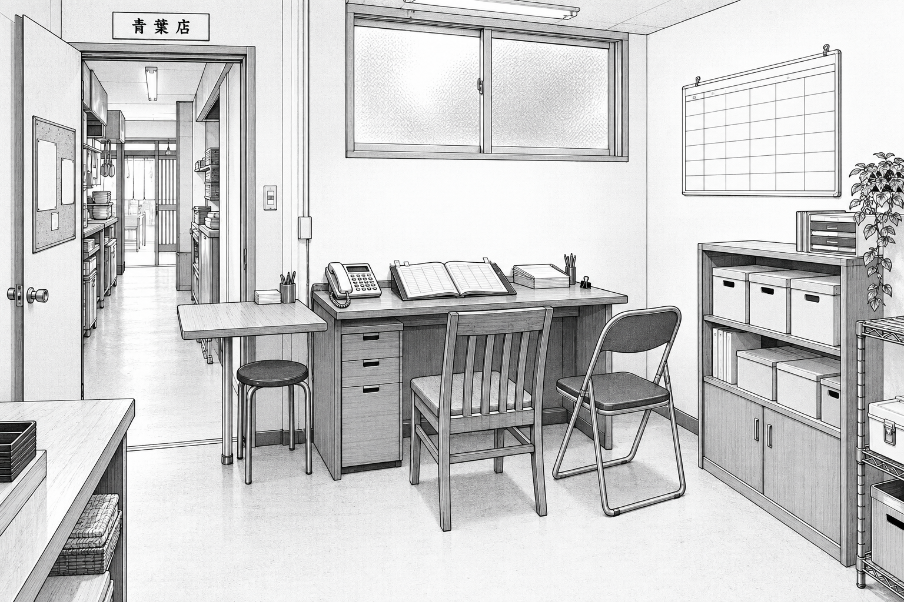
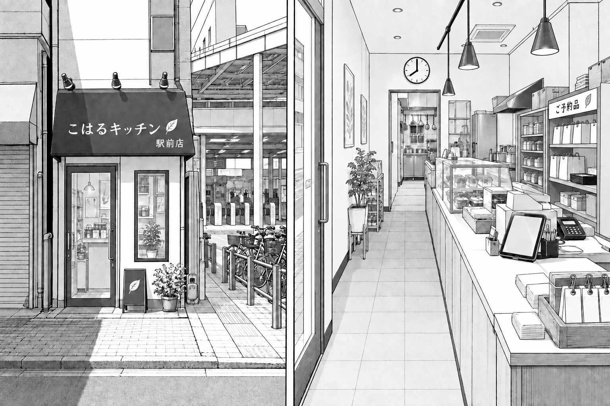
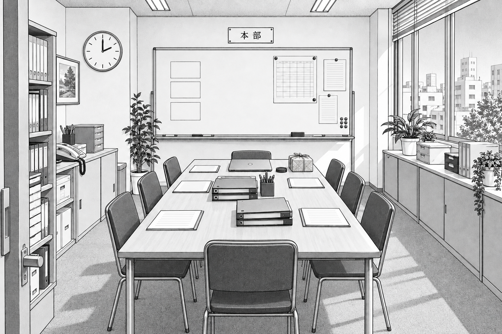
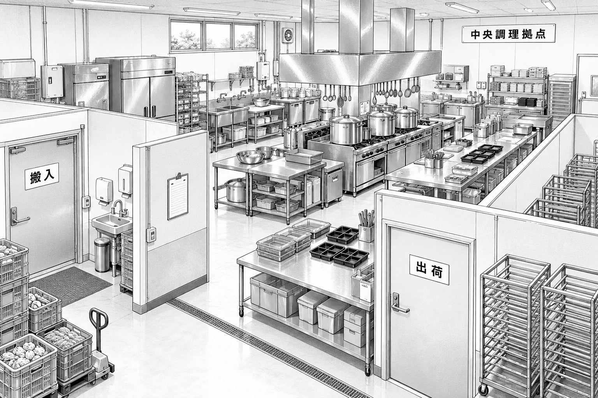
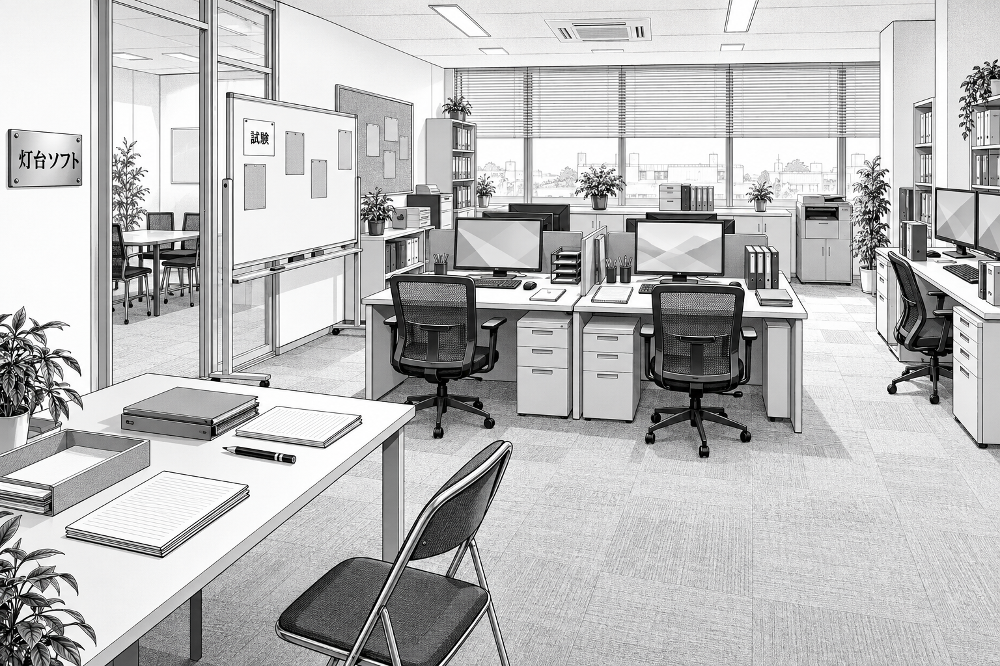
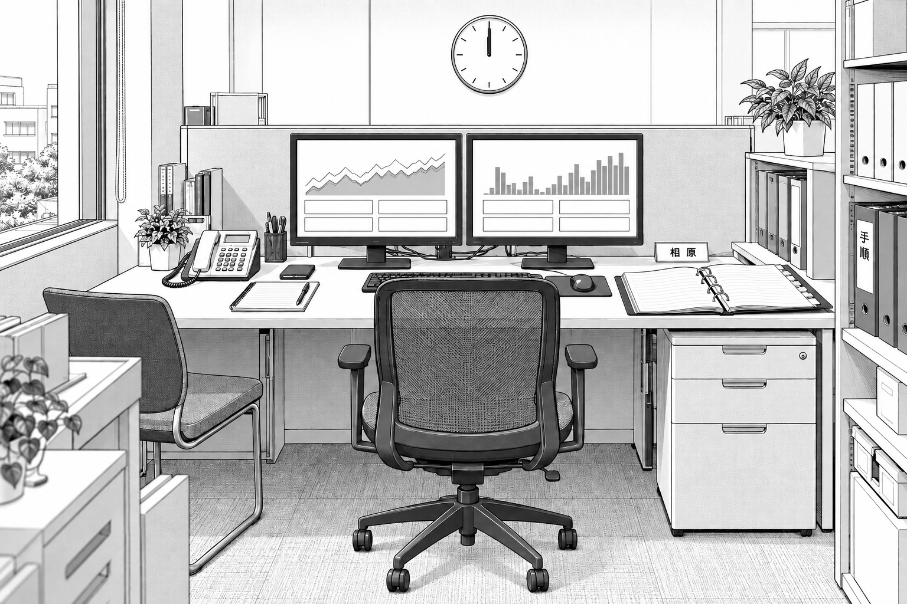

# 舞台・背景美術設定

本書は [作品思想](../../README.md)、[ストーリーバイブル](../story-bible.md)、[人物外見設定](../character-design.md)、[人物ラインナップ](../../manga/00-character-sheet.png)、[REQ-01の既存原稿](../../manga/pages/01-REQ-01.png)を基準とする。全458話の場所指定と舞台に関する画面指示を参照し、とくに第1〜3部の電話・台帳・厨房・受取口のつながりを固定した。物語の流れは[台本のあらすじ](../../script/README.md)を参照。

**区分**：「台本確定」は登場話・出来事・道具。「美術補完」は未指定の方角、建物形状、家具配置、街の地理と仮店名。本書の配置は作画の共通基準であり、新しい事件や導入実績を追加するものではない。初登場は原則として実際にその場所で場面が描かれる最初の話を指し、言及・画面内の店名・担当者の来訪とは分ける。

## 共通の描画・継続ルール

- 日本の少年漫画の白黒線画＋スクリーントーン。輪郭を明瞭にし、白い床・壁・机上に人物を置ける余白を残す。特定作品・作家の模倣はしない。背景画像には人物を入れない。人物を後から描く際は全員成人で、既存の外見設定を維持する。
- 地図は上を北とする。室内の東西南北もこの方角にそろえる。カメラを反対側へ回す際は左右が反転するが、家具の場所は動かさない。画像の鏡像反転で別アングルを作らない。
- 季節は [世界観の十八か月表](world.md#十八か月の季節)の「1か月目＝4月」を美術上の共通補足として使い、台本に具体的な季節・天候がある場面はその指定を優先する。西暦・曜日は固定しない。同じ窓や照明の明暗、紙の量、道具の更新でも時間を表す。
- 画像中の文字は短い日本語の店名・場所名・物品ラベルに限る。数字、画面の詳細、台詞、長い掲示文はこの背景資料には入れない。時計は目盛りと針で表す。台帳・伝票の顧客情報や試験結果は空の罫線とする。
- REQ-01とENG-01の時計は12:20、OPS-17は12:00。背景画像の時刻はその画像の基準場面だけに適用する。別時刻のコマは画像生成で針を描き直す。
- 赤い札は中濃度トーン。青いテープは床の連続する細い中濃度トーン帯。赤・青の着色をしない。青いテープは[REQ-09（013）](../../script/part-02.md#episode-req-09)が初出で、初月の背景には描かない。
- 古い台帳は濃い布張り、擦れた角、紙の見出しを持つ同じ一冊。カウンターと事務机の画像は別の瞬間であり、同じ台帳を二か所へ同時に置かない。必要な控え・模擬用の帳面は別物として区別する。
- 2〜5か月目の紙画面・古い端末・印刷機は試作や営業外の確認。6か月目に青葉・駅前の2店舗で本番試行、7か月目のOPS-17時点では既存8店舗へ展開済み。背景だけで本番導入を先取りしない。

## 00 街の俯瞰図

**役割・初出**：一店舗の経験を全店へ広げる際の距離と環境差を見せる。街全体の地形を描く初登場話は未指定。既存8店舗・中央調理拠点1か所はバイブルの確定条件。地図の道路・鉄道・川・建物位置はすべて美術補完で、実在都市の地図ではない。

**平面の固定**：東端に南北の川、街の中央を東西に鉄道が横切る。駅は中央より東、主要な駅前広場は線路の南。青葉店から商店街を東へ進むと駅前店、さらに東が駅。本部は線路の北で駅の北西。灯台ソフトは線路の南、駅前店の南、南町店の北東。中央調理拠点は南東の業務地区、川の西岸。道路橋と鉄道橋を混同しない。縮尺・所要時間・配送順は未設定。

| 施設 | 設定区分 | 地図上の位置・周囲 |
| --- | --- | --- |
| 青葉店 | 台本確定名 | 中西部、線路南側の商店街。駅前店より西 |
| 駅前店 | 台本確定名 | 駅の西側、駅前広場へ出る通り。既存8店舗の一つ |
| 桜丘店 | 未登場店の美術用仮名 | 北西の住宅丘陵 |
| ひばり店 | 未登場店の美術用仮名 | 北部中央、公園のそば |
| 川辺店 | 未登場店の美術用仮名 | 北東、川沿い。中央調理拠点より北 |
| 西町店 | 未登場店の美術用仮名 | 南西の住宅地 |
| 南町店 | 未登場店の美術用仮名 | 南部中央寄り、灯台ソフトの南西 |
| 橋本店 | 未登場店の美術用仮名 | 南東の橋の北側、中央調理拠点より南 |
| 本部 | 施設は確定、地理は補完 | 駅北西の小規模オフィス棟 |
| 灯台ソフト | 施設は確定、地理は補完 | 駅南西のオフィス棟 |
| 中央調理拠点 | 施設は確定、地理は補完 | 南東の業務地区。店舗数に数えない |

**光・小道具**：昼の白い道路、薄い屋根のトーン、木立、橋、駅の屋根、店舗共通の庇で場所を識別する。人や車列で地名を隠さない。

**18か月の変化**：地理と店舗数は固定。試行から全店展開への変化は台本コマ内の説明や資料で示す。ARC-06の「九つ目の使い方」を9店舗目の開店に置き換えない。仮名6店には店長・独自の事件・導入日を設定しない。

## 青葉店全体の間取り

美術補完として、南側が商店街、北側が裏方の長方形店舗とする。南西に一つの客用出入口、南東に大きなガラス窓。客だまりは南側、中央に東西方向のカウンター、その北側がスタッフ通路。北寄りの間仕切り壁に、西から厨房口、中央の受取棚、そのすぐ東の壁時計、東端の事務通路口が並ぶ。厨房は北西、事務机と打ち合わせの隅は北東に置き、裏方同士はスタッフ通路でつなぐ。裏方の搬入経路を客の出口として描かない。

カウンター西端は電話子機・台帳を一時的に開く場所、東端はレジ。通常商品のケースは東側の客だまりに沿わせ、予約棚と区別する。観察者は南東の壁際へ寄せ、出入口から受取口への通路を空ける。打ち合わせ椅子は裏方へ戻せる可動物で、営業中に客動線を塞がない。南側の窓際には必要な話だけ小さな相談用客席を置ける余白を残す。

## 01 青葉店・外観

**役割・初登場**：[REQ-01（001）](../../script/part-01.md#episode-req-01)、開始時の第1か月。店名から店内へ入る導入と、ENG-01で普通の昼食へ帰ってくる日常の目印。画像の基準は初月の昼。

**固定する配置**：正面から見て左にガラス扉と短い暖簾、右に広い窓。濃色の庇に「こはるキッチン」「青葉店」と小さな葉の印。窓下は縦板、上階は住宅風の窓と細い手すり。立て看板は扉と窓の間の外側、植木鉢は窓端。商店街の左右の店は無記名とする。自転車は入口から離す。

**光・時間**：昼は庇の下だけ濃く、歩道に葉と電線の影。閉店後は暖簾をしまい、室内照明を窓越しに弱く見せる。季節の描き分けは世界観の対応表を参照し、台本指定の天候を優先する。

**小道具・変化**：植木鉢、立て看板、暖簾、無地の袋を基本にする。導入後も店の庇と扉を変えず、6か月目以降は窓越しに受取用端末が見える程度。18か月目を新装開店にしない。

## 02 青葉店・カウンターと受取棚

**役割・初登場**：REQ-01（001）。画面の成功と現物の一食の差が見える場所。基準画像は初月12:20、予約棚が空いている状態で、既存原稿の棚と時計の関係を継承する。

**固定する配置**：客側から北を見る。左が厨房口、中央が縦長の金属製受取棚、棚の右上に丸時計、さらに右が事務通路口。レジはカウンター右端、台帳と電話子機は左端。予約札は棚板前縁へ挟む。レジ脇のトレーはレシート・伝票用で、予約の現物を入れる棚とは別。通常商品ケースは画面右端。台帳はスタッフ側から開き、客側から全文が読める向きに固定しない。

**光・時間**：南のガラス面から白い昼光を入れ、棚の奥を薄いトーンで落とす。時計の位置は動かさず、REQ-01／ENG-01では12:20。昼営業後の聞き取りは光を弱め、受取棚の物量で切り替える。

**小道具・18か月の変化**：初月は台帳、予約札、レジ、電話、伝票。REQ-09（013）で受取口の客側に青いテープを仮設する。テープは扉の可動域を避け、カウンター前の待つ位置と往復の通路を分ける細い帯とし、形を変更した試行では配置図も更新する。3か月目は紙画面と試験端末、5か月目は営業外の設置・停止訓練。6か月目からレジの内側隣に受取用端末を置く。POSとは別機器として描き、即時連携を初月へ先取りしない。12か月目のENG-07（391）は同じ受取口とテープで比較を行う。ECO-16（451）で台帳を保管した後は、台帳の常設位置が空き、必要な控えは取り出せるまま。最終回の棚はその日の予約品の状態に合わせる。

## 03 青葉店・厨房と仕込み場

**役割・初登場**：[REQ-02（002）](../../script/part-01.md#episode-req-02)で仕込み場の入口が実際の場面になる。REQ-01では代替弁当の背景となる店内設備。PRO-20（005）で本部の言葉が実際の準備と受け渡しへ結び付く。

**固定する配置**：南の厨房口から北向きに見る。北壁は換気フードと加熱・炊飯器具、西壁は洗い場、東壁は冷蔵庫と容器の棚、中央はステンレスの仕込み台。台の左右にスタッフが通れる通路を取る。受取口へは南に戻る。事務側へ抜ける接続は東側の手前で、北奥に客用扉を増やさない。見学者は入口脇で待ち、作業線を横断しない。

**光・時間**：仕込みの朝は北の高窓から散乱光、天井灯の均一な明るさ。昼は金属の白抜きと少量の湯気で稼働を表す。閉店後は容器を片付け、台の反射を静かに残す。

**小道具・18か月の変化**：ボウル、まな板、トング、弁当容器、炊飯器、鍋、札と伝票。初期から設備を働く店のものとして描く。試行後はスタッフが確認する札や控えが増えるが、調理機械を注文システムが自動制御する画面は足さない。MNT-06（340）の仕込み切替も既存の作業台と時計を共有する。13〜14か月目の製造連携は相談・試作の段階で、厨房自動化を完成させない。

## 04 青葉店・バックヤード事務机／打ち合わせの隅

**役割・初登場**：打ち合わせスペースとしてREQ-02（002）。「事務机」の明記は[CON-20（333）](../../script/part-08.md#episode-con-20)。バックヤードという独立した室名は台本未指定で、打ち合わせ・記録机を北東の同じ隅へまとめる美術補完。REQ-01で出す椅子はここから運べる。

**固定する配置**：南西側から北東を見る。北壁の高窓の下に机、天板の左に電話親機、中央に台帳、右に伝票トレー。椅子は南向きに引け、横に折り畳みの予備椅子。東壁は低い保管棚と勤務表、西側の出入口は厨房・カウンターへつながる裏方通路。机脇の小さな張り出しに資料を広げる。電話親機とカウンター子機の区別は美術補完とする。

**光・時間**：高窓の柔らかい散乱光と天井灯。閉店後は机上だけ明るく、通路を一段薄暗くする。昼の喧騒から聞き取りの静けさへの変化を椅子と余白で示す。

**小道具・18か月の変化**：台帳、電話、伝票、鉛筆、クリップ、勤務表。台帳の定位置はここで、営業時にはカウンターへ持ち出す。3〜5か月目の試験には持込端末を空いた張り出しへ置く。9〜10か月目の事務調査では調査用複製と原本を別トレーにする。[MNT-18（350）](../../script/part-08.md#episode-mnt-18)で古い台帳の「店長確認」を見せるが、背景資料には長い記入内容を焼き込まない。17〜18か月目のECO-16では照合後の台帳を東の保管棚の箱へ入れる。机には停止時の控えと翌日の準備表を残し、連絡先カードは勤務予定の隣へ移る。箱を廃棄箱として描かない。

## 05 駅前店・外観と店内

**役割・初登場**：店長の立花はREQ-04（004）で青葉店へ来訪し、駅前店の違いを示す。現地を明示する最初の場面は[OPS-15（289）](../../script/part-06.md#episode-ops-15)、6か月目の二店舗試行。画像も試行初日の開店前を基準とする。背景内の時計は朝8時の作画上の一時点で、営業時間を確定するものではない。

**固定する配置**：南正面の西端に一つの客用出入口。店内は細長く、西側が客の通路、東側が奥へ延びるカウンター。入口寄りの南がレジ、北寄りが受取棚、最奥が厨房口。スタッフは東側のカウンター内に立つ。電話と伝票はレジ裏、予約端末はレジの隣。事務記録はカウンター奥の引き出しへ収め、青葉店のような広い相談机を客だまりへ置かない。壁時計は北壁。入口と出口を別々に増やさず、戻る客が通れる幅を残す。

**客層・見え方**：常連の名字が手掛かりになる青葉店に対して、駅へ急ぐ初回客が番号を確かめて短く受け取れる店。背景だけでは駅の庇、狭い間口、短い確認に必要な端末と札、空いた通路で違いを出す。青葉店と同じ看板書体・葉の印・制服のチェーンであり、立花の店だけを別ブランドにしない。

**光・小道具**：隣接ビルで外は影が多く、奥は天井灯が主光。予約札、伝票、袋、レジ、端末、電話。棚の数字は場面ごとに生成し、試験番号と実注文を流用しない。

**18か月の変化**：開始時から存在する店舗。初期の話へ遡る際は本番予約端末を外し、紙中心にする。6か月目の試行後はTST-20（298）の誤った店舗選択を確かめる舞台。9〜10か月目は店別設定・閉店時刻の差を残す。青葉店の床テープを、そのまま駅前店の実績としてコピーしない。18か月目の駅前店独自の改装・台帳廃止は未設定。

## 06 こはるキッチン本部・会議室

**役割・初登場**：[ECO-06（007）](../../script/part-01.md#episode-eco-06)で本部の打ち合わせ机。[REQ-05（009）](../../script/part-02.md#episode-req-05)で会議室が明記される。同室を使う補完とし、初期投資、範囲、運用費、採否、終結を資料越しに相談する場所。基準画像は2か月目の午後。

**固定する配置**：南西に出入口、中央に南北向きの長机と8脚の椅子、北壁に白板、東壁に窓と低い収納、西壁に資料棚と電話台。壁時計は西側の棚の上。承認印・比較資料は会議中だけ机の北端に出す。小野寺の執務机は会議室と混同せず、廊下を介した隣室に置く補完とする。

**光・小道具**：東の窓から朝は強く、午後は柔らかい反射光。夕方の案比較では紙の端へ長い影。白板、予定票、比較ファイル、承認印、閉じたPC、弁当包み。金額や予定は台本コマで必要な部分だけ作画し、背景へ固定しない。

**18か月の変化**：初月の「渡せる予約」から2か月目の3,000万円と6か月目試行の合意へ、資料の中身が変わる。5か月目は未確認札を伴う公開判断、6か月目は二店の結果、7〜8か月目は全店状況、12か月目は実績比較、17〜18か月目は置換・終結資料。机や窓は変えず、赤札をすべて消すことを成功の表現にしない。ECO-15で台帳廃止まで一括承認した絵にしない。

## 07 中央調理拠点

**役割・初登場**：既存8店舗を支える製造の背景。施設1か所の存在はバイブル確定。**台本全458話には「中央調理拠点」を現地舞台とする話はなく、初登場話は未設定**。13〜14か月目の製造連携や技術展示をこの施設への訪問へ置き換えない。この画像は未登場施設の美術補完である。

**固定する配置**：西側に搬入の前室、北側に冷蔵・下処理、中央に換気フード下の加熱設備、東側に盛付・包装、南東に仕切った出荷待ちの区画。南西の職員入口に手洗いを置く。原材料の入口と包装済み容器の出荷側は仕切りで分ける。受付事務の電話・製造台帳は西側前室の事務棚、時計は中央区画の壁上部として追加アングルでも固定する。画像の画角にない設備を別位置に描き足さない。

**光・小道具**：北の高窓と天井灯の均一な朝光、ステンレスの白抜き、薄い湯気。鍋、作業台、蓋付き容器、食品用番重、車輪付きラック、搬入箱。店頭レジや客用の受取棚は置かない。

**18か月の変化**：既存施設として維持する。紙の製造・出荷記録の置場は残す。13〜14か月目以降に追加するなら持込調査資料までとし、製造連携の本番採用や設備の自動制御を描かない。15か月目も製造連携図は未接続・調査中である。

## 08 灯台ソフト・執務室

**役割・初登場**：[REQ-06（010）](../../script/part-02.md#episode-req-06)、2か月目の試作机。個人の速さから、複数の机を一件の注文が通る協働へ変わる場所。画像は5か月目の試験期。

**固定する配置**：南西が入口、北側が窓、中央に向かい合わせの4席の島。西列は南が遥・北が藤堂、東列は南が森・北が水野という美術補完に固定する。相原は東壁側の独立した運用席で5人目。南西の共有レビュー机は持込PCを置ける席で、蓮の常設6席目にはしない。西壁側に白板・試験札の掲示、さらに西のガラス間仕切りの向こうに小会議室。会社全体は24人で、この島だけが会社の全席ではない。

**光・小道具**：北窓のブラインド越しの散乱光、画面は弱い灰色。白板、ノートPC、紙の図、付箋、試験札、ファイル、模擬注文用の空袋。森の赤ペンを出す際は白帯2本の軸。試験札の中濃度トーンは5か月目に増えるが、部屋全体を警告色で埋めない。

**18か月の変化**：2か月目は比較案と予定表、3か月目は紙の受付・状態札、4か月目は複数端末をつなぐ試験、5か月目は確認済み／未確認の資料。6か月目以降は現場の記録が戻る。9〜12か月目は古い図や変更理由を新しい資料と並べる。13〜14か月目の展示資料・模型は共有机へ持ち帰る。15か月目のMNT-11（442）で藤堂の椅子を空け、相談先と引き継ぎ資料を残す。異動後も机を弔う演出にしない。18か月目は資料を引き渡し、使う人と案件が変わっても部屋は働き続ける。

## 09 灯台ソフト・運用席

**役割・初登場**：運用の参加はOPS-01（042）の会議。席を空けて試す場面は[OPS-14（284）](../../script/part-05.md#episode-ops-14)、場所名「運用席」が明記されるのは[OPS-17（304）](../../script/part-07.md#episode-ops-17)。初出を区別して扱う。画像は7か月目の正午直前から正午にかけて使う無人の基準。

**固定する配置**：執務室の東壁に向かう机。西から東を向くカメラで正面に監視用モニター2台、机の左が電話と共有記録、右が開いた手順ファイルと資料棚。中央に相原の椅子。左の補助席と立ち位置を空け、水野が電話を引き取り、相原が復旧操作を続けられるようにする。北窓は画面左の端。壁時計は画面の上で、OPS-17は両針を真上へ向ける。

**光・小道具**：正午も普通のオフィスの昼光。大画面だらけの司令室にはせず、二つの画面、電話、連絡端末、手順ファイル、共有記録を見せる。8店舗の状態は画面上の8つの枠で表し、背景単体では成功・失敗の数値を断定しない。

**18か月の変化**：初期計画では担当札と運用の検討資料、5か月目は別の人が試す手順、6か月目は二店舗の控え、7か月目は8店の連絡と復旧記録。OPS-04（305）の再現は本番と分離した端末で行う。9〜10か月目は資産・版・通知条件の記録が加わる。18か月目のECO-35（452）で当番が引き継げる席を残す。空いた椅子は休める仕組みの表現で、徹夜用の寝具や過労を讃える小道具を足さない。

## 台本全体で繰り返す補助舞台

以下は独立した追加画像を作らず、既存室の補助アングルまたは将来の追加美術として固定する。場所指定が「同じ机」の回を毎回別室にしない。

| 舞台・役割 | 初登場と固定する配置 | 光・小道具 | 18か月内の変化 |
| --- | --- | --- | --- |
| 灯台ソフト・小会議室。計画と試験報告 | 会議室明記はTST-02（031）。執務室西隣、東側のガラス扉から入る。中央に机、北壁に白板、西壁に資料棚、南壁に時計。電話は入口脇 | 午後の間接光。比較表、担当札、予定票、持込端末 | 2か月目の計画から5か月目の未確認の報告、後半の評価へ。会議の人数に合わせて椅子を出す |
| 灯台ソフト・試験机／模擬受付。条件を再現する場所 | REQ-06（010）の試作机を起点に共有レビュー机を利用。執務室南側、東西の机の両端に端末、中央に状態札と空容器。入口は南西、白板は西、電話は運用席側 | 昼の天井灯。紙画面、古い端末、空袋、試験札。時計は試験用のものを別に置く | 3か月目の紙から4か月目の一件リレー、5か月目の負荷・復旧試験へ。本番端末と隔離する。13〜14か月目の模型試作もこの机 |
| 灯台ソフト・資材保管棚。版と受領物を照合する場所 | 資材管理机はCFG-03（204）、保管棚明記はCFG-09（286）。共有机の南東背面に棚、手前に照合台。通路を残して運用席へつながる | 明るい天井灯。箱、媒体、配布票、閉じたファイル。電話・時計は執務室のものを共用 | 4か月目の受領記録、5か月目の配布候補、7〜8か月目の店舗別適用記録、後半の引き継ぎ資料へ |
| 本部・小野寺の執務机／来客席。会議前後の判断 | SEC-03（058）の「小野寺の机と来客席」。会議室の隣、南入口から北の机へ。西に2席の来客卓、東の窓下に保管棚。電話は机の西端、時計は入口上 | 東窓の光。稟議、比較資料、承認印。店の台帳原本を常設しない | 初期の依頼・責任の確認から投資評価、終了判断へ。資料のみ更新し役職室を豪華化しない |
| 技術展示会場・実演卓／休憩所。知らない領域を訪ねる場所 | CMP-03（401）。広い会場の南側に入口と通路、北側に各実演卓、東端に休憩卓。卓の奥に掲示壁、関係者の保管箱は卓下。設備の所有者は展示側 | 高い天井の拡散照明。展示機器、説明札、模型、配布資料。休憩所のおにぎりはMTH-15（404）に合わせる | 13〜14か月目の繰り返す見学。MTH-27・28（439・440）も紹介卓。店舗数や中央調理拠点の設備が増えたことにはしない |
| 領域別の相談会。医療等の比較事例を聞く場所 | TST-46（416）。現地は未詳のため展示会の一角とは断定せず、南に扉、中央に相談卓、北に説明用白板、東に資料棚という追加美術案 | 均一な室内光。事例資料、持参の問い。病院の病室や臨床機器を新設しない | 13〜14か月目の比較学習。店の事業や担当者の専門性が切り替わったことにはしない |

坂本の自宅（OPS-20／293）は単発の休日場面で、店舗バックヤードを寝室として流用しない。読書会・資料確認は台本で指定された灯台ソフトまたは本部の机を使い、バイブルのアーク説明だけを根拠に図書館や書店への移動を追加しない。

## 画像の扱いと記録

画像はすべて組み込み image_gen で生成し、生成元を残して `art/backgrounds/` にコピーする。画像の描画・合成・文字修正・トリミングはプログラムで行わない。画像ごとの基準時期を本文に記し、異なる月のコマへそのまま流用して端末・台帳・テープを先取りしない。

担当プロンプトは [art/prompts](../../art/prompts/)、生成と目視確認・再生成の記録は [art/log-locations.json](../../art/log-locations.json) に保存する。他担当のログ・設定・画像は変更しない。
