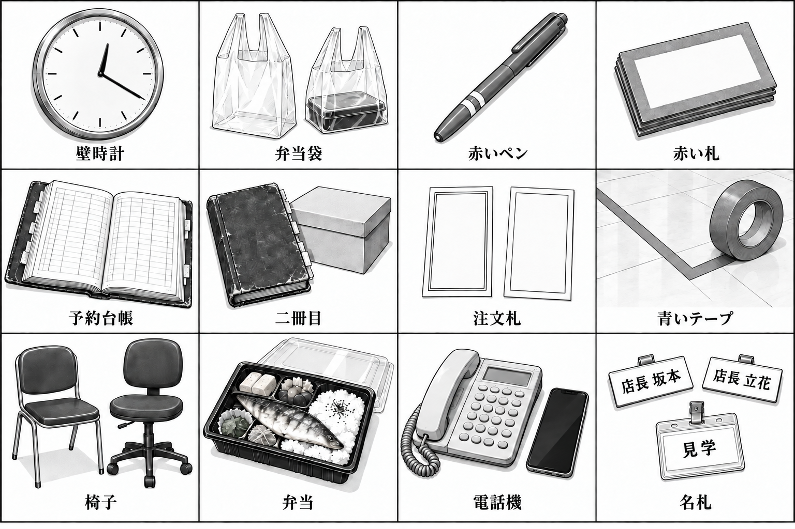

# 画風・漫画化共通ルール

内容は [作品思想](../../README.md)・[台本](../../script/README.md)、人物の外見は [character-design.md](../character-design.md)、線と画面の基準は既存REQ-01。画像の細字や生成上の誤りを新しい設定にしない。[世界観](world.md) と [小道具](props.md) の補足を併用する。


## 判型と読む順

既存REQ-01は1052×1495px、幅÷高さは約0.704。今後もA4相当の縦比率（約1:√2、幅÷高さ約0.707）を基本とする。生成時の目安は1440×2048pxなど同等比率。これは画面用の寸法目標であり、生成されたPNGを印刷用300dpi原稿と呼ばない。印刷の塗り足し・実寸校正は別工程で未実施。

ページ外周には白余白を約3〜4%、コマ間には約1〜2%の幅を目安に確保する。タイトル帯を使う場合は本文と分離する。一話一ページ、一メッセージ、主コマは4〜6。右上から左下へ、各段は右→左、次の段へ下がる。差し込みは主コマの読み順を横切らせない。

| 主コマ数 | 基本の組み方 | 使い方 |
| --- | --- | --- |
| 4 | 2段×2コマ、または上段2＋中段1＋下段1 | 一つの試行と変化を大きく見せる。 |
| 5 | 上段2＋中段2＋下段横長1 | 最後の受渡し・返答を決めゴマにする。 |
| 6 | 3段×2コマ | REQ-01型。状況、問い、行動、結果を順に見せる。 |

決めゴマは原則一つ、ページ面積の約1/4〜1/3を目安にする。大きな表情だけでなく、手が次の人へ道具を渡す瞬間に使う。本文の情報量に合わせて台本のコマを調整したら、何を分割したか生成ログへ残す。多数の出演者を一コマで全員発話させず、話す二人と聞く人の反応に分ける。

## 線・黒・トーン

日本の少年漫画の白黒線画＋スクリーントーン。人物は全員成人、職場での体格と衣装を守る。顔の可愛さで幼児体型へ寄せず、眉・目線・手の動きで感情を出す。特定の既存作品・作家は指定しない。

| 線の用途 | 相対的な太さ | 1052px幅での見え方の目安 |
| --- | --- | --- |
| コマ枠・強い前景 | 内部線の2〜3倍 | 3〜4px程度。均一な枠と白い間隔。 |
| 人物と主要小道具の外輪郭 | 1.5〜2倍 | 2〜3px程度。顔・手・札が背景から分かれる。 |
| 顔・衣服の折れ・内部形状 | 基準 | 1〜2px程度。鼻や口を囲い込みすぎない。 |
| 背景の遠景・布目・細部 | 基準より細く疎ら | 約1px相当。縮小で文字に見える細線を増やさない。 |

数値は見た目をそろえる目安。生成PNGの線幅を加工で補正しない。焦点の周囲は線を整理し、速度線で食品や札の状態を隠さない。

| 濃度段階 | 主な用途 |
| --- | --- |
| 白／0% | 肌の明部、文字盤、白い札、紙、ご飯、吹き出し。 |
| 10% | 生成りエプロン、淡い服、袋の重なり、薄い壁影。 |
| 20% | 灰色カーディガン、紙の小口、金属の側面。 |
| 30% | 床の青いテープ。連続する細い帯で識別。 |
| 40% | 森の赤ペンと赤札、椅子、食品の焼き目。ペンの白帯2本は抜く。 |
| 60〜70% | 古い台帳、濃紺エプロン、暗い服。隣接物は輪郭と白抜きで分ける。 |
| ベタ／100% | 髪の影、黒い容器の縁、靴、最も深い隙間。 |

一コマの広い面は白を含め3〜4段階でまとめる。細かすぎる網点や多重の網を避け、縮小時の縞・モアレを目視する。柔らかさは白地と適度なトーンで出し、漫画本文を写真調のぼかしや油彩に置き換えない。カラーはキービジュアル・季節ボード・人物カラー設定と、制作依頼でカラーを指定した扉・表紙に用い、同じ線の上に控えめな色面を置く。人物の配色は [人物美術設定](characters.md#カラー扉表紙の共通色)を参照する。漫画本文・白黒の人物設定画・背景設定画・小道具設定画には着色しない。



## 吹き出しと効果音

以下は今後の**漫画本文**のための規則。今回の美術設定画像4枚には吹き出し・台詞・効果音を入れず、短い日本語の名前・場所名・品名だけを使う。キービジュアルの作品タイトルは依頼に明記された例外。注文番号の文字列は [小道具設定](props.md) に置く。

| 種類 | 形・配置・文字 |
| --- | --- |
| 通常の会話 | 白い楕円、細く明確な尾を本人へ。縦書きを基本に、右から先に読む。返答を質問より右へ置かない。口元を隠さない。 |
| 電話 | 軽く角張る外枠または小さな折れのある尾。尾は受話器・端末へ向ける。必要なら「水野」等の短い話者名。店長へ尾を向けて電話相手の発話と混同させない。 |
| モノローグ | 尾なしの細枠長方形。台詞と間を空け、台本にある内語だけ。説明を補う長文を足さない。 |
| 叫び・切迫した呼びかけ | 控えめな放射状の輪郭、太めの字。大きさは通常の1.2〜1.5倍程度。危機でも全員を怒鳴らせない。 |

漫画の台詞は原文の意図・謝罪・問いと返答・残る条件を保持する。短縮で意味が消えるならコマ内の余白を増やす。小道具の細字に正しい技術説明を担わせない。技術解説は物語後の補足へ。

効果音は黒一色の素直な手書き風。袋の「かさ」、台帳の「ぱた」、ペンの「かち」、ベルの「からん」は細く小さく、動作の近くへ置く。電話の「プルル」はやや角張らせ、短く反復する。強い衝撃だけ太くする。毎コマに音を足さず、無言の受渡しに白い余白を残す。実在作品の特徴的な描き文字を引用しない。

## コピーして使う共通プロンプト

次の断片の角括弧を各話の内容へ置き換える。本文モードと美術設定画モードはどちらか一方を選ぶ。画像内に指示文や変数名を描かせない。

```text
Use case: illustration-story.
日本の少年漫画。明瞭な白黒のインク線とスクリーントーン。
肌と紙の白を残し、輪郭は背景より太く、布・金属・薄い袋を描き分ける。
赤いペンも青いテープも白黒の濃淡で描く。全員成人。
特定の既存作品や作家の絵柄を模倣しない。

参照1＝manga/00-character-sheet.png：顔・髪・体格の基準。
上段左から遥・藤堂・水野・森・相原、下段左から小野寺・坂本・佐伯・蓮・立花。
参照2＝manga/pages/01-REQ-01.png：線・トーン・素材・店の目印の基準。
参照の配置・台詞・偶発的な細字を、そのまま別の話へ複製しない。
外見の正本はdocs/character-design.md。今回の出演者は［名前］だけ。
人物の服装と手の状態：［場所に応じた衣装・持ち物］。
遥の白いピンは本人の右こめかみに合計2本。森は丸眼鏡と直線ボブ。
坂本の名札は左胸「店長 坂本」、立花は「店長 立花」と首の結び布。
遥は白い丸首シャツ。店の手伝い時だけ生成りエプロン。
ENG-01の遥は昼食客でエプロンなし、森の赤ペンは鞄の中。

場所・経過月・時刻：［台本に従う］。
今回の一つの変化：［何が誰の行動で変わるか］。
連続する小道具：［札の種別と番号／袋の中身／台帳の状態／時計の針］。
時計が12:20なら長針は4、短針は12を少し過ぎる。OPS-17は正午。
屋号は「こはるキッチン」、支店は「青葉店」「駅前店」。

禁止：人物の重複・入替え、子供化、悪役顔、実在ロゴ、英語の飾り文字、
無指定の数字・日付・価格・架空コード・説明文、余分な台詞、透かし、
着色された赤ペンと青テープ、写真調、3D、後付け文字合成。
全ての絵・線・文字はimage_genで生成する。
```

漫画本文用の追加断片（今回の4画像には使わない）：

```text
縦長の一ページ。幅:高さは約0.707:1。白い外余白と明瞭なコマ間。
主コマ［4〜6］個。右上→左上→次の段、最終は左下。
コマ1［状況／話者と正確な短い台詞／小道具］
コマ2［行動／話者と台詞］
［必要なコマを続ける］
決めゴマ［番号］では［受渡し・確認・変化］を大きく見せる。
台詞は指定したものだけ。尾は正しい発話者へ。問いを返答より先に読む。
試験用番号と実注文番号を分け、同じ一件は札・画面・控えで一致させる。
```

美術設定画用の追加断片：

```text
漫画ページではなく［小道具設定画／制服設定画／背景ボード］。
画像内の文字は次の短い日本語ラベルだけ：［許可する文字の完全な一覧］。
台詞・効果音・説明文・数値・日付を追加しない。
白い余白を取り、全形と素材が分かる大きさで並べる。
［カラー指定がある場合だけ：同じ漫画のインク線を保持し、控えめな色面を使う。］
```

## 参照の渡し方と検査

1. 台本の時期・出演・物の状態を読む。参照画像は画像ビューアで開いて確認する。
2. 上記2枚を実際の画像入力として渡す。パスの文字列をプロンプトへ書くだけで参照した扱いにしない。小道具の形が必要なら該当設定画も加え、画像ごとの役割を明記する。
3. 新規画像では参照は外見・画風用と明記する。修正時は「参照1＝修正対象」「参照2＝人物基準」などに番号を付け直し、変える点と保持する点を具体的に書く。利用中の組み込みツールの画像参照引数にローカルパスを渡す。
4. プロンプト全文を `art/prompts/<画像名>.txt`、修正は `<画像名>-revision1.txt` 等へ保存。担当ログは `art/log-<担当>.json`。この総論担当は `art/log-world.json` のみ編集し、共有generation-logへ書かない。
5. `image_gen` の生成元を `~/.codex/generated_images/` から担当の保存先へそのままコピー。Pillow・matplotlib・SVG・HTML等で描画・文字追加・合成・グレースケール変換・切抜き・リサイズをしない。ファイルコピーと寸法確認のみ可。
6. 自分で生成画像を見て、人物の取り違え、髪留めと眼鏡、衣装、時計、袋の箱数、文字、濃淡、読む順、札の前後を確認。設定矛盾や大きな崩れがあれば画像生成で修正する。再生成は1画像につき最大2回。
7. ログには参照・全試行のプロンプトと元パス・採用先・寸法・再生成回数・目視結果・残る不具合を残す。上限後の不具合を隠さず、文書の正本を画像に合わせて改変しない。担当外のファイル編集とgit commitはしない。

今回の4画像はすべて組み込みツールによる生成。完成画像は [世界観](world.md) と [小道具](props.md) に埋め込み、採用結果は [担当ログ](../../art/log-world.json) に記録する。
