# 連載版 v2 作画仕様

制作・目視確認：2026-09-24（日本時間）。

標準画風は **E案**。F案はディレクターが指定したページで、効果線とデフォルメの強度を上げるために使う。人物10枚、集合ラインナップ1枚、表情ガイド1枚、無人背景5枚の計17枚を収録する。これは本文制作の参照資料であり、時計などの個別課題を含む画像を無修正の入稿原稿として扱わない。

正本の優先順は今回のディレクター指示、[人物外見](../character-design.md)、[人物美術の文章設定](characters.md)、[間取り](locations.md)、[連載方向性](../serial/direction.md)。旧資料の「旧画像を常時参照」「表情6種」「設定画の名札は名字だけ」は今回適用しない。全身三面と表情8種、名札「店長 坂本」「店長 立花」を使う。身長は人物美術の作画用目安であり、原作で確定した数値ではない。

## E標準とF強調

| 用途 | 指定と使い方 |
| --- | --- |
| 通常会話、説明、観察、静かな決断 | E。太細のある主線、黒ベタ、広い紙白。眉・瞼・口・手の変化を中心に、効果線は短い束に限定 |
| 昼ピークの熟練した手、見せ場、逆転 | 指定ページだけFまで強調可。主動作を大きくし、効果線・少数の残像・口と瞼の変形を強める。手と道具の位置を読み取れることを優先 |
| 客の損失確認、困惑、誠実な謝罪 | E。怒りマーク、嘲笑、落としのギャグを重ねない。静かな山場を効果線だけで騒がしくしない |
| 設定画と背景資料 | E。表情ガイドのギャグ枠だけ強い変形例。無人背景には速度線や擬音を焼き込まない |

ページの制作指示に `画風強度：E標準` または `画風強度：F強調（対象：手元／表情、理由：昼ピーク等）` を明記する。F指定のないページはEとする。Fでも顔幅、年齢差、髪型、衣装、識別点、家具配置は固定する。次ページにFを自動で持ち越さない。比較資料は [第2ラウンド所見](../craft/art-style-round2.md)。

## 共通画風プロンプト最終版・全文

元の [final-style-prompt.txt](../../art/style-tests/round2/final-style-prompt.txt) を基に、参照許可範囲、E/Fの運用、8表情、無人背景を更新した。コピー用の同一全文は [common-style.txt](../../art/v2/prompts/common-style.txt)。個別生成では他人物の小道具が混入しないよう、共通の人物例を対象人物の指定へ差し替える。実際に送った全文は各画像のプロンプトおよび [log.json](../../art/v2/log.json) が正本。

```text
Use case: illustration-story
日本の週刊少年誌向けのオリジナル白黒漫画。成人の仕事と成長を、力強いペン線・黒ベタ・表情・動く手で読ませる。特定の漫画家・作品を模倣しない。

【線と黒：第2ラウンドE案を基準】
外形線は内側線の約3〜5倍を目安に太く、一筆に細い入り・力のある胴・鋭い抜きをつけるGペン線。線数は少なく、わずかな揺れと局所的なかすれで筆勢を残す。目鼻口・手指・背景の内部は細い線。髪と濃色エプロンと最深部の影を、大胆で連続した真っ黒の面にする。髪は艶なしの黒いシルエット、毛束は外形を主にして示す。顔・手・顔の背後には広い白い紙を残す。画面全体の半分ほどが紙白の印象。淡色の衣装を黒ベタへ変更しない。

【陰影と背景】
肌とPCの天板は紙白。中間調は服の限られた箇所へ均一な可視の網点一段。深い折り目だけ短いハッチングか局所的カケアミ。背景は線で描き、焦点の近くの重要な道具に描き込みを集める。場面で列挙された背景だけを描き、顔や手の後ろは白く空ける。空棚・袋の口・行列の経路を人物や文字で埋めない。紙の端まで白さを保つ。小物全面の反射や細密な木目を足さない。

【顔と演技】
顔は少年漫画としてやや記号化。簡潔な鼻、大きく読める目と眉、強い一筆の上瞼。通常は成人の頭身から軽く圧縮する程度。感情に応じて眉・瞼・瞳・口・顎・肩・手指を連動させ、強い感情では口形と瞼をはっきり変える。表情が変わっても髪型、前髪の分け目、顎の基形、固定の目印と年齢差は保つ。
静：目の停止、上がった肩、道具を握る指で緊張を見せる。必要なら汗一粒と短い縦線、顔の背後に短い集中線。謝罪は口を閉じて相手へ重心を下げる。
動：主要な手と道具を大きく、動作経路に短く鋭いスピード線。主動作の両手を明瞭にし、残像は少数の途切れ線。誰が何を袋へ入れているかが先に読める。
表情：悔しさは眉を寄せて歯を食いしばる。ひらめきは眉と顎を上げ目が開き、人差し指と小さな閃光記号。慌てるギャグ顔は白い楕円の目と小さな瞳、大きく崩した口、汗と額の縦線。成人の首と肩、同じ髪型を保持する。

【効果線と描き文字】
効果線は焦点へ短い束で集める。手描きの描き文字は筆圧・揺れ・かすれを持ち、物と動作のすぐ近くに置く。複数の音は重要度に応じて大きさを変える。静かな時計の「カチ」は小さく、超速の手元の「シュババッ」は大きく、袋の「パサッ」と電話の「プルルル」は発生源に結びつける。漫画記号は感情の原因に合わせる。青線は黒インクの縦線で示す。客の困惑や誠実な謝罪を嘲笑・威嚇の記号に変えない。

【人物の固定項目】
各場面の人物設定を必ず追記し、年齢感・顔幅・体格・髪型・衣装・目印・小道具を守る。
遥：20代前半の小柄な成人、短い襟足ポニーテール、本人右こめかみの白ピン2本（正面では画面左）。白丸首シャツ、薄灰の袖まくりカーディガン。店の手伝い時は紙白の生成り胸当てエプロンと大きな角ポケット。見学時は「見学」の証。店長名札を付けない。
坂本：40代後半、大柄で太い腕と首、短い角刈りとこめかみの白髪、太い眉。白半袖ポロ、黒ベタの濃紺エプロン、本人左胸の白い横長名札「店長 坂本」。
佐伯：30代前半、肩までのゆるい内巻き・横分け、柔らかい頬と丸い顎。薄いブラウスと淡いカーディガン、膝下スカート、左腕時計、肩掛けバッグ。普通に困った客の目と口を描く。

【文字と構図】
台詞は指定の文字列を保持し、白い吹き出しへ読みやすく配置。右から左の読み順、尾は正しい話者へ。吹き出し全周を画面内に収め、顔・手・時計・袋を隠さない。指定外の看板や説明文は足さない。各コマで、まず表情、次に動く手と重要な道具、最後に必要な背景が読める配置にする。

【使わない仕上げ】
光沢のある髪、帯状ハイライト、滑らかなグラデーション、エアブラシ、CGライティング、3D的な陰影、発光、ぼかし背景、ビネット、全面の粒状汚し、均一なベクター輪郭、全員共通の美形顔・微笑・赤面。

【場面ごとの追記】
場所と時刻／登場人物の外見設定／行動と視線・眉・口・手／読み順と構図／重要小道具の状態／正確な台詞・描き文字／残す背景の限定列挙。
参照画像は round2 の E/F と art/v2 の画像のみ。旧 art/characters、art/backgrounds、manga 以下や第1ラウンド画像は渡さない。E-2/E-3は線・ベタ・表情の基準。人物の外見は文章と該当するv2個人設定画、場所はv2背景を優先し、E/Fに偶然描かれた家具配置は移さない。

【連載版v2の強度】
標準はE。Fへの強調はディレクターが指定したページだけ。昼ピーク、見せ場、逆転ではF-2/F-3を効果線と口・瞼の変形量の参考に加えてよい。顔立ち、髪型、衣装、識別点、手と道具の関係はEおよびv2から固定する。通常会話、説明、謝罪、客の損失確認へ強い集中線やギャグ顔を常用しない。

【設定画と無人背景】
個人設定画は全身の正面・本人右側から見る横・背面と表情8種。表情は通常／笑い／怒り・悔しさ／驚き／困惑・焦り／真剣・集中／悲しみ・落ち込み／ギャグ顔デフォルメ。顔の基本形と成人の首・肩は保持する。表情ラベル、氏名、身長、指定された目印の説明を読みやすく置く。場面のない設定画では擬音や物語の台詞を加えない。背景は無人、映り込みや人影もなし。白い壁と床を広く残し、金属・ガラスも線と限定した網点で表す。蓮の明るい茶髪だけは均一な薄い網点で区別し、黒髪へ変えない。赤いペンや青線は着色せず、ペンはクリップと軸の白帯2本、青線は黒い縦線とする。
```

## 禁止事項と固定項目

- 旧 `art/characters/*.png`、`art/backgrounds/*.png`、`manga/` 以下、および第1ラウンドの画像を参照入力にしない。旧文書から継承するのは外見・衣装・間取りの文章設定。
- 滑らかなグラデーション、CG光沢、髪と金属の帯状反射、エアブラシ、発光、ぼかし、ビネット、全面の粒状汚しを加えない。人物を全員同じ顔・微笑・赤面にしない。
- 遥の白ピン2本は本人右こめかみ。正面では画面左。三面図や参照を鏡像反転して左右を作らない。生成りエプロンを黒くしない。オフィスでは外す。見学証は見学時だけで、手伝い時の常設名札にはしない。
- 店長は坂本と立花。名札を本人左胸に置く。立花の首布は細い結び布。藤堂は長方形眼鏡、森は丸眼鏡。佐伯の時計は本人左腕だけ。
- 森の赤ペンは白黒では中濃度の軸・白帯2本・クリップ。連載第1話では黒鉛筆、第2話から赤ペン。札の番号や顧客情報を設定画から流用しない。
- 第1話の背景に青い床テープ、新しい予約システム用の本番端末を足さない。従来レジと持込の試作PCを区別する。会議室の持込PCは本番稼働の証拠ではない。
- 予約台帳は同じ一冊。カウンターと事務机は別時点。カウンターで使った後に事務机へ戻す。二冊の原本が同時に存在する描写にしない。
- 背景のカメラを動かしても方角と家具配置は動かさない。無人画像へ人影・鏡像の人物を加えない。
- 描画・合成・切り抜き・リサイズ・色調変更・文字後付けはプログラムで行わない。今回の納品PNGは組み込み image_gen 出力の無加工コピー。

## 参照画像の渡し方

ローカル画像は先に開いて確認し、各入力の役割をプロンプトへ書く。`referenced_image_paths` は今回の組み込みツールでは最大5枚だった。関係のない画像を大量に渡さず、以下のように選ぶ。各入力に人物の同一性・画風・配置・演技のどれを担当させるかを明示し、採用候補の局所的な誤りは継承しない。

| 場面 | 入力する画像と役割 |
| --- | --- |
| 新しい人物設定画 | E-2/E-3＝線・ベタ・表情、遥v2・坂本v2＝同じ連載の基準。対象人物は文章で厳密指定。今回の遥と坂本の初回はE-2/E-3だけ |
| 青葉店の遥と坂本、静かな会話 | 遥個人、坂本個人、背景02、E-3。必要なら表情ガイドを5枚目にする。背景02は配置だけ、時計と厨房設備の細部は後述の注意を適用 |
| 欠品に困る佐伯、謝罪 | 遥個人、坂本個人、佐伯個人、背景02、E-3。佐伯の普通の困惑を優先し、ギャグ顔を渡さない |
| 昼ピークの見せ場 | 遥個人、坂本個人、背景02、F-2、表情ガイド。F-2は速度と効果だけ。家具・時計・行列の配置をF画像から移さない |
| 強い表情を見せるページ | 対象の個人設定、表情ガイド、E-3。F指定時だけF-3を追加。Fを顔の同一性の参照にしない |
| 厨房での観察・仕込み | 登場する個人設定＋背景03＋E-2。背景03の北の加熱、西の洗い場、東の冷蔵庫と棚、東手前通路を固定 |
| 営業後の電話・台帳の照合 | 登場する個人設定＋背景04＋E-3。台帳の見出しは坂本個人の拡大小道具も参照 |
| 第1話末の本部 | 蓮個人、小野寺個人、ほかの登場人物の個人設定、背景05。5枚を超えるときは集合画で人数・並びを補い、主要な顔は個人画を優先 |
| 店への導入 | 背景01＋E-2。店名、のれん、左扉と右窓を固定。人物のいないカットなら個人画は不要 |
| 集合や遠景 | 集合画で人数とシルエットを確認し、顔の近い人物は個人画を追加。正確な身長は下の数値表を追記 |

渡す例：`入力1＝遥の同一性、入力2＝坂本の同一性、入力3＝青葉カウンターの配置、入力4＝F-2の手元効果のみ。遥の本人右に白ピン2本。時計は短針12を少し過ぎ、長針4。背景参照の余分な針は描かない。`

## 表情ガイドの使い方

[表情ガイド](../../art/v2/characters/00-expression-guide.png) は8感情×2人の16顔。上段は通常／笑い／怒り・悔しさ／驚き、下段は困惑・焦り／真剣・集中／悲しみ・落ち込み／ギャグ顔。各人の個人設定画も同じ順で4列2段になっている。

感情名だけでなく、眉・目・口と発生原因を指定する。「驚き」は急な認知で目と丸い口が開く。「焦り」は困り眉・汗・額の縦線と手の遅れ。「真剣」は視線が固定し口を結ぶ。「悲しみ」は目を伏せ口角と肩が下がる。「ギャグ」は白い目・大きく崩れる口・汗で、一時的に強く変形する。怒りマークは相手を悪役化する記号にせず、自分の早合点への悔しさなど原因を限定する。

チャート下の人物名ラベルは説明用で、衣装の名札の代わりではない。坂本の本文名札は常に「店長 坂本」。チャートの遥の焦りとギャグは似た口形が残るため、本文では焦りの瞳を保ち、ギャグだけ白目と口の変形を一段強める。青線は黒い縦線で、青く着色しない。

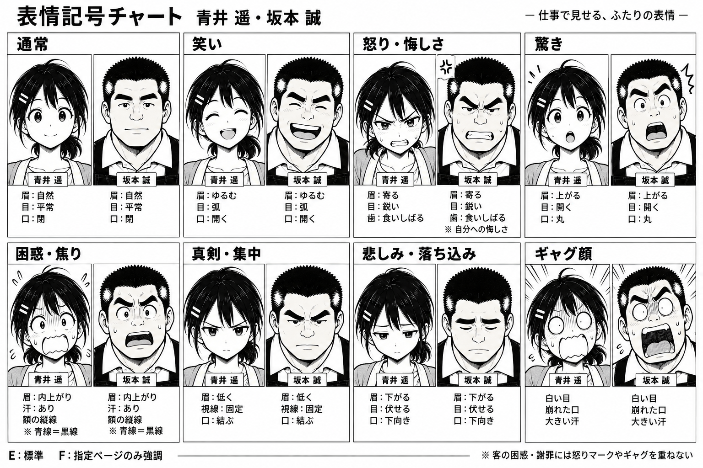

## 集合ラインナップと身長

| 人物 | 身長目安 |
| --- | ---: |
| 青井遥 | 156cm |
| 藤堂直人 | 182cm |
| 水野真紀 | 165cm |
| 森理沙 | 162cm |
| 相原健太 | 178cm |
| 小野寺恵 | 164cm |
| 坂本誠 | 180cm |
| 佐伯真帆 | 160cm |
| 真柴蓮 | 174cm |
| 立花千夏 | 166cm |

集合画は同じ床に10人を並べた外形確認用。数cmの差を測る図にはしない。遥と佐伯、相原と坂本などの差は図よりこの表を優先する。小野寺の顔と立花の細い結び布は個人画が優先。

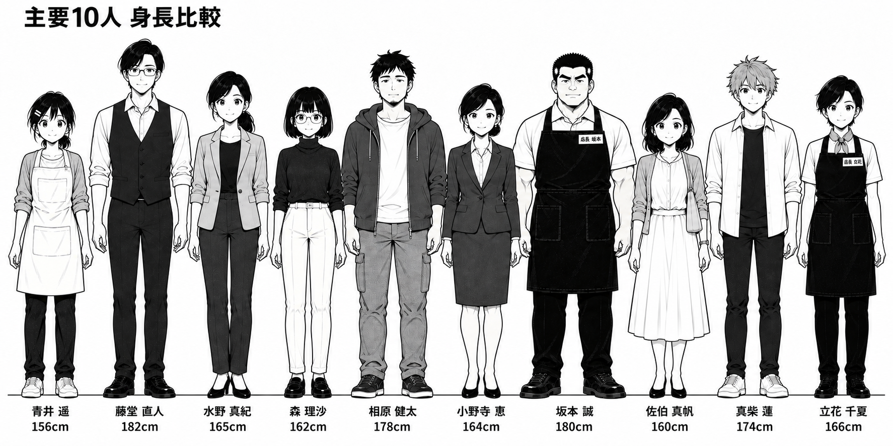

## 個人設定画10枚

各画像は全身正面・右側面・背面と8表情、小道具。全員成人。横図は原則として本人右側から見て鼻が画面左へ向く。右側面では奥の左胸名札・左腕時計を無理に表へ移さない。

### 01 青井遥

全身三面・表情8種、右こめかみの白ピン2本を正面・右側面・8表情で確認。誤ったペンは解消。短い白抜き毛束と薄い頬線は残る。

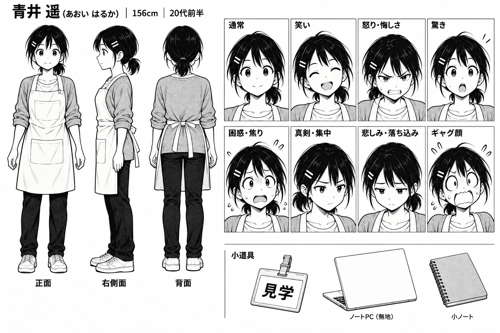

[採用プロンプト](../../art/v2/prompts/01-aoi-haruka-r1.txt)。再生成1回。

### 02 藤堂直人

三面・8表情、細い長方形眼鏡、長身細身、開襟シャツ・ベストを確認。薄いファイルの中の図は閉じた状態では見えない。髪と靴に細い白抜き線が残る。

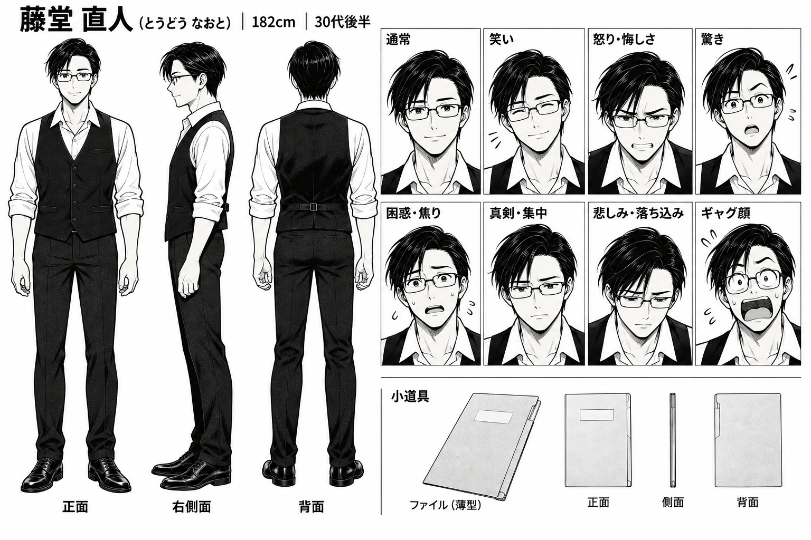

[採用プロンプト](../../art/v2/prompts/02-todo-naoto.txt)。再生成0回。

### 03 水野真紀

三面・8表情、長いポニーテール、明るいジャケットと黒インナー、眼鏡・ピンなしを確認。頬線と若めの目の表現が残る。

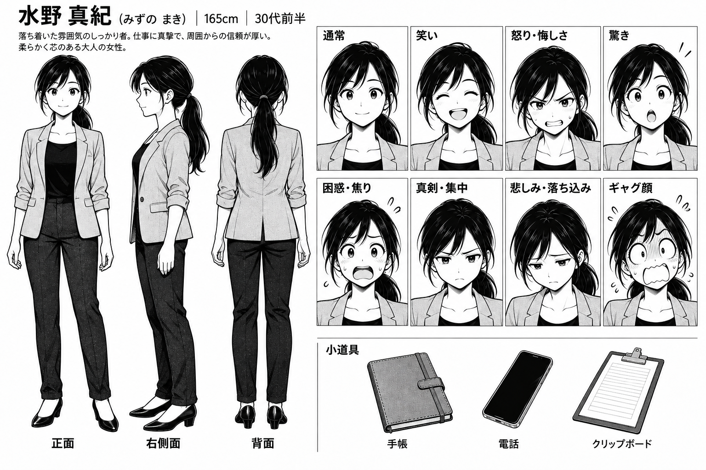

[採用プロンプト](../../art/v2/prompts/03-mizuno-maki.txt)。再生成0回。

### 04 森理沙

前髪と顎までのボブを直線寄りへ修正。三面・8表情、丸眼鏡、白帯2本とクリップ付きペン、第1話の黒鉛筆を確認。通常目はまだ丸め。

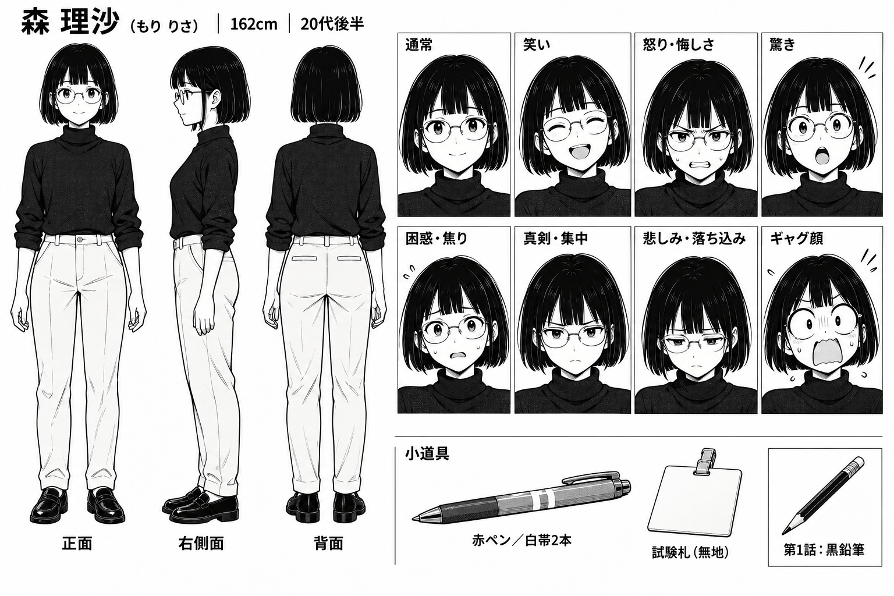

[採用プロンプト](../../art/v2/prompts/04-mori-risa-r1.txt)。再生成1回。

### 05 相原健太

三面・8表情、肩幅、パーカー、顎髭、半開きの通常目を確認。真剣顔の開眼は控えめ。

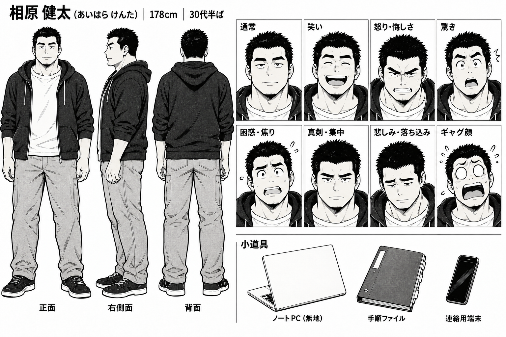

[採用プロンプト](../../art/v2/prompts/05-aihara-kenta.txt)。再生成0回。

### 06 小野寺恵

三面・8表情、低いシニヨン、丸い耳飾り、膝丈スーツ、役職、比較資料と印を確認。通常目と輪郭は成熟寄りに改善、40代の年齢差はまだ控えめ。再生成上限2回到達。

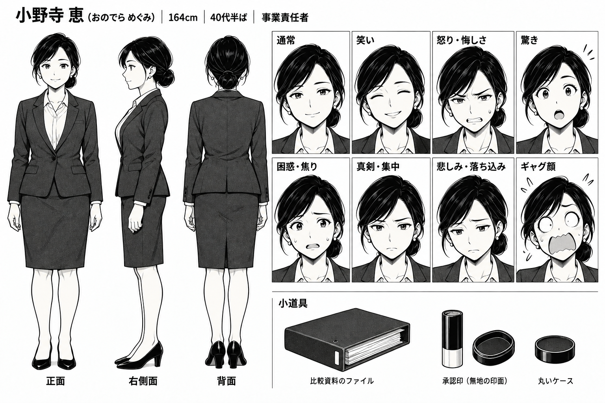

[採用プロンプト](../../art/v2/prompts/06-onodera-megumi-r2.txt)。再生成2回。

### 07 坂本誠

三面・8表情、太い腕と首、角刈りの白髪、本人左胸の店長 坂本を確認。黒ベタ主体、CG階調なし。

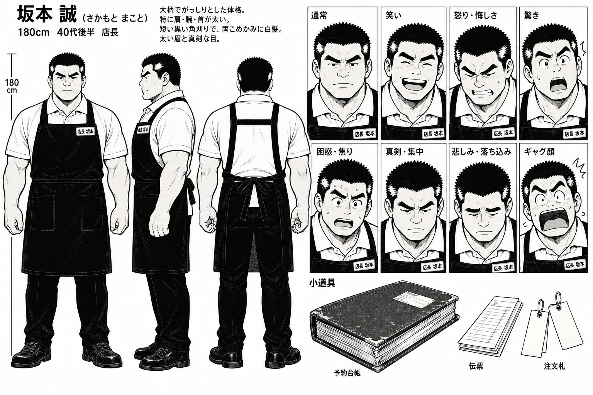

[採用プロンプト](../../art/v2/prompts/07-sakamoto-makoto.txt)。再生成0回。

### 08 佐伯真帆

三面・8表情、内巻き髪と膝下スカート、正面と背面の左腕時計・右側面の時計非表示、拡大12:20を確認。正面の肩バッグが不鮮明で側面・背面を優先。再生成上限2回到達。

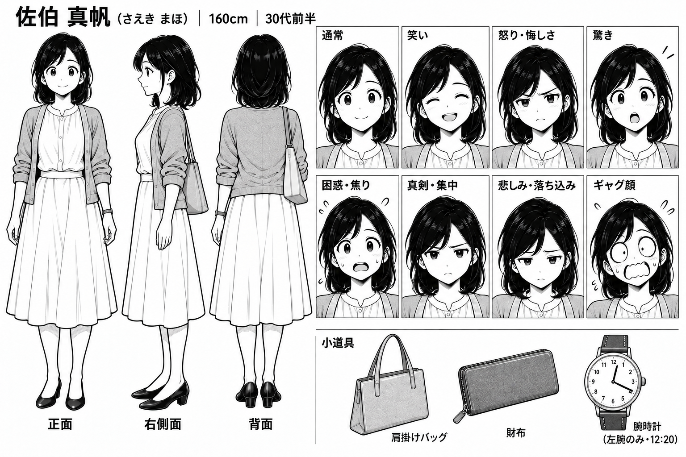

[採用プロンプト](../../art/v2/prompts/08-saeki-maho-r2.txt)。再生成2回。

### 09 真柴蓮

三面・8表情、明るいトーン髪と短い跳ね、白シャツ黒T、無地PC・札・お茶を確認。

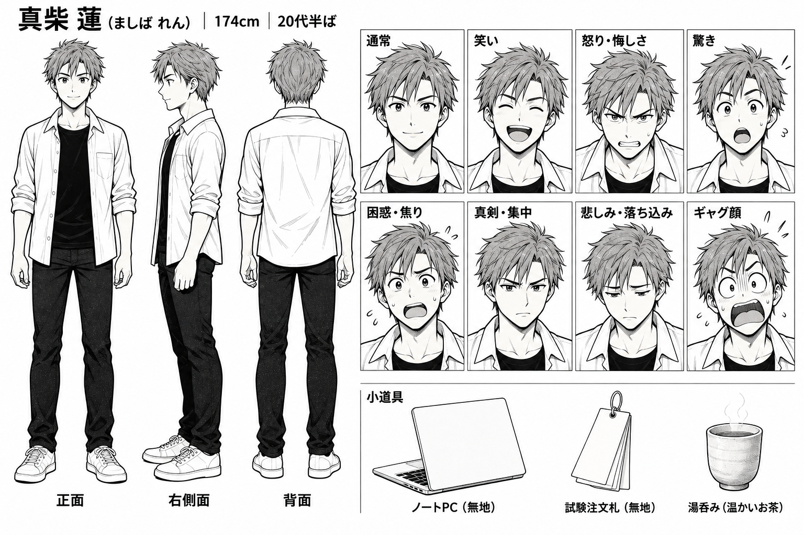

[採用プロンプト](../../art/v2/prompts/09-mashiba-ren.txt)。再生成0回。

### 10 立花千夏

三面・8表情、短いピクシー、結び布、店長 立花、制服と細い腕を確認。耳の見える範囲は表情角度で変わる。

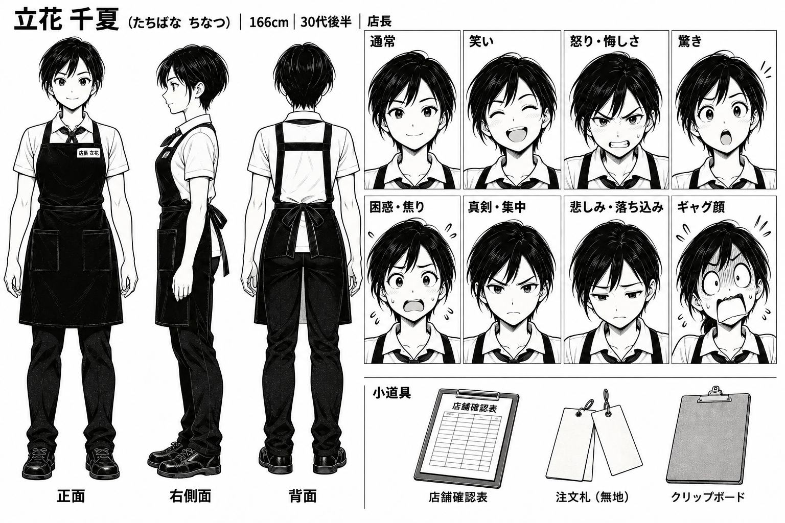

[採用プロンプト](../../art/v2/prompts/10-tachibana-chinatsu.txt)。再生成0回。

## 第1話用の無人背景5枚

青葉店は南に客だまり、中央に東西カウンター、その北にスタッフ通路。北寄りの間仕切り壁には西から厨房口、予約棚、棚のすぐ東の時計、事務通路口が並ぶ。厨房は北西、事務の隅は北東。背景01〜04はこの一店舗の別アングル。背景05の本部は原資料の「06 本部会議室」と同じ場所で、v2納品番号だけ05となる。

### 01 青葉店外観

初月の昼。南から北を見る。正面左が唯一の客入口、右が大窓。看板「こはるキッチン 青葉店」、のれん「こはる」、上階の住宅窓と手すりを固定。

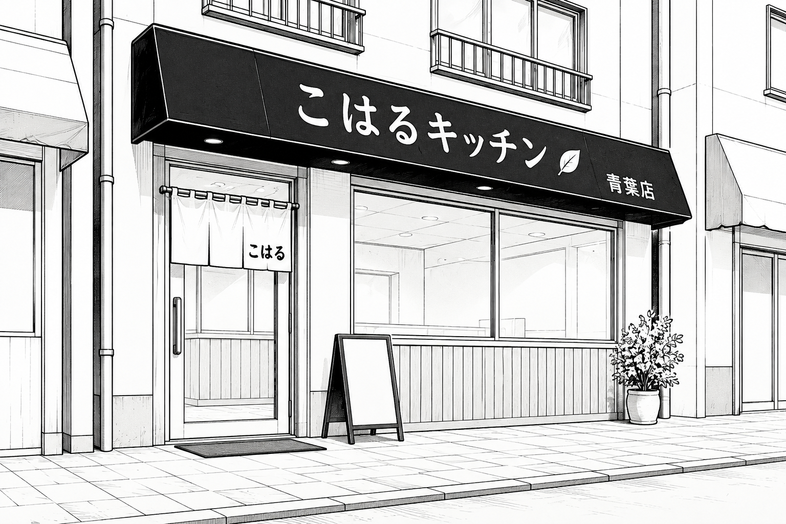

[採用プロンプト](../../art/v2/prompts/bg-01-aoba-exterior.txt)。再生成0回。

### 02 青葉店カウンターと予約棚と壁時計

初日の12:20を意図した空棚の配置資料。南の客側から北を見る。**時計には上向きの線が2本あり、短針角度もずれる。12:20の完成時計として流用しない。** 本文では長針4・短針12を少し過ぎる位置を指定する。再生成上限に達したため、今回は間取り参照として保存。厨房奥の設備は本画像の端の描写より背景03を優先。台帳の記入方向はスタッフ側と文章で固定する。

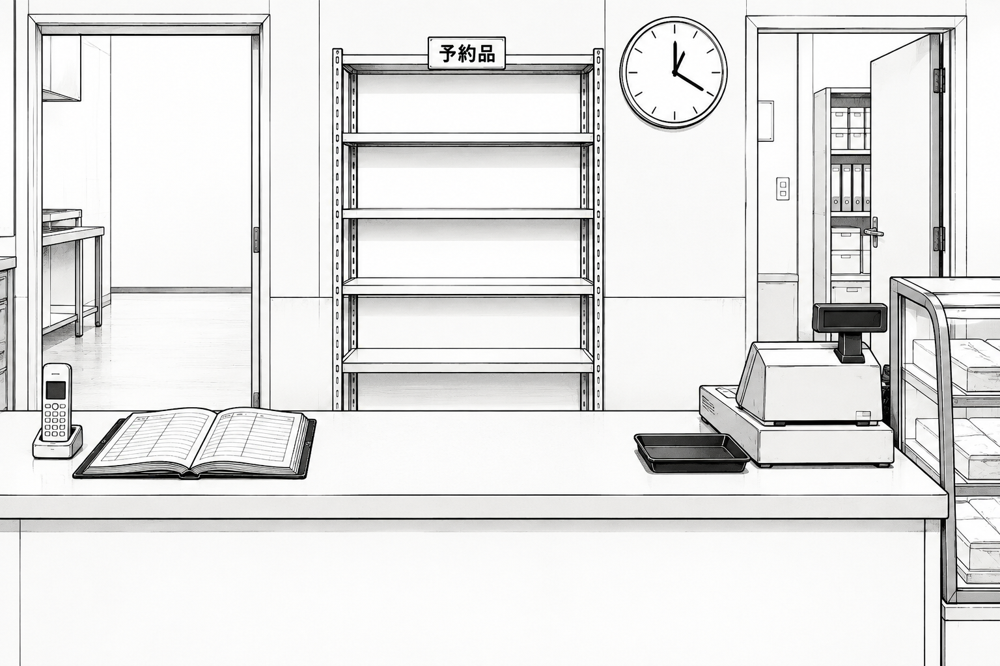

[採用プロンプト](../../art/v2/prompts/bg-02-aoba-counter-r2.txt)。再生成2回。

### 03 青葉店厨房

初月の昼、南の厨房口から北を見る。北の換気フードと加熱、西の洗い場、東の冷蔵庫と容器棚、中央の台、東手前の事務接続を固定。2回目の再生成でボウル・天板・鍋の帯状反射を除いた。

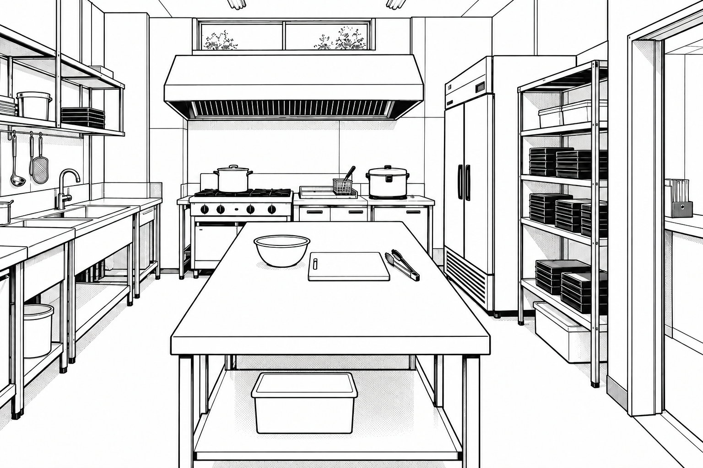

[採用プロンプト](../../art/v2/prompts/bg-03-aoba-kitchen-r2.txt)。再生成2回。

### 04 青葉店バックヤード事務机

初日の昼営業後の聞き取り・照合。南西から北東を見る。台帳はカウンターから戻した同じ一冊。北の高窓下の机、左の電話親機、右の伝票トレー、東の棚と勤務表、西の裏方通路を固定。台帳の見出しはこの画像では弱いので坂本の設定画を補助にする。

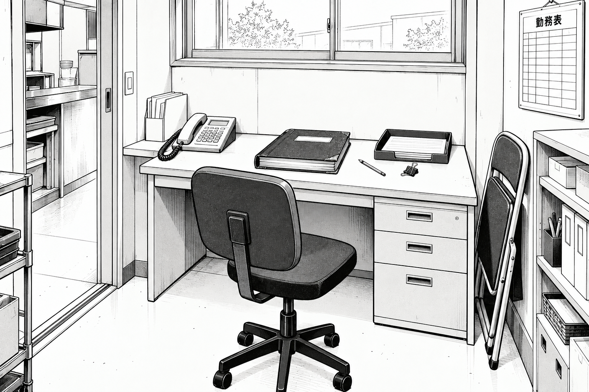

[採用プロンプト](../../art/v2/prompts/bg-04-aoba-back-office.txt)。再生成0回。

### 05 こはるキッチン本部会議室

第1話末の午後。原資料の2か月目の室内配置を保ち、時期と机上資料だけ連載第1話へ合わせた。北に白板、東に窓と低い収納、西に資料棚・電話・時計、南西に入口。南北の長机と8脚。画像の時計は15:00になっているが台本の確定時刻ではない。本文の指定に合わせて針を生成し直す。

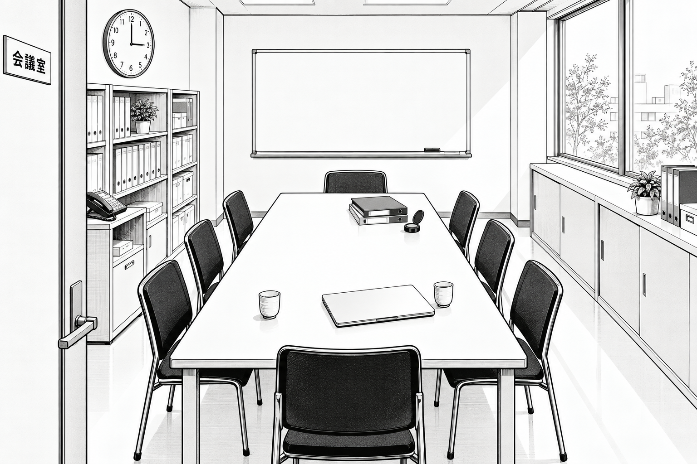

[採用プロンプト](../../art/v2/prompts/bg-05-honbu-meeting.txt)。再生成0回。

## 制作記録と残る課題

すべて組み込み image_gen。画像生成成功29回、採用17枚、再生成12回。各画像は初回＋再生成最大2回。別に、集合画で参照10枚を渡した呼び出しが入力上限5枚で生成前に失敗した。この1回は画像生成数・再生成数に含めない。ツール呼び出し総数は30回。

| 再生成回数 | 画像 |
| --- | --- |
| 2回 | 小野寺、佐伯、集合ラインナップ、カウンター、厨房 |
| 1回 | 遥、森 |
| 0回 | 藤堂、水野、相原、坂本、蓮、立花、表情ガイド、外観、事務机、本部会議室 |

プロンプトは [art/v2/prompts/](../../art/v2/prompts/)。採用・不採用の出力元、実際の入力画像、理由、PNG寸法、SHA-256は [log.json](../../art/v2/log.json)。不採用画像は生成元に残し、納品先のPNGには採用候補だけを置いた。生成元パスの画像を参照した場合も、すべてこのタスク内のv2生成物である。

残る課題を本文制作へ引き継ぐ。

1. カウンター時計は配置参照専用。12:20の重要なコマで余分な針と短針角度を継承しない。
2. 集合画の身長は近似。数cm単位の順位・比率は数値表を使い、立花の布と小野寺の顔は個人画を参照する。
3. 小野寺の40代の年齢感は改善後も控えめ。森の通常目も丸め。本文では成熟した輪郭・瞼、落ち着いた視線を維持する。
4. 一部の髪の短い白抜き線、薄い頬線、靴の小さい反射が残る。CGの滑らかな陰影へ拡大しない。背景の線は人物より整っており、本文では人物の主線を背景より太くする。
5. 佐伯の正面の肩バッグ、事務机の台帳見出しは不鮮明。佐伯の側面・背面と坂本の拡大小道具を優先する。
6. 17枚とも画面で目視した。印刷校正や本文ページでの実寸確認はしていない。網点を含むPNGは1 bit原稿ではない。

生成元と納品PNGのバイト同一性をSHA-256で確認。プログラムは文書・ログ作成、ファイルコピー、PNGヘッダ読み取りとハッシュ照合だけに使用した。編集範囲は `art/v2/` と本書だけ。git commit は行っていない。
