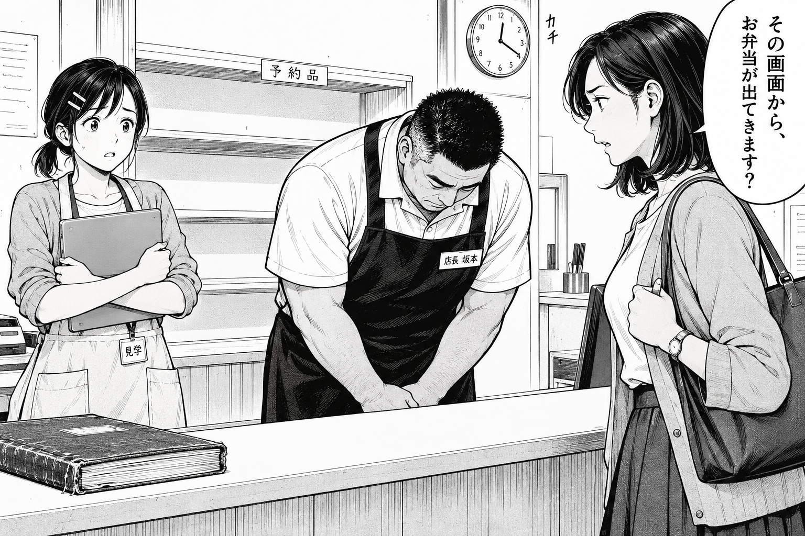
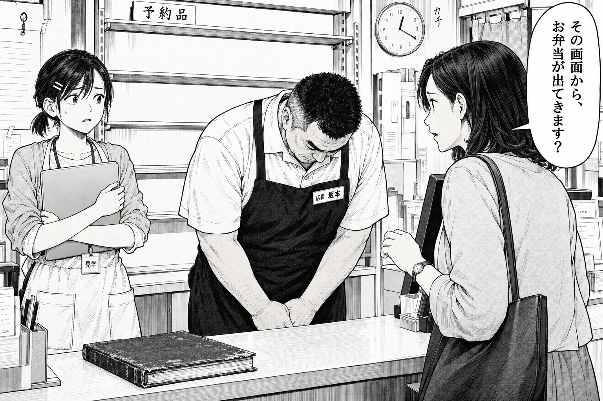
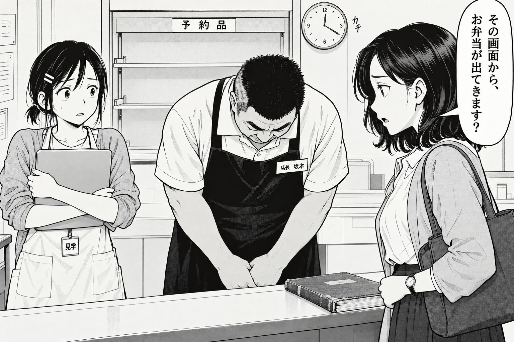
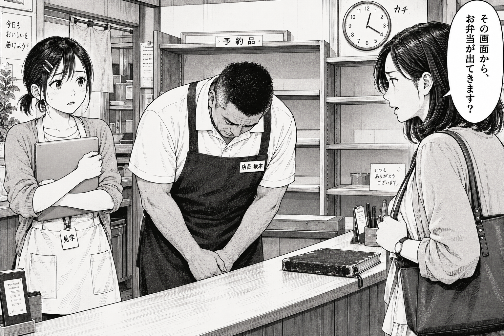

# 調査R3：手描きの少年誌タッチと画像生成での再現

調査・画像確認・生成日：2026-09-23（日本時間）。対象は『こはるキッチンの開発日誌』。本稿の「手描き感」は生成画像の見え方を指し、制作工程が手描きだったという意味ではない。資料で確認した事実、既存画像の目視所見、本作向けの提案を区別する。少年誌の画風は多様であり、以下を全誌共通の正解や採用基準とはしない。

## 1. 調査の結論と判断基準

4案の推奨は**C（太い省略線）**。白場と人物の分離が最も明瞭だった。佐伯の髪の光沢などは残るため、Cの省略を基準にした新共通プロンプトを第6節に提案する。

本作の改善対象は、線の質感だけでなく、**「どこを見るか」「誰が何に困っているか」を白黒と身体で伝えること**である。細部の追加より、顔・手・空棚に情報の優先順位を付ける。佐伯の問いを悪意に変えず、坂本の謝罪と遥の言葉を失う瞬間を異なる姿勢で示す。[作品思想](../../README.md)の「悪役を作らない」「知識より先に出来事を読む」を作画でも守る。

少年誌の一次資料では、週刊少年マガジン第111回新人漫画賞の『NOVA ROCK！』講評で、佐藤友生が表情・動き・背景の影による演技を評価している。同ページの編集部講評も絵と演出、人物が生き生きしていることを評価している。これは本作の評価軸を「精密さ」だけにしない根拠になる。ただし、個別作品への講評であり、公式の統一採点表ではない。[S1]

大今良時のインタビューは、映る物の量で場面の重さを調整し、小道具で感情を伝える実践を示す。そこから本作では、全コマに同じ厨房の密度を与えるのではなく、空棚・閉じたPC・古い台帳のうち、その瞬間に必要な物を選ぶと提案する。[S2]

## 2. 手描き白黒原稿を構成する要素

以下の技法説明は出典S3〜S9、本作の使い分けは本調査の提案。グラデーション、端正な顔、均一線はそれ自体が欠陥でもAIの証拠でもない。今回避けたいのは、これらが全場面・全素材に一様に現れ、芝居の差を弱める状態である。

| 要素 | 技法と読む上での働き | 本作で指示する形／避ける形 |
| --- | --- | --- |
| Gペン・入り抜き | 筆圧や角度で線幅が変わる。入りから胴で力をかけ、抜きで細くするなど、一筆の変化が輪郭に重さを作る。すべての線を両端とも尖らせる必要はない。[S3][S4] | 坂本の肩・PCを握る手の外周を強く、遥の口元を細く。すべての輪郭を一定幅で囲まない。 |
| 丸ペン | 細線や背景に使う。製品・筆圧で性質が異なり、「Gペンなら太線しか出ない／丸ペンなら強弱が出ない」という区分ではない。[S3][S4] | 佐伯の瞼、遥のピン2本、棚の金具を細く。小物の細線を人物の外輪郭と同じ重さにしない。 |
| ベタ | 黒のまとまりと紙白を先に設計する。黒を増やすだけでなく、白く残す場所との関係で像を分離する。[S5] | 坂本の濃色エプロンと遥の髪を黒の支点にし、空棚と顔の周囲を白く残す。黒面の内部に細かな反射を大量に足さない。 |
| ハッチング・カケアミ | 一方向の線束で陰影を作るハッチング、方向を交差させるクロスハッチング／カケアミ。方向・間隔・重なりを変えて面や陰影を表す。[S6] | 謝罪で曲がった坂本の袖・台帳の擦れに限定。肌全面や白い壁を同じ網掛けで埋めない。 |
| スクリーントーンの網点 | 規則的な点の集合で中間の濃さを表す。網点の細かさと濃度は別の指定。デジタルでもトーン化・削りを行える。[S5][S7] | 薄灰カーディガンは淡い一段、影は必要ならもう一段。線数だけを指定して物理的な印刷品質を保証できるとは考えない。 |
| トーンの削り | トーンの一部を削って白を出し、輪郭・光・質感を変える。手描き原稿にもグラデトーンはある。[S5][S7] | 棚の縁や袖の一部を短く抜く。全画面を滑らかな灰色で包む処理と区別する。 |
| ホワイト | はみ出した線の修正にも使う白い材料。[S3] 本作では黒面を分ける少数の白線としても扱う。 | 髪の短い白抜き、ピン2本、台帳の擦れを選ぶ。髪全体の帯状反射や顔の発光を作らない。 |
| 背景線の密度 | 場所を伝える背景と心理を伝える効果背景は役割が異なる。線の粗密・方向は速度や強調に関わる。[S8] 情報量が場面の重さにも影響する。[S2] | 空の予約棚は横板と奥行きを明瞭に。遥の停止を見せる顔の後ろは白く抜く。厨房の全備品を毎回描かない。 |
| デフォルメの幅 | 本作の提案：普段は成人の体格、驚きでは瞼・眉・口・肩の変形を一段強める。顔を崩す量を感情の強度に合わせる。 | 遥の「固まる」は肩と指、佐伯の「困る」は眉と口、坂本の「謝る」は重心で描く。全員を大目・小顎・同じ汗顔にしない。 |
| 描き文字 | 字形・配置も演出。吹き出しの位置は話者と読み順に結びつけ、描き文字は動きや調子を伝える。[S9] | この山場は時計の小さな「カチ」だけ。大きな衝撃音で佐伯を攻撃者に変えない。後の袋は「パサ」、椅子は「コト」と物に結びつける。 |

**網点は装飾ノイズではない。** Xieらの漫画復元研究は、スキャン・縮小の解像度が不適切だと網点にアーティファクトが生じる問題を扱う。[S10] 生成PNGを見て「印刷用の正確な網点になった」とは判断できない。今回は原寸表示と全体表示による目視比較であり、印刷試験や実寸校正はしていない。Pillow等による加工・二値化・縮小版作成もしていない。

## 3. 既存画像の実見診断

`manga/part-01/`の扉1枚＋本文8枚、`art/characters/`の個人10枚＋集合2枚、計21枚を実際に開いて確認した。以下は画像に見える特徴への編集上の診断であり、生成方式を外観から判定する検査ではない。紙白・輪郭の強弱・困り顔も既にあるため、「全くない」と誇張しない。

### 3.1 漫画ページごとの所見

| 画像 | 確認した箇所・所見 | 改稿時の扱い |
| --- | --- | --- |
| [000-cover](../../manga/part-01/000-cover.png) | 髪、弁当の透明蓋、袋、机に豊富な反射。カラー扉としての華やかさはある。 | 白黒本文の画風参照から外す。カラーであること自体を問題扱いしない。 |
| [001-REQ-01](../../manga/part-01/001-REQ-01.png) | 上段左の佐伯は困り眉だが、髪の光沢と整った顔の仕上げが強く、問いの重さが弱い。中段右は時計を見る佐伯と坂本が微笑み、安堵が先に見える。空棚・台帳・手元は明瞭。 | 謝罪と緊張に眉・口・肩を連動させる。受領後の笑顔まで一律に消さない。空棚の読みやすさを維持。 |
| [002-REQ-02](../../manga/part-01/002-REQ-02.png) | 厨房の奥行き・器具は細かく描かれ、後ろ姿や横顔もある。一方、会話の各コマが似た中間調と柔らかい口元で続く。 | 受け取り係が指す紙と、現場へ移る動きを強調。廊下・厨房は場面を紹介するコマで重点的に描く。 |
| [003-REQ-03](../../manga/part-01/003-REQ-03.png) | 遥が追いつけない中段の驚きは読めるが、坂本の電話中・説明中・最後の表情が穏やかな微笑へ寄る。厨房もほぼ常時高密度。 | 電話・札・指示を同時に扱う手の仕事を強くし、会話相手を見る余裕の有無を目線で変える。 |
| [004-REQ-04](../../manga/part-01/004-REQ-04.png) | 立花、水野、遥は髪・制服で識別できるが、口を開いた笑顔と大きい目が似る。坂本の「三回」を話す顔も微笑。 | 立花の素早い姿勢、水野の確認する視線、遥の書き留める手で違いを出す。 |
| [005-PRO-20](../../manga/part-01/005-PRO-20.png) | 冒頭の坂本の困惑と小野寺の考える顔は有効。手前の札の動きもよい。ただし机の反射と厨房の描き込みが紙の図と競合する。 | 札を置く手、言葉の食い違いを聞く瞼を優先。台詞を紙に写すだけの図解的な印象を弱める。 |
| [006-ECO-05](../../manga/part-01/006-ECO-05.png) | 台帳・電話・休日表が話に結びつく。坂本の腕組みもあるが、台帳の価値を問い直す会話は柔らかい表情に揃う。 | 古い台帳に触れる手と、坂本が返事を待つ間を描く。擦れの質感は台帳に集中。 |
| [007-ECO-06](../../manga/part-01/007-ECO-06.png) | 受付無制限のPC、包む布、弁当へ物語が移る点は読める。理解に至る顔は既存ページと似た笑顔、机・布・食品は一様に精細。 | PCから包む手へ線の重点を移す。気づく直前と直後の口・重心を分ける。 |
| [008-ENG-08](../../manga/part-01/008-ENG-08.png) | 森の黒いハイネックは明快な識別点。最初の「まだ見ていたい」から終盤まで笑顔が多く、観察中の沈黙の温度差が弱い。 | 観察中は口を閉じ、客の移動へ視線を置く。冗談の小さな笑いは残す。 |

### 3.2 人物設定画ごとの所見

| 画像（`art/characters/`） | 保持する情報 | 画風・演技上の注意 |
| --- | --- | --- |
| [01 青井遥](../../art/characters/01-aoi-haruka.png) | 短い結び髪、白ピン2本、生成りエプロン、PC | 正面寄りの整った輪郭が表情欄を通じて安定しすぎ、頬の赤面風線と髪の帯状反射が多い。停止・食い下がる・相手を待つ姿勢が不足。 |
| [02 藤堂直人](../../art/characters/02-todo-naoto.png) | 長方形眼鏡、細身、ベスト | 顎に手は有効。ただし表情欄の顔向きと輪郭の変化が小さく、穏やかさと判断に迷う間が分かれにくい。 |
| [03 水野真紀](../../art/characters/03-mizuno-maki.png) | 長いポニーテール、ジャケット、電話 | 遥に近い大目・小顎・困り眉。危機で短く言い切る顔には、口の閉じ方とまっすぐな目線を追加したい。 |
| [04 森理沙](../../art/characters/04-mori-risa.png) | 直線ボブ、丸眼鏡、ハイネック、白帯2本のペン | 眼鏡等の識別は強いが、口角の上がった標準顔と閉眼笑顔が他人物と同型。観察時の中立顔を増やす。 |
| [05 相原健太](../../art/characters/05-aihara-kenta.png) | 肩幅、短髪、無精髭、パーカー | 体格と半開きの目は区別できる。服全面の陰影が密で、危機時の集中が顔の小さな変化に留まる。 |
| [06 小野寺恵](../../art/characters/06-onodera-megumi.png) | 低いシニヨン、スーツ、耳飾り、承認印 | 設定の40代半ばに対し若い美形へ寄る。年齢は皺を一様に足すのでなく、頬・顎・瞼と姿勢で区別する。 |
| [07 坂本誠](../../art/characters/07-sakamoto-makoto.png) | 太い眉、大柄、角刈り、濃色エプロン、古い台帳 | 困り顔・集中顔はある。通常の口角が高く、本文へ常用すると謝罪にも微笑が混じる。布の灰色陰影が黒ベタを分断。 |
| [08 佐伯真帆](../../art/characters/08-saeki-maho.png) | 左腕時計、肩バッグ、ブラウスとスカート | 困り眉はあるが、髪が細かな巻き毛・光沢へ強く寄る。文字設定の「肩につくゆるい内巻き」を優先し、遥との年齢差を目鼻・輪郭でも作る。 |
| [09 真柴蓮](../../art/characters/09-mashiba-ren.png) | 明るい跳ね髪、開いた白シャツ | 黒髪勢との区別はつくが、笑う・困る・額に手・閉眼の組が遥等と共通。携行PCに小さなリンゴ状マークがあるので参照時に除外を明記。 |
| [10 立花千夏](../../art/characters/10-tachibana-chinatsu.png) | ピクシーカット、首元の結び布、制服 | 30代後半の設定に対し顔が若く、遥に近い。きびきびした体重移動や斜めの眉で職歴の手応えを出す。 |
| [00 身長比較](../../art/characters/00-height-lineup.png) | 全員の体格差、服のシルエット | 坂本と藤堂の体格差は明瞭。多くの顔が正面の微笑で、芝居の資料には足りない。 |
| [00 カラー設定](../../art/characters/00-color-reference.png) | 配色と全身識別 | 色の資料として有用。白黒の陰影・髪の反射の基準には使わない。 |

「全員同じ顔・全員同じ角度」という断定は不正確。体格差、三面図、横顔、困り顔は存在する。問題は**顔立ちの類似に加え、表情の組と強度が各人で似ていること**。背景もぼけたもの一辺倒ではなく、むしろ厨房・棚・紙・布を均等に描き込みすぎている。輪郭の強弱もあるが、細密な陰影に埋もれやすい。

## 4. image_genへの指示と参照画像の扱い

### 4.1 形容詞より、見える形を書く

OpenAI公式の画像プロンプトガイドは、用途・主題・構図・画材・制約、人物と物の相互作用、正確な文字列、参照画像の役割を明示し、変更を一つずつ検査する方法を説明している。[S11] これは文章設計の参考とし、API用のモデル名・品質パラメータを組み込みツールの実行設定として混同しない。今回呼び出した組み込み`image_gen`では、`prompt`だけを渡し、画像参照引数は省略した。モデル名・seed・参照強度は指定していない。

| 曖昧／避ける指定 | 代わりに書く指定 |
| --- | --- |
| 「AIっぽくしない」「手描き風で」だけ | 「人物外周は太細が変わるGペン線、瞼は細線、髪とエプロンは黒い塊、顔と空棚は紙白」 |
| 「masterpiece」「ultra detailed」「美麗」「美形」「高精細」を一括追加 | 見せたい部分を限定。「PCの縁を強くつかむ指と、空棚の二段の板が読める」 |
| 「cinematic lighting」「glossy」「photorealistic」「3D render」 | 「黒インク・白い紙・局所的な網点。陰影は面と線で表す」 |
| 「困り顔」「シリアス」だけ | 「佐伯は眉の内側を少し上げ、口を小さく開く。遥は唇が止まり、肩を上げてPCを抱く」 |
| 「表情豊かに」 | 「三人の顔の向き・頭の高さ・口の開き・肩の角度を変える。坂本だけが上体を曲げる」 |
| 「背景は簡略化」だけ | 「予約棚の横板と奥行き、12:20の時計は残す。不要な瓶や掲示物は描かず、顔の後ろを白く抜く」 |

上の「避ける語」は本制作内の運用規則であり、ツールの禁止語一覧ではない。禁止項目は肯定的な代案と対にする。否定文を長く並べれば確実に抑制できるわけではない。「グラデーション禁止」だけだと有効な網点グラデまで排除するため、「連続階調のエアブラシを使わず、必要な陰影は点・線・黒面へ」と形を指定する。

### 4.2 旧設定画に画風が引き戻される問題

既存[REQ-01の初回プロンプト](../../manga/part-01/prompts/001-REQ-01.txt)は、旧漫画を「インク線とトーン」の参照にし、人物・背景・小道具の複数画像も使っている。[美術人物設定](../art/characters.md)も旧REQ-01の画風継承を指定している。**旧画風を継続する入力経路があることは確認できる**。ただし、どの参照がどれだけ光沢に影響したかは対照実験をしておらず、因果関係やモデル内部の重みは分からない。

本作向けの運用は次の順序とする。

1. **画風探索では文字設定だけを使う。** 人物の髪・体格・服・印を[人物設定](../character-design.md)から抜き出す。今回の4案はこの条件。設定文の「全ページに既存集合画を渡す」は従来の本制作向け手順として残し、今回の画風再検討では継承を意図的に外した。設定文自体は編集していない。
2. **選んだ画風で新しい人物基準を作る。** 今後、遥・坂本・佐伯の三面と「言葉が止まる／謝る／困って問う」の演技を、新画風で生成・確認する。文字設定を正本にする。この調査では新人物シートまでは制作していない。
3. **本制作時は参照の役割を分ける。** 参照1＝承認済みの新画風と線・黒・網点、参照2＝新人物シートの髪型・体格・固定の印、参照3＝必要な場合だけ背景の間取り。不要な旧カラー設定やページ全体は同時に渡さない。
4. **旧画像が必要なら継承する要素を列挙する。** 「旧設定画からはピン2本、短い結び髪、服、体格のみ。髪の光沢・陰影密度・微笑は新基準へ置き換える」。これは抑制の依頼であり分離を保証しない。戻る場合は旧参照を外す。
5. **修正は一項目ずつ。** 時計だけ直す場合も、佐伯の台詞、三人の姿勢、ピン、黒面の配分を保持するよう再指定して比較する。今回は比較のため各案1回とし、追修正はしていない。

ローカル画像を入力する際は先に開いて検査し、組み込みツールの`referenced_image_paths`へ実在パスを渡す。会話画像しかない場合の`num_last_images_to_include`とは併用しない。プロンプト内にパスを書くことだけでは画像入力にならない。参照画像や履歴を使う将来の試行では、役割・ファイル・生成回数を一緒に残す。[S11]

## 5. 同じ山場の4案テスト

依頼指定の「十二時二十分、空棚、坂本の謝罪、PCを抱えた遥、佐伯の問い」を一枚に固定した。既存6コマ版の同一コマの忠実な再現ではなく、依頼に従って場面をまとめた比較用1コマである。全案、全員成人、白黒、人物の左右配置・台詞・小道具・否定項目を共通とし、末尾の画風ブロックだけを変えた。特定作家・作品名は画風指定に含めていない。

| 案 | 変えた画風指定 | 画像 | 実際に送信した全文 |
| --- | --- | --- | --- |
| A | Gペンの強弱、大きなベタ、少量の薄いトーン | [A.png](../../art/style-tests/A.png) | [A.txt](../../art/style-tests/A.txt) |
| B | 乾いたペン、局所的カケアミ、現場の質感 | [B.png](../../art/style-tests/B.png) | [B.txt](../../art/style-tests/B.txt) |
| C | 太い省略線、表情の変形、広い余白 | [C.png](../../art/style-tests/C.png) | [C.txt](../../art/style-tests/C.txt) |
| D | 丸ペンの細線、二段階の網点と削り、静かな緊張 | [D.png](../../art/style-tests/D.png) | [D.txt](../../art/style-tests/D.txt) |

画風は複数技法をまとめた4方向の探索であり、個々の語の効果を推定する実験ではない。同じseedによる厳密な構図固定、複数回生成による再現率測定、読者の盲検評価は行っていない。構図の偶然差も含め、得られた4枚そのものを比較する。

### 5.1 出力と制作記録

4枚とも組み込み`image_gen`で生成。各案1回、計4回。入力画像なし、再生成なし。出力は1536×1024ピクセル、8 bit RGB PNGで、モノクロの見た目でも1 bitの入稿原稿ではない。元ファイルからバイト一致でコピーし、描画・合成・文字の後付け・リサイズ・Pillow等での加工は一切していない。元パス、寸法、画像・プロンプトのSHA-256は[generation-log.json](../../art/style-tests/generation-log.json)に記録した。

| A：Gペン・ベタ | B：乾いたペン・カケアミ |
| --- | --- |
|  |  |
| C：太い省略線 | D：細線・網点・削り |
|  |  |

### 5.2 比較採点

単独の目視評価、各5点。5＝今回の場面で意図が明瞭、4＝概ね達成し局所修正、3＝有用だが目立つ課題、2＝大きな修正、1＝目的を満たさない。「少年誌らしさ」は人気や連載可否ではなく、本調査で定義した線・黒・省略・演技の明快さ。設定一致は画面内で見える項目だけを評価し、画面外の靴や膝下丈を推測で合格にしていない。

| 案 | 手描き感 | 少年誌らしさ | 表情の演技 | 人物設定との一致 | 読みやすさ | 計 |
| --- | ---: | ---: | ---: | ---: | ---: | ---: |
| A | 3 | 3 | 4 | 4 | 4 | 18/25 |
| B | 4 | 3 | 4 | 4 | 3 | 18/25 |
| **C** | **3** | **4** | **4** | **4** | **5** | **20/25** |
| D | 4 | 3 | 3 | 4 | 3 | 17/25 |

| 案 | 指定が現れた箇所 | 残った問題・採用判断 |
| --- | --- | --- |
| A | 坂本のエプロンにまとまった黒、太い輪郭、カウンターの白い帯。佐伯の困り眉と遥の小さく開いた口で問いと停止が区別できる。 | 棚下の網掛け、髪の細かい白線、台帳・木目の密度は指定より多い。大きな佐伯と太い眉が、Bより問いを強く感じさせる。右上の吹き出しは画面端に接しており余白を取りたい。バランス型の次点。 |
| B | 坂本の腕と服に細かなハッチング、台帳の擦れ、硬い棚の線。佐伯の横顔と遥の視線が向き合う。 | 掲示物・ファイル・筆立てが増え、背景の省略が弱い。髪の白線は光沢としても読める。PCを握る指はあるが、腕を交差した静止姿勢はAに近い。道具の質感を見せる場面に向く。 |
| C | 遥の髪が大きな黒面になり、服の細線が減少。太い輪郭と広い白場で三人が明瞭に分かれ、棚の空白も読みやすい。 | 佐伯の髪に帯状の反射が残り、PCにも滑らかな灰色が残る。遥に小さな汗が付き、成人の顔立ちも他案に近い。頭身・顔の変形の差は指定ほど大きくない。省略の基準として推奨。 |
| D | 細線と網点で布・台帳・棚に触感があり、坂本の重い頭と肩はよく読める。 | 背景の全面的な灰色と線が戻り、顔の近くまで情報が密。遥の頬線は赤面の記号にも見える。指定外の店内標語と感謝文が生成された。空の予約棚は残るが、周辺棚に物が増えている。今回の山場の共通基準にはしない。 |

全案で、指定した佐伯の台詞を目視で確認でき、弁当は描かれていない。丸時計は長針4、短針は12付近で、12:20の表現を概ね満たす。細かな短針角度の正確さまで保証しない。遥の本人右側のピン2本と短い結び髪、坂本の大柄な体格・白ポロ・濃色エプロン・左胸の名札、佐伯の左腕時計と肩バッグは確認できる。坂本のこめかみの白い部分は短い刈り込みとも読め、白髪の識別は弱い。Cでは遥の結び髪が小さく、佐伯のカーディガンは設定の淡色より濃く感じられる。

三人の頭の高さは分かれ、謝罪中の笑顔は改善した。ただし坂本の礼は各案とも客側へ正面寄りで、佐伯個人へ右に向く度合いが弱い。遥の表情・PCの抱え方も4案でほぼ同系統であり、**異なる4つの指定から、十分に離れた4つの顔の演技まで得られたわけではない**。今回確認できた差は、主として省略量・線とトーンの密度にある。

### 5.3 推奨：Cの省略を共通基準にする

Cは手描き風の細密な質感ではB・Dに劣るが、読ませる順番が最も明瞭。REQ-01では、台帳の表皮より、空棚と遥の固まる顔を先に見せたい。**Cの線数と白場を採用し、手描き感を増やすために全体のカケアミを戻さない。** 必要なら坂本の肘、古い台帳の角だけにBの短い線束を足す。

推奨は方向性であって、このPNGの入稿承認ではない。次の本制作では、佐伯の帯状光沢、遥の汗・頬線、PCの滑らかな階調、背景の余分な掲示を抑え、坂本の礼を佐伯へ向ける。人物の識別点を保った新しい表情資料を作ってから、連続ページで顔の維持を確認する。これだけで連載としての面白さを保証できず、ページの緩急や人物の選択の検討は別に必要である。

## 6. 新しい共通画風プロンプト

保存先：[common-style-prompt.txt](../../art/style-tests/common-style-prompt.txt)。Cの実見後にまとめた**次回用の提案**であり、5枚目として生成・検証したプロンプトではない。以下に各話の人物・場面・台詞の指定を追記して使う。

```text
Use case: illustration-story
日本の週刊少年誌向けのオリジナル白黒漫画。成人の仕事と成長を、表情と身体の動きで読ませる。特定作家・作品を模倣しない。
【画風】太さが変わる弾力あるGペンの外輪郭と、瞼・口・指の細い線。線を終える場所では軽く抜く。髪と濃色衣装は大きな黒面にまとめ、髪の白抜きは少数の短い形にする。肌と顔の背後を紙白にする。陰影は必要な場所の薄い網点一段、深い影は局所的な線束。服の皺は姿勢に必要な線だけ。
【情報の優先順位】最初に表情、次に動く手と重要な道具、最後に場所を示す背景。背景は場所と出来事を証明する棚・扉・机等の線を残し、同じ密度で全備品を描き込まない。重要な空間や空の棚は、物や吹き出しで埋めない。
【人物】各話で渡す人物設定の髪型・年齢感・体格・服装・固定の印を保持する。体格、顎幅、瞼、鼻の形を人物ごとに変える。表情は台本に書かれた行動の結果として描き、眉・瞼・口・肩・重心・手指を連動させる。全員をカメラへ向かせず、その瞬間に見ている人や物へ視線を向ける。
【演技の幅】日常は成人の頭身。驚きや失敗では眉・目・口・姿勢を一段変形して明確にする。強い感情でも髪型と年齢感を保つ。謝罪は口角を上げず重心を前へ、困惑は眉と視線、言葉の停止は小さく開いた口と止まった指。受領後の安堵や冗談の笑いは、場面が求めるときに描く。
【文字】指定された台詞を一字ずつ保持し、白い吹き出しに読みやすい縦書きで置く。右から左へ読み、尾は正しい話者の口へ。顔・手・主要小道具を隠さず、吹き出し全周と文字の余白を画面内に収める。指定外の看板・標語・ロゴ・説明は描かない。描き文字は指定された物と動作の近くに必要最小限。
【避ける仕上げ】連続階調のエアブラシ、帯状の髪の鏡面反射、肌の発光、3D的な陰影、ぼかし背景、全面の粒状汚し、全人物共通の微笑や赤面。
【各話で必ず追記】場所と時刻／出演者の文字設定／一つの瞬間の行動／各人の視線・眉・口・手／読み順と配置／重要な小道具の状態／正確な台詞と描き文字／参照画像がある場合は各画像の継承対象と除外対象。
```

REQ-01に付ける演技指定は「佐伯は眉の内側を少し上げ、遥を見て小さく口を開く。坂本は佐伯へ肩を向けて礼をし、口を閉じる。遥は佐伯に視線を止め、PCの縁を両手で握ったまま肩が上がる。空棚は白い横板を二段見せる」。共通画風だけで演技を済ませない。

## 7. 出典と参照範囲

すべて参照日 **2026-09-23**。漫画家の発言と出版社・画材メーカー・研究著者・ツール提供元の資料を優先した。他作品のコマや長い台詞の転載はせず、技法と評価の要約に留める。公開日が確認できない資料を参照日で置き換えてはいない。

| ID | 出典URL・著者／提供元 | 今回参照した範囲と限界 | 参照日 |
| --- | --- | --- | --- |
| S1 | [第111回新人漫画賞、結果発表！](https://pocket.shonenmagazine.com/article/entry/wm_20231227)／講談社・マガポケベース、2023-12-27 | 『NOVA ROCK！』の編集部・佐藤友生講評。表情、動き、背景の影、演出の評価。受賞作品本文全体の分析ではない。 | 2026-09-23 |
| S2 | [大今良時流、読者の心を掴む演出テクニック](https://www.clipstudio.net/oekaki/archives/152311)／大今良時インタビュー、講談社企画・セルシス掲載 | 構図の情報量、緩急、小道具による心情表現。特定作品の構図をそのまま模写する指示には使わない。 | 2026-09-23 |
| S3 | [まんがを描くための道具](https://shincomi.shogakukan.co.jp/training/003.html)／小学館新人コミック大賞 | Gペン、丸ペン、ホワイトの説明。画材の基本を確認。 | 2026-09-23 |
| S4 | [メーカー別・種類別の特徴](https://tachikawa-net.jp/pen/features)／立川ピン製作所 | ペン先の種類・硬さ・太細の違い。個々の描線が一意に決まるという資料ではない。 | 2026-09-23 |
| S5 | [デジタル作画で僕が気をつけていること・前編](https://www.clipstudio.net/oekaki/archives/151102)／佐藤秀峰本人の解説、セルシス掲載 | 白を先に残す計画、トーン、画面表示と印刷の差。デジタル制作を否定する根拠にはしない。 | 2026-09-23 |
| S6 | [色鉛筆の塗り方―技法やコツ](https://www.craypas.co.jp/press/feature/009/sa_pre_0191.html)／サクラクレパス、2022-09-05 | ハッチング・クロスハッチングと漫画のカケアミの技法説明。色鉛筆の記事なので少年誌の審美基準には流用しない。 | 2026-09-23 |
| S7 | [デジタルでトーンを貼る方法](https://www.clipstudio.net/oekaki/archives/152356)／サイドランチ著『CLIP STUDIO PAINT デジタルマンガ＆イラスト道場』（ソーテック社）のセルシス掲載公式抜粋 | 公開抜粋本文の網点の設定、削り用ツール、カケアミによる削りを確認。書籍全巻は未読。デジタルでも実現できる技法として参照。 | 2026-09-23 |
| S8 | [背景を描こう！・後編](https://shincomi.shogakukan.co.jp/training/008.html)／小学館新人コミック大賞 | 風景／効果背景、集中線の入り抜き、スピード線の粗密、ベタフラッシュ。 | 2026-09-23 |
| S9 | [フキダシとセリフ](https://shincomi.shogakukan.co.jp/training/006.html)／小学館新人コミック大賞 | 右から左の読み順、話者との位置関係、描き文字の働き。 | 2026-09-23 |
| S10 | [Exploiting Aliasing for Manga Restoration](https://arxiv.org/abs/2105.06830)／Minshan Xie, Menghan Xia, Tien-Tsin Wong, 2021 | 著者公開の要旨で、二値網点の縮小・スキャン時の劣化と復元課題を確認。AIらしさの心理実験でも、今回のimage_genの精度評価でもない。 | 2026-09-23 |
| S11 | [Image prompting](https://developers.openai.com/api/docs/guides/image-prompting)／OpenAI公式 | Prompting fundamentalsの構造化・具体的動作・正確な文字・参照の役割・段階的修正。APIの設定を今回のツールがすべて公開しているとはしない。 | 2026-09-23 |
| S12 | [ヘタッピマンガ研究所R](https://www.shueisha.co.jp/books/items/contents.html?jdcn=08874859874859315501)／村田雄介、集英社、紙版2011-06-03 | **書誌と公開目次のみ確認**。道具・ペン練習・顔・動き・背景が扱われる。本文未読の助言を著者の主張として引用しない。次の実作練習用の読書候補。 | 2026-09-23 |

[S1]: https://pocket.shonenmagazine.com/article/entry/wm_20231227
[S2]: https://www.clipstudio.net/oekaki/archives/152311
[S3]: https://shincomi.shogakukan.co.jp/training/003.html
[S4]: https://tachikawa-net.jp/pen/features
[S5]: https://www.clipstudio.net/oekaki/archives/151102
[S6]: https://www.craypas.co.jp/press/feature/009/sa_pre_0191.html
[S7]: https://www.clipstudio.net/oekaki/archives/152356
[S8]: https://shincomi.shogakukan.co.jp/training/008.html
[S9]: https://shincomi.shogakukan.co.jp/training/006.html
[S10]: https://arxiv.org/abs/2105.06830
[S11]: https://developers.openai.com/api/docs/guides/image-prompting
[S12]: https://www.shueisha.co.jp/books/items/contents.html?jdcn=08874859874859315501

## 8. 本作にどう適用するか

1. **REQ-01の問いではCの白場を使う。** 十二時二十分の時計、空の予約棚、胸にPCを抱える遥を残す。佐伯の口を小さく開き、坂本の口を閉じる。白い棚と黒いエプロンの対比で「弁当がない」と「謝る人」を読む。大きな衝撃音は付けない。
2. **次の動作で絵を変える。** 坂本が焼き魚弁当を示すコマでは、顔より弁当と差し出す手を大きくする。遥が袋を広げるコマは袋の空の底を白く読み、薄い持ち手だけに必要な線を置く。佐伯の小さな安堵は受け取りが成立してから描く。
3. **古い台帳と閉じたPCで遥の変化を示す。** 二枚の伝票を並べて坂本に聞く場面では、PCの美しい画面や金属反射を消し、遥の指先・伝票・坂本の出す椅子に線を集める。台帳の擦れは少数の白抜きで足りる。
4. **REQ-03の忙しさは手と視線で描く。** 電話を取る坂本は常に遥へ微笑まず、厨房へ目を向け、札を渡す手と返事を待つ手を区別する。遥のノートは書きかけで止まり、段取りに追いつけない身体を描く。
5. **ENG-08の森は沈黙も演技にする。** 丸眼鏡・直線ボブ・黒いハイネックで識別し、観察中の口は閉じる。白帯2本の赤ペンは紙を指す必要があるときに見せ、笑顔は冗談や共有の瞬間へ置く。
6. **判定は一枚の美麗さより連続する変化で行う。** 次回は「遥がPCを見せる→問いで止まる→PCを置いて袋を広げる」の3コマで新共通プロンプトを試す。文字設定の一致と、台詞を隠しても行動の違いが読めることを採否条件にする。これは今後の制作提案であり、本調査の4枚以外は未制作。
