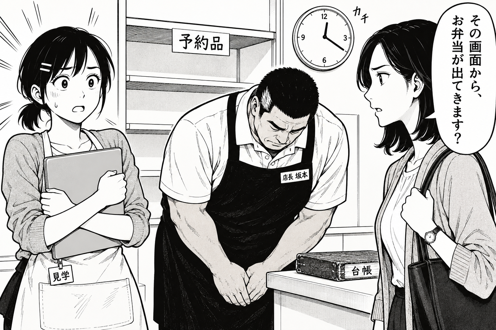
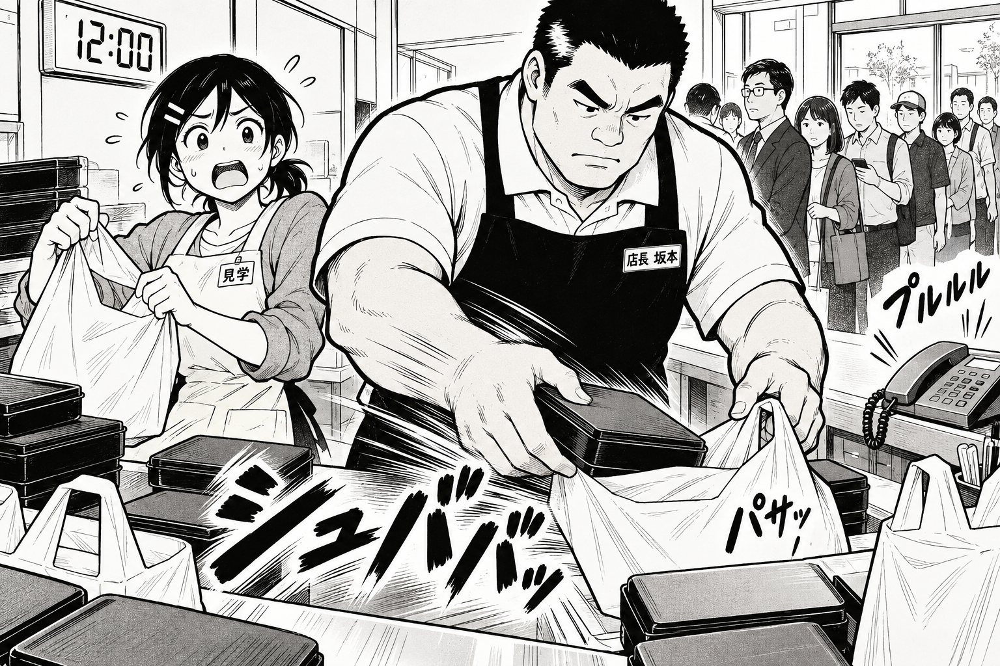
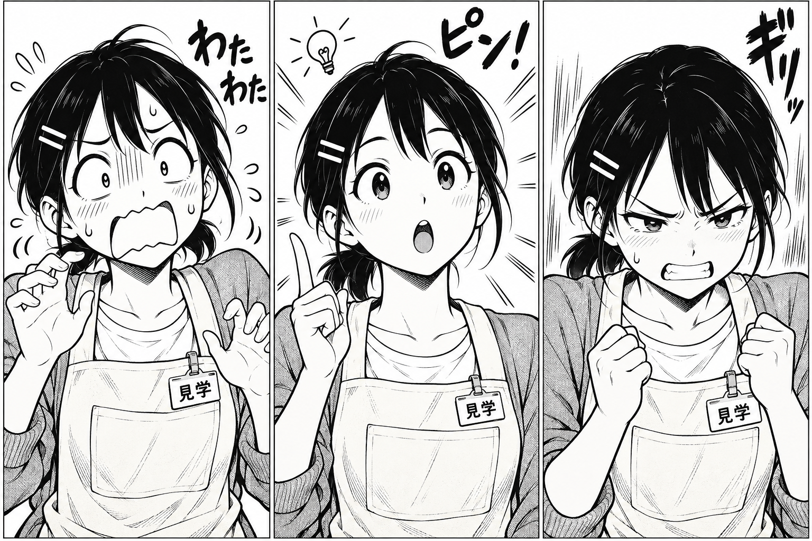
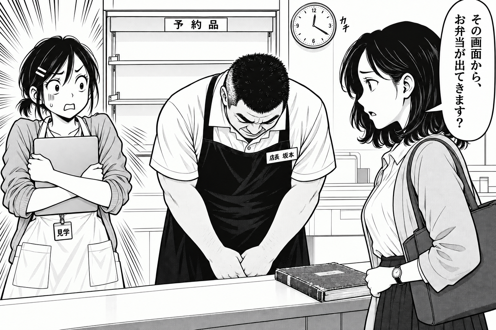
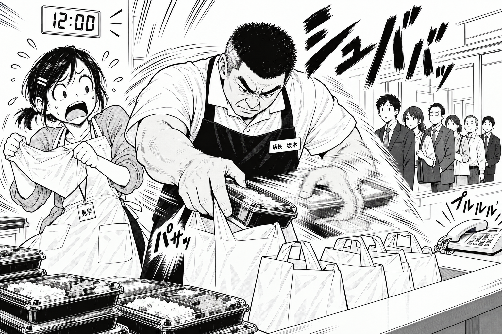
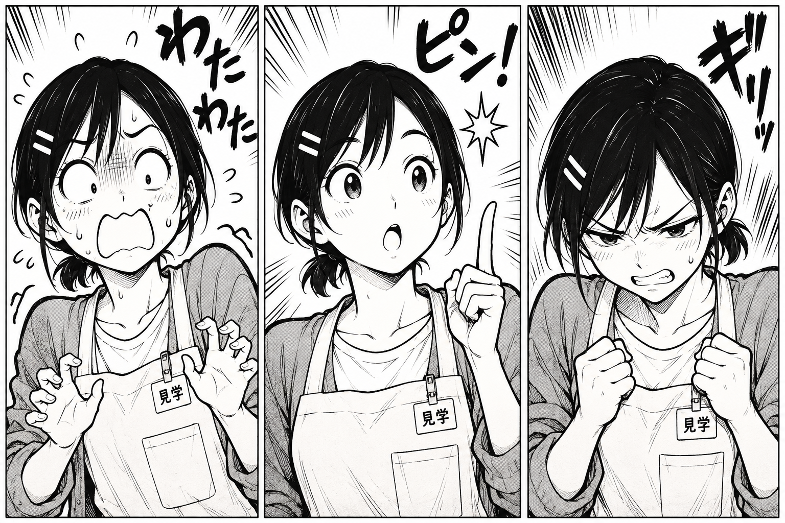
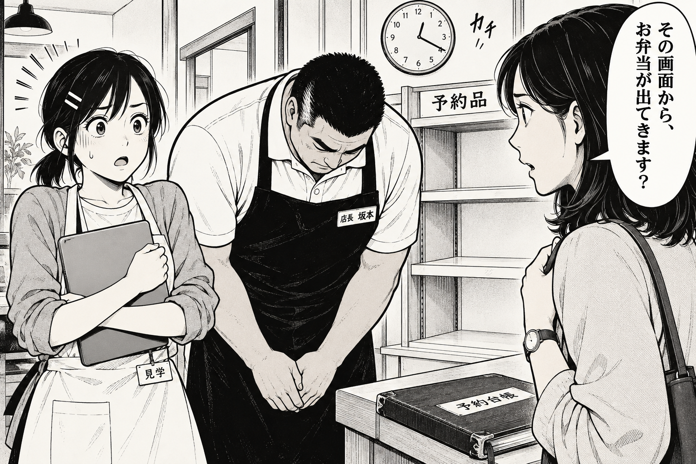
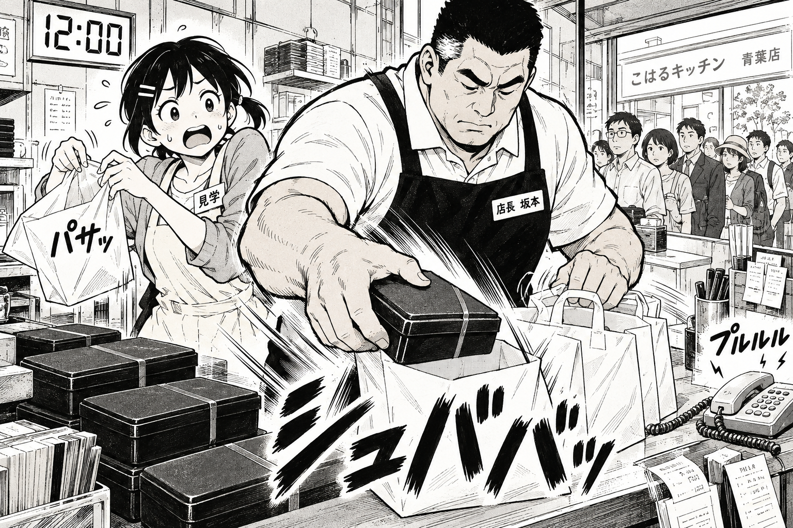
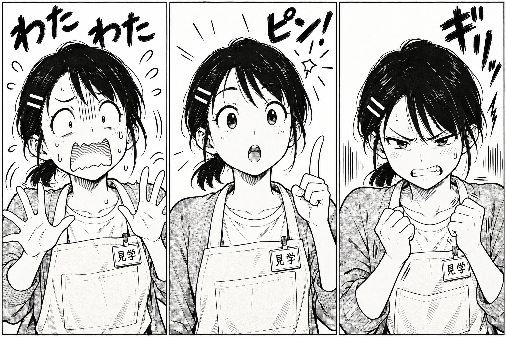

# 画風テスト第2ラウンド：少年誌の手描きタッチ

制作・目視確認日：2026-09-23〜24（日本時間）。

**推奨はE案。** C案の白場を残した太い主線と黒ベタに、見開く目、食いしばる歯、汗、描き文字、手元のスピード線を加えた方向が、静・動・表情の3種を通して最も読みやすかった。F案は強い衝撃と超速の演出、G案は顔の連続性に長所がある。今回得られた画像では、Gの背景省略はEを上回らなかった。

共通画風プロンプトの最終版は [final-style-prompt.txt](../../art/style-tests/round2/final-style-prompt.txt)。Eの実見結果をもとに、残った課題への指示を整理した本文制作用の整備版。**この最終版全文を使った追加の画像生成は行っていない。** 実際に9枚へ送ったプロンプトは、それぞれの同名 `.txt` に保存した。

## 1. 入力と比較条件

必読の [第1ラウンド調査](art-style-research.md)、[A〜Dの画像とプロンプト](../../art/style-tests/)、[人物外見設定](../character-design.md)、[人物美術設定](../art/characters.md)を確認した。第1ラウンドのA〜Dは実際に開いて見比べた。新たな外部資料調査は行わず、ディレクターの講評と生成画像の目視所見を判断の根拠とする。

外見は文章で指定し、旧 `art/characters/*.png` は生成の参照入力にしていない。初回9枚はすべて画像入力なし。F-1とF-2の最終生成だけ、許可された [C.png](../../art/style-tests/C.png)を白場・線画・人物分離の参照として渡した。F-1では左右配置も継承対象とした。既存人物設定文にある旧設定画の常時参照は、今回のユーザー指定を優先して適用していない。

| 案 | 指示した差 | 実際に見えた主な差 |
| --- | --- | --- |
| E | Cの省略を土台に主線とベタを強化。顔はやや記号化、効果線は短い束。 | 静の白場、黒いエプロン、人物と道具の分離が明瞭。動作と表情も同系統の輪郭でつながる。 |
| F | Eより太い線、大きい顔の変形、強い集中線・残像・擬音。 | 静の衝撃と動の瞬発力が強い。表情3連の変形量はE・Gとの差が小さく、全場面が一様に強くデフォルメされたわけではない。 |
| G | EとFの中間。顔の変形を一段強め、焦点を絞って読みやすくする。 | 表情3連は安定。動の手元は読めるが、棚・伝票など周辺情報も多く生成された。 |

3種の場面は共通。1＝12:20の空棚、坂本の謝罪、PCを抱えた遥、佐伯の問い。2＝12:00の時計、行列、電話、坂本の超速の袋詰め、追いつかない遥。3＝遥の顔アップ3連で、**画像の右から悔しさ／ひらめき／慌てるギャグ顔**。3だけは1枚の画像内に3コマを配置した。青線は着色せず、黒い縦線の漫画記号として指定した。佐伯や坂本へ敵意を表す怒りマークは付けていない。

これは生成結果の編集比較であり、同一seedや参照条件をそろえた対照実験ではない。途中で禁止仕上げや目印を補強し、Fではプロンプトの短縮とC参照を使ったため、画風ブロックだけの効果や再現率は推定しない。再生成前の失敗を隠して「各1回で安定した」とは扱わない。

## 2. E案：主線・ベタ強化

### E-1 静：問いで止まる

[生成プロンプト E-1.txt](../../art/style-tests/round2/E-1.txt)

広い白場と黒エプロンで、遥の停止、坂本の礼、佐伯の困り顔が分かれる。遥の汗と短い集中線が、Cより大きい反応を作る。再生成で佐伯の帯状光沢と周辺の植物・照明が減った。問いの台詞と空棚は読める。PCの天板は依然滑らかな灰色寄りで、台帳に指定外の「台帳」が入った。礼は佐伯への方向づけがまだ弱く、カメラ側にも向いて見える。

### E-2 動：手元を中心に読む

[生成プロンプト E-2.txt](../../art/style-tests/round2/E-2.txt)

太い腕から箱、開いた袋への動作経路が明瞭。大きな「シュババッ」、袋の「パサッ」、電話の「プルルル」が別々の発生源につく。12:00と行列も読める。遥は顔だけでなく上体と袋を持つ両手で追いつけなさを演じる。初回で逆になったピンは再生成で本人右側へ直った。背景の窓や箱はなお多いが、G-2より主動作の周辺が整理されている。残像の強さはF-2より抑えめ。

### E-3 表情：変形しても同じ遥

[生成プロンプト E-3.txt](../../art/style-tests/round2/E-3.txt)

右の食いしばりと拳、中央の開く目・口・人差し指、左の白い目・大きい口・汗で3種が明快。黒髪と白ピン2本が識別点として残る。中央のひらめきは指定した閃光に代わり電球記号になったが意味は読める。頬線が3コマとも入り、照れの記号にも見える。髪に細かな白い線は残るものの、第1ラウンドCの佐伯にあった広い帯状反射は主役になっていない。

## 3. F案：強い変形と効果

### F-1 静：内的衝撃を強める

[生成プロンプト F-1.txt](../../art/style-tests/round2/F-1.txt)

遥の角張った口、上がった眉、汗と密な集中線で、Eより強い内的衝撃が出た。C参照で白い空棚と黒エプロンの分離も戻り、佐伯の頭頂にあった帯状の反射は抑えられた。ただし、顔立ちと棚の構成は参照Cへ近づき、狙ったほど頭身は圧縮されていない。PCの灰色とエプロン内の大きめのトーンも残る。問いそのものを攻撃にせずに強い反応を描けたが、静のコマを囲む集中線はEより騒がしい。

### F-2 動：超速の見せ場

[生成プロンプト F-2.txt](../../art/style-tests/round2/F-2.txt)

3案で最も「次々に手を動かす」瞬発力が強い。頭上の大きな擬音、右手側の残像、身体を囲む曲線が一気に視線を動かす。時計・電話・行列の周囲にも白場が戻った。一方、残像側の手の形と袋の操作はEより追いにくい。先頭付近の客が若めに見え、弁当の蓋と中身にも細部が増えている。Fの強さを日常の説明コマへ常用すると、作業の確認より勢いが先に立つ。

### F-3 表情：集中線の強さと変形量は別

[生成プロンプト F-3.txt](../../art/style-tests/round2/F-3.txt)

各コマの縁から入る集中線が強く、右の悔しさは眉と拳で伝わる。黒髪・ピン・見学証も維持。ただし「Eよりさらにデフォルメ」という指示に対して、目と口の変形はE・Gとかなり近い。左のギャグ顔も、頭や口が極端に伸縮するほどではない。効果線の密度だけを理由に顔の演技まで最大と評価しない。

## 4. G案：中間の変形と読みやすさ

### G-1 静：自然な芝居

[生成プロンプト G-1.txt](../../art/style-tests/round2/G-1.txt)

遥の開いた目と口、坂本の下がった頭、佐伯の横顔がつながり、誰が困っているかは明快。白ピン・名札・腕時計も読める。ただし背景に照明や植物が戻り、棚奥の網掛けも広い。E-1のほうが白場の省略は成功した。PCは灰色の面、台帳には指定外の「予約台帳」が生成された。

### G-2 動：動作は明快、周辺が過密

[生成プロンプト G-2.txt](../../art/style-tests/round2/G-2.txt)

弁当箱を傾けて袋へ入れる手と、袋の口の関係は読める。遥のピンの側、短い結び髪、明るいエプロン、坂本の白髪と名札も保持。反面、手前の札・棚・筆立て・窓・店名看板に情報が広がった。太い線と局所的速度線はよいが、「EとFの中間で読みやすさ重視」という狙いが、背景整理にまで一貫して現れたとはいえない。

### G-3 表情：顔の連続性がよい

[生成プロンプト G-3.txt](../../art/style-tests/round2/G-3.txt)

前髪・短い結び髪・二本ピン・丸い顎が連続し、目・口・眉・手の変化で3種を読ませる。左の大きい開口、中央の閃光、右の拳が分かりやすい。白場の量もよい。髪の短い白線、頬の斜線、服の細かな線は残るため、さらに省略する余地がある。

## 5. 六つの観点による比較

単独の目視評価、各5点。5＝今回の目的が明快、4＝おおむね達成し局所課題、3＝有用だが目立つ課題、2＝大きな修正が必要、1＝不適合。「少年誌らしさ」は本依頼の太細・ベタ・記号的な顔・効果の強さを指す。「手描き感」は生成物の見え方であり、実際に人がペンで描いたという意味ではない。動きは主に各案の2、表情は1と3、ほかは3枚全体から判定する。

| 案 | 少年誌らしさ | 手描き感 | 表情の演技 | 動きの表現 | 人物設定との一致 | 読みやすさ | 計 |
| --- | ---: | ---: | ---: | ---: | ---: | ---: | ---: |
| **E** | **4** | **4** | **5** | **4** | **4** | **5** | **26/30** |
| F | 5 | 4 | 4 | 5 | 4 | 3 | 25/30 |
| G | 4 | 4 | 5 | 4 | 4 | 4 | 25/30 |

点差だけで決めず、3種を通した読みの安定性を優先した。Fの動作は最も強いが、残像と集中線の量が場面を支配しやすい。Eは静の停止を壊さず、動では明快な手の経路、表情では大きな顔の変化へ移れる。Gの表情もよいが、動作コマの周辺密度は今回の目的に対して不利だった。

### 設定と場面の照合

| 確認項目 | 目視結果・限界 |
| --- | --- |
| 遥 | 最終採用9枚では本人右側の白ピン2本、短い結び髪、明るいエプロンと見学証を確認。3連は全コマを確認した。ポニーテールの向き・太さや見学証の取り付け位置は画像間で揺れる。 |
| 坂本 | 静・動の6枚で角刈り、白い半袖ポロ、濃色エプロン、大柄な肩と腕、本人左胸の名札を確認。白髪は白い束で示されるが刈り込みの白とも読める。 |
| 佐伯 | 静の3枚で肩までの髪、淡色上着、左腕時計、肩バッグを確認。膝下丈や靴は画面外のため未判定。 |
| 時刻 | 静は丸時計の分針4・時針12付近、動は数字「12:00」。静の短針の厳密な角度までは保証しない。 |
| REQ-01 | 静の3枚で空棚、弁当なし、PCを抱える遥、謝罪する坂本、佐伯の問いを確認。台詞「その画面から、お弁当が出てきます？」は読める。 |
| 昼ピーク | 動の3枚で行列、電話、袋と弁当、超速の描き文字、追いつけない遥を確認。Fの残像は速度が強い分、指と袋の関係が曖昧。 |
| 表情3連 | 3枚とも右から食いしばり／ひらめき／ギャグ顔。全コマの顔が同じ表情へ戻る問題は改善。 |
| 線・仕上げ | まとまった黒と白、網点、線の陰影が主。髪の細い白抜き・頬線・PCの滑らかな灰色など、完全に抑えられなかった仕上げは個別所見に残した。 |

「人物設定一致4」は、画面内の識別点がおおむね守られた評価。画像間で寸分違わぬ顔や全身を確立したという意味ではない。全体表示と画像を開いた目視で比較し、印刷校正や読者テストはしていない。

## 6. 推奨案と最終版への反映

**共通基準はE。** 第1ラウンドCの省略を捨てずに、黒いエプロン・太い輪郭・大きい目眉口・汗・描き文字を足せた。静でも動でも顔と重要な道具が見つけやすく、表情3連も同じ遥として読める。Fの強い演出は場面限定なら有効だが、本作の説明と仕事の芝居へ一律に適用する基準には選ばない。

[共通画風プロンプト最終版](../../art/style-tests/round2/final-style-prompt.txt)では、Eの主線・ベタ・短い効果線を維持し、残った課題を次のように具体化した。

- 背景は場面に必要な物を限定列挙し、静なら空棚・時計・カウンター・台帳へ絞る。
- 髪の形は主に外形で示し、PC天板と肌を紙白にする。滑らかな階調、帯状反射、周辺減光を避ける。
- 目印の左右は本人基準と画面基準を併記する。遥の生成りエプロンを黒く塗らない。
- 静・動・表情それぞれの演技と効果量を指定し、全場面を同じ強度の集中線で埋めない。
- 指定外の看板・台帳の説明文字・恒常的な頬の赤面を加えない。

この整備版は画風の方向を固定するための成果物であり、9枚すべての局所的な問題を消した入稿原稿の認定ではない。今回の用途である3案比較と推奨決定の結果として扱う。

## 7. 制作・保存記録

すべて組み込み `image_gen` で生成。計16回、採用9枚、不採用7枚。E-1・E-2は各2回、E-3は1回、F-1は4回、F-2は3回、F-3とG-1〜G-3は各1回。Eでは髪の光沢・背景過密とピンの左右、Fでは光沢・変形の弱さ・暗いグラデーションを修正対象にした。F-1・F-2は最終生成でC参照へ切り替えた。不採用画像は生成元に残し、比較用PNG9枚には含めていない。

Pillow等による描画・合成・切り抜き・リサイズ・色調変更・文字の後付けは行っていない。元の生成PNGをそのままコピーし、採用ファイルと元ファイルのSHA-256一致を確認した。PNGヘッダの寸法等の読み取りとファイル検査は画像加工ではない。

| 納品 | 内容 |
| --- | --- |
| [round2/](../../art/style-tests/round2/) | E-1〜G-3のPNG9枚、同名プロンプト9本、最終版プロンプト |
| [generation-log.json](../../art/style-tests/round2/generation-log.json) | 採用画像の出力元、参照画像、寸法、ハッシュ、生成回数、不採用出力のプロンプトと理由 |
| 本文書 | 9枚の埋め込み、画像ごとの所見、6観点の比較と推奨 |

採用PNGはすべて1536×1024。白黒の見た目でも1 bitの二値原稿ではない。今回の変更先は `art/style-tests/round2/` と本ファイルのみ。既存の第1ラウンド成果物・人物設定は編集せず、git commitも行っていない。
