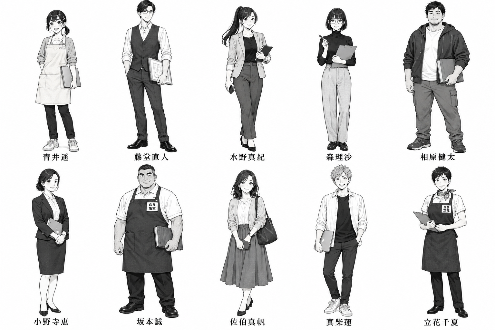
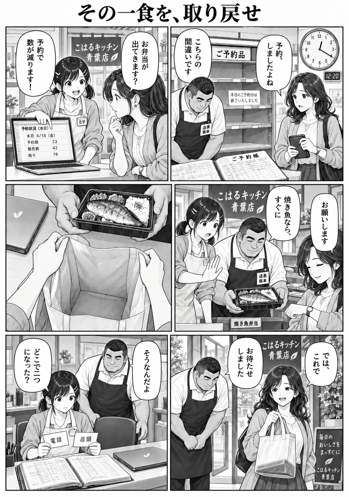
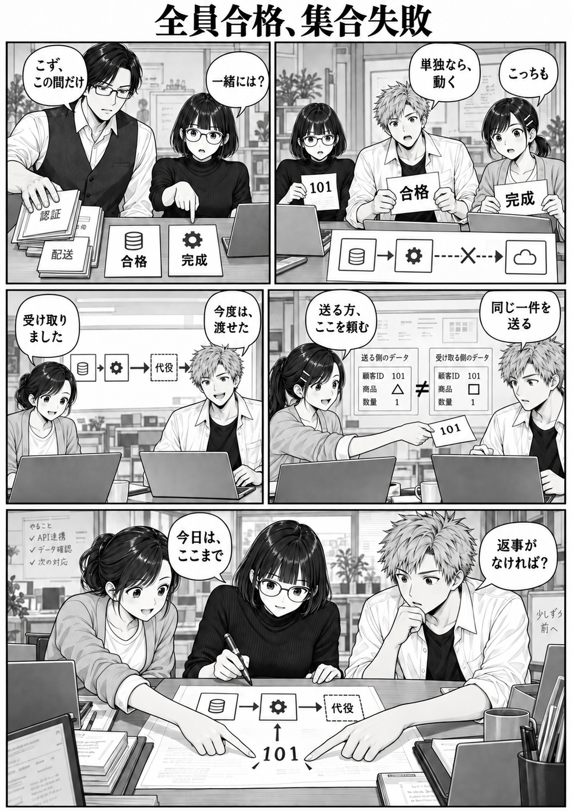
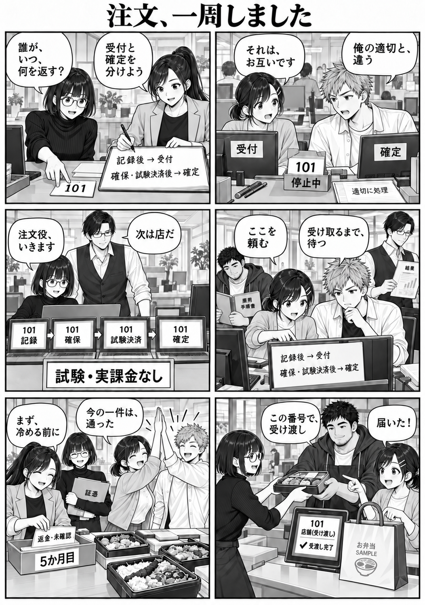
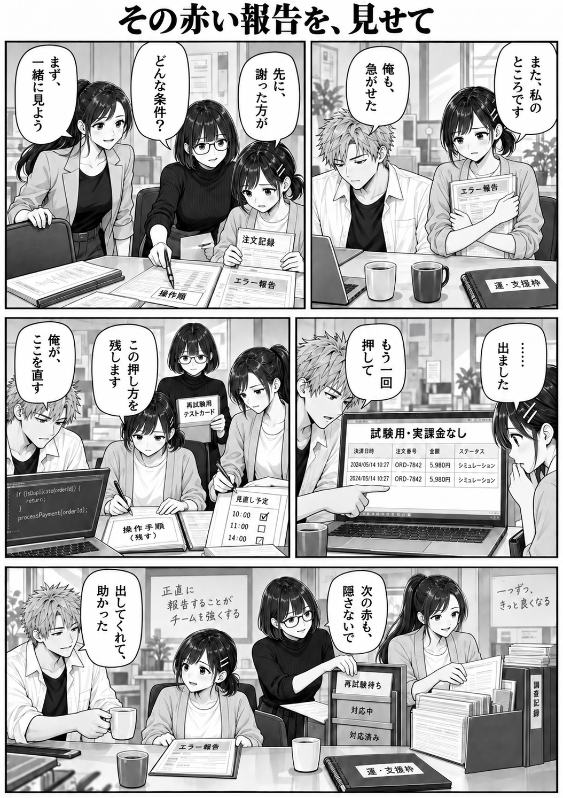
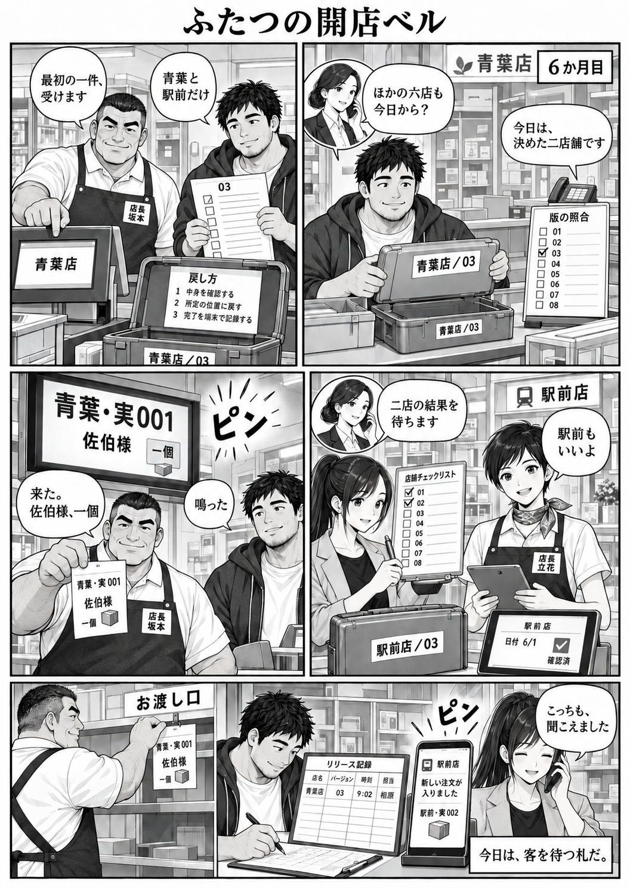
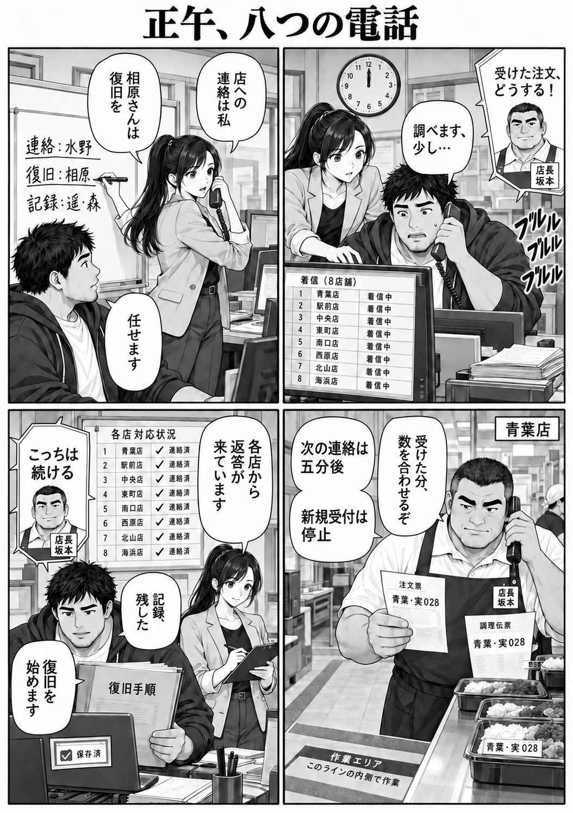
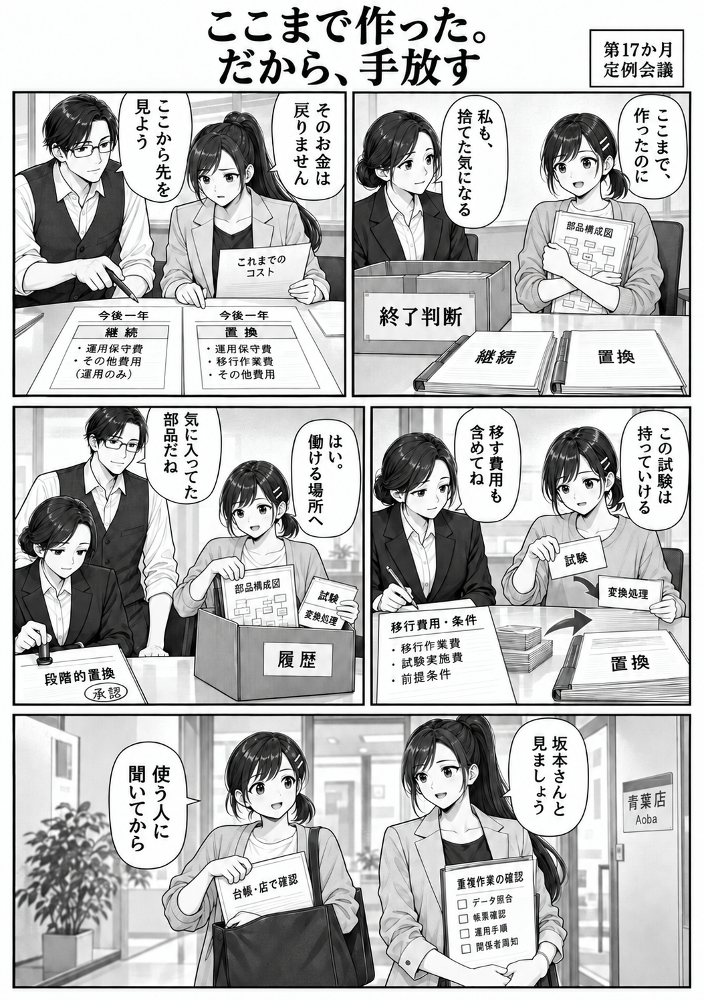
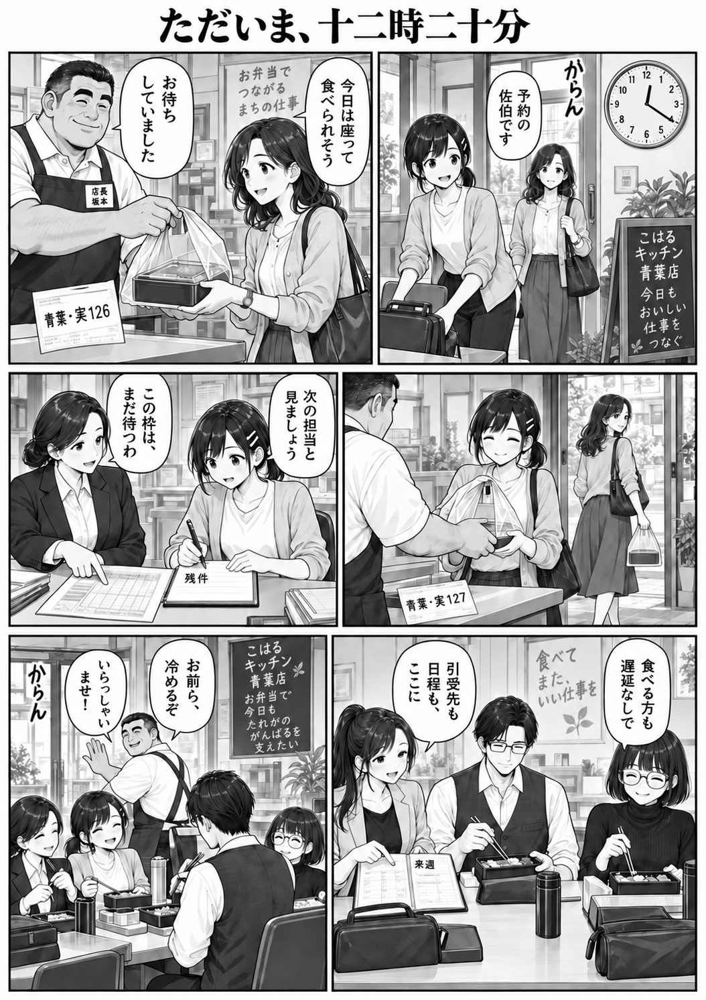

# 漫画（連載版・旧画風の試作）

- [連載版第1話「その一食を、取り戻せ」](serial/ch01/README.md)：全46ページを読む。
- [第1部「腹ぺこの約束」](part-01/README.md)：旧画風の試作。扉と全8話を順に読む。
- [代表場面の漫画8ページ](pages/)：旧画風の試作。各ページの説明は以下に掲載。
- [美術設定](../docs/art/README.md)：人物・舞台・小道具・画風の資料。

## 代表場面の漫画（旧画風の試作・フェーズ3）

主要10人の設定画1枚と、物語の転換点を選んだ漫画8ページ。すべて組み込み `image_gen` で生成し、同ツールによる修正後のPNGを `~/.codex/generated_images/` からコピーした。外部描画・文字の後付け・画像合成は行っていない。

人物設定は [character-design.md](../docs/character-design.md)。各ページの初回生成・修正の両方に設定画を参照画像として渡した。原作は [README](../README.md)、[story-bible](../docs/story-bible.md) と完成台本。開始時は `script/chunks/` を参照し、統合後に該当する `script/part-*.md` の漫画本文を再確認した。`script/` は編集していない。

各画像を目視し、人物・コマ数・タイトル・短い日本語・小道具・物語上の到達点を確認した。赤いペン・札と青いテープは、白黒原稿では灰色と形で表す。設定画の年齢感や髪型は、バイブルで未指定だった部分を作画用に具体化したもの。

## 00 — 主要10人の設定画

上段左から青井遥、藤堂直人、水野真紀、森理沙、相原健太。下段左から小野寺恵、坂本誠、佐伯真帆、真柴蓮、立花千夏。

- 目的：顔・髪型・体格・服装と、遥のエプロン、店長名札、森のペンを固定する。
- プロンプト要約：白黒・スクリーントーン、成人10人の全身を2段に配置、各人の下に氏名。職務と性格に合う姿勢。
- 全文：[設定画プロンプト](prompts/00-character-sheet.txt)。
- 再生成：0回。既知の不具合：ペンの白帯や小さい名札は縮小表示では判別しづらい。

## ページ一覧

| 画像 | 話ID・通読順 | タイトル | 主コマ数 |
| --- | --- | --- | --- |
| [01](pages/01-REQ-01.png) | REQ-01・001 | その一食を、取り戻せ | 6 |
| [02](pages/02-CON-11.png) | CON-11・181 | 全員合格、集合失敗 | 5 |
| [03](pages/03-PRO-24.png) | PRO-24・217 | 注文、一周しました | 6 |
| [04](pages/04-TST-40.png) | TST-40・280 | その赤い報告を、見せて | 5 |
| [05](pages/05-OPS-15.png) | OPS-15・289 | ふたつの開店ベル | 6 |
| [06](pages/06-OPS-17.png) | OPS-17・304 | 正午、八つの電話 | 4 |
| [07](pages/07-ECO-15.png) | ECO-15・450 | ここまで作った。だから、手放す | 5 |
| [08](pages/08-ENG-01.png) | ENG-01・455 | ただいま、十二時二十分 | 6 |

主コマは右上から左下へ読む。電話相手の小さな顔の差し込みは主コマ数に含めない。OPS-15は台本の最終コマを棚への札掛けと記録・通話に分け、6コマになっている。

## 01 — REQ-01：その一食を、取り戻せ

- 原作：[第1部・REQ-01](../script/part-01.md#episode-req-01)。
- 選んだ理由：発端。画面を見せることから、目の前の昼食を渡して現場の経緯を聞くことへ、遥の行動が変わる。
- プロンプト要約：6コマ。12:20、空の予約棚、古い台帳、見学証、試作PC。焼き魚の代替を提案し、空袋から弁当入りの袋への変化を描く。最後に電話・店頭の伝票と椅子。
- 全文：[初回](prompts/01-REQ-01.txt)、[修正1・店名](prompts/01-REQ-01-revision1.txt)。
- 再生成：1回。設定画と修正前のページを参照し、3か所ののれんと右下コマの黒板の「あおば弁当」を「こはるキッチン 青葉店」に修正。6コマの構図・タイトル・セリフ・人物と、空袋から弁当入り袋への流れを踏襲。
- 既知の不具合：謝罪を含む原作台詞の一部と「あと二分」は短縮で省略。背景の台帳や画面の細字は正文として扱わない。

## 02 — CON-11：全員合格、集合失敗

- 原作：[第4部・CON-11](../script/part-04.md#episode-con-11)。
- 選んだ理由：単独の完成が全体の成功にならない挫折と、遥・蓮が助けを頼み合う転機。
- プロンプト要約：5コマ。合格札の間で止まる試験番号101、森の指摘、二部品の修正、代役を含めた三つ目までの到達。店への受け渡しはまだ描かない。
- 全文：[初回](prompts/02-CON-11.txt)、[修正1](prompts/02-CON-11-revision1.txt)。
- 再生成：1回。ペンの赤い着色を白黒にし、遥の服装を統一。
- 既知の不具合：図中の「顧客ID 101」は生成された誤った項目名。追跡している101は台本上の試験注文番号である。上段左の藤堂の台詞の「まず」が欠け気味。縮小時は眼鏡・ペンの細部が読みにくい。

## 03 — PRO-24：注文、一周しました

- 原作：[第4部・PRO-24](../script/part-04.md#episode-pro-24)。
- 選んだ理由：CON-11で始まった共闘の回収。一つの試験注文を全員で受け渡しまで通した喜び。
- プロンプト要約：6コマ。「受付」と「確定」を分け、試験番号101を記録・確保・試験決済・店役端末へ通す。「試験・実課金なし」と未確認の返金札を残し、ハイタッチと昼食で閉じる。
- 全文：[初回](prompts/03-PRO-24.txt)、[修正1](prompts/03-PRO-24-revision1.txt)、[修正2](prompts/03-PRO-24-revision2.txt)。
- 再生成：2回。受渡し完了表示と遥の服装を修正し、修正時に変わった森の外見・水野のインナーを再修正。
- 既知の不具合：蓮のインナーの濃淡にコマ間の揺れが残る。小さな手順書の見出しは文字が不明瞭。「101」「試験・実課金なし」「受渡し完了」と未確認札は判読できる。

## 04 — TST-40：その赤い報告を、見せて

- 原作：[第5部・TST-40](../script/part-05.md#episode-tst-40)。
- 選んだ理由：森の赤いペンが、責められる印から条件を一緒に探す道具へ変わる関係の転換。
- プロンプト要約：5コマ。二人分のお茶、報告札、名前でなく操作順を指すペン、同じ模擬支払いが二行出る再現、修正・記録・再試験・時刻調整の分担。「再試験待ち」で閉じる。
- 全文：[初回](prompts/04-TST-40.txt)、[修正1](prompts/04-TST-40-revision1.txt)。
- 再生成：1回。赤・桃色の着色を白黒にし、遥の服装を統一。
- 既知の不具合：水野のインナーの濃淡にコマ間の揺れがある。背景にプロンプト外の標語が追加された。画面の2024年の日付・金額・注文IDは生成された模擬データで、作品の確定設定ではない。最終コマでは報告が机上に残り、掲示の動作は省略されている。

## 05 — OPS-15：ふたつの開店ベル

- 原作：[第6部・OPS-15](../script/part-06.md#episode-ops-15)。
- 選んだ理由：試験の一件から、実際の客を待つ一件へ。二店舗だけの初公開を店側も確認する。
- プロンプト要約：確認済みの版03、青葉店と駅前店、二店だけのチェック、戻し方、実注文「青葉・実001」、二つの受付音。電話で小野寺の合意を得て、札を棚へ掛け公開記録を残す。
- 全文：[初回](prompts/05-OPS-15.txt)、[修正1](prompts/05-OPS-15-revision1.txt)。
- 再生成：1回。鞄の02を03に直し、青葉店に重複して描かれた水野を電話の声へ変更。
- 既知の不具合：最終場面が2コマに分かれ、台本5コマに対し画像は6コマ。小さな「戻し方」の本文は生成による不適切な補間で、実際の復旧手順を表していない。背景の日付・時刻と駅前の実注文番号002は生成上の補間。相原と電話先の水野が同じ背景に見える最終コマは二地点をまとめた演出。

## 06 — OPS-17：正午、八つの電話

- 原作：[第7部・OPS-17](../script/part-07.md#episode-ops-17)。
- 選んだ理由：全店展開後の最初の障害。相原が抱えた連絡を水野に渡し、店と復旧担当が動けるようになる。
- プロンプト要約：4コマ。正午の時計と8店の着信、水野の連絡・相原の復旧・共有記録の分担、五分後の再連絡、新規受付停止。青いテープを灰色の帯で示し、控えと現物の実注文番号を照合。記録保存後、復旧を開始する。
- 全文：[初回](prompts/06-OPS-17.txt)、[修正1](prompts/06-OPS-17-revision1.txt)、[修正2](prompts/06-OPS-17-revision2.txt)。
- 再生成：2回。「五分後」を補い店舗一覧に駅前店を戻し、欠けた受付停止の指示を別の吹き出しにして修正。
- 既知の不具合：「7か月目」の表示は省略。青葉・駅前以外の店名と実028は作画用の仮名・番号。床のテープは太い帯になっている。電話の台詞の尾が坂本側へ向くため、発話者が水野であることは台本と前後関係で補う必要がある。

## 07 — ECO-15：ここまで作った。だから、手放す

- 原作：[第12部・ECO-15](../script/part-12.md#episode-eco-15)。
- 選んだ理由：自作への愛着を認めながら、使う人と今後の運用のために手放す成熟。
- プロンプト要約：5コマ。遥と小野寺の迷い、同じ期間の継続・置換比較、残せる試験と変換処理、小野寺による段階的置換の承認、旧図面の履歴保存。台帳はその場で廃棄せず「店で確認」の票を持ち出す。
- 全文：[初回](prompts/07-ECO-15.txt)、[修正1](prompts/07-ECO-15-revision1.txt)。
- 再生成：1回。最後のコマで小野寺に似た髪型になった遥を修正。
- 既知の不具合：「第17か月」は不自然な表記。比較期間「今後一年」は同期間比較を見せるための作画上の仮置きで、原作の確定値ではない。最後の背景は「青葉店」の札があり、本部から店へ向かう移動を圧縮した見え方になっている。

## 08 — ENG-01：ただいま、十二時二十分

- 原作：[第12部・ENG-01](../script/part-12.md#episode-eng-01)。
- 選んだ理由：発端と同じ12:20、今度は予約の弁当を普通に受け取れる結末。残る仕事は次の担当につながり、仲間は昼食を取る。
- プロンプト要約：6コマ。12:20の時計、佐伯への弁当入りの袋、遥自身の昼食、別枠の待ちの記録、水野の引受先と予定、閉じた鞄、箸を持つ森、次の客へのベル。赤いペンは鞄の中。
- 全文：[初回](prompts/08-ENG-01.txt)、[修正1](prompts/08-ENG-01-revision1.txt)、[修正2・店名](prompts/08-ENG-01-revision2.txt)。
- 再生成：2回。修正1で重なった弁当箱を一つにし、佐伯と遥の実注文番号を分けた。修正2は設定画と修正1採用ページを参照し、右上・左下の黒板で屋号に見える「青葉」を「こはるキッチン 青葉店」に修正。6コマの構図・タイトル・セリフ・人物、一袋一箱と注文番号126／127を維持。
- 既知の不具合：冒頭の鞄は足元ではなく台の上に置かれ、口が開いて閉じた端末が見える。最終場面では鞄は閉じている。発端の空袋との対応は手渡しのモチーフとして再現し、画角は完全一致ではない。126・127は作画用に置いた実注文番号。背景の標語は生成上の補間。

## 共通する制作上の限界

吹き出しは原作を約15字以内に短縮したもの。主要な台詞は読めるが、コマ内で返答の吹き出しが右側に来る箇所があり、会話順は尾と人物から補って読む必要がある。細字の帳票・背景文・サンプルコードは生成上の補間を含み、仕様書や正確な教材用コードとして使わない。人物の顔と髪型を優先して合わせているが、服の襟・トーン・小物の細部には揺れが残る。これらは画像への手描き修正では補っていない。

## 店名・ブランドの確認（2026-09-23）

[舞台設定](../docs/story-bible.md#舞台と共通設定)に基づき、正式な屋号を「こはるキッチン」、店舗を「青葉店」と確認し、全8ページの看板・のれん・黒板・袋などを目視した。

| ページ | 確認結果・対応 |
| --- | --- |
| 01 REQ-01 | のれん3か所と黒板の「あおば弁当」を「こはるキッチン 青葉店」に再生成で修正。 |
| 02 CON-11 | 事務所の場面。別屋号の看板・ブランド表示なし。変更なし。 |
| 03 PRO-24 | 袋の「お弁当 SAMPLE」は一般的な試料表示。別屋号なし。変更なし。 |
| 04 TST-40 | 事務所の場面。背景標語にも別屋号なし。変更なし。 |
| 05 OPS-15 | 「青葉店」「駅前店」は設定どおりの支店表示。変更なし。 |
| 06 OPS-17 | 「青葉店」と8店舗一覧は支店表示。既知の仮の支店名を含むが、別チェーンの屋号ではない。変更なし。 |
| 07 ECO-15 | 扉の「青葉店 / Aoba」は支店表示。変更なし。 |
| 08 ENG-01 | 黒板2か所の屋号に見える「青葉」を「こはるキッチン 青葉店」に再生成で修正。 |

今回の再生成は組み込み `image_gen` で各1回、計2回。両ページとも設定画と修正前の現行ページを参照した。文字を含めて生成結果をそのまま採用し、Pillow等による描き込み・合成・加工は行っていない。修正前の採用元・ハッシュ、使用プロンプト、参照画像、全8ページの確認結果は生成ログに記録した。

## 保存・検査記録

- 初回生成9回（設定画1枚＋漫画8枚）、再生成計11回（今回の店名修正2回を含む）。PRO-24・OPS-17・ENG-01は各2回、REQ-01・CON-11・TST-40・OPS-15・ECO-15は各1回、設定画は0回。各画像の上限2回以内。
- 設定画は1536×1024px。各漫画ページは約1052〜1056×1489〜1495px、A4に近い縦横比。全ページ4〜6主コマを目視確認した。
- 元画像からの同一バイトコピー、PNGヘッダー、縦横比、画像9枚と相対リンクの存在を検査。印刷実寸での校正は未実施。
- 採用元・再生成回数・サイズ・SHA-256・不採用版の元パスは [generation-log.json](generation-log.json)。生成時のプロンプト全文は [prompts/](prompts/)。
