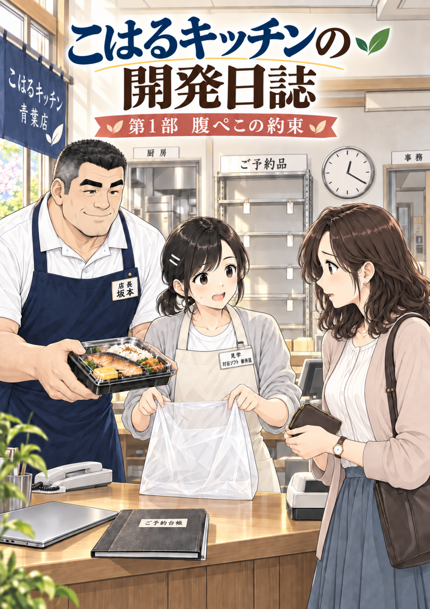
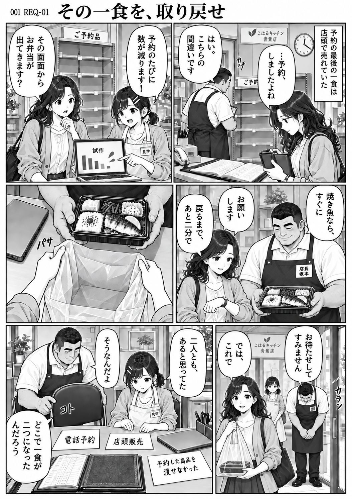
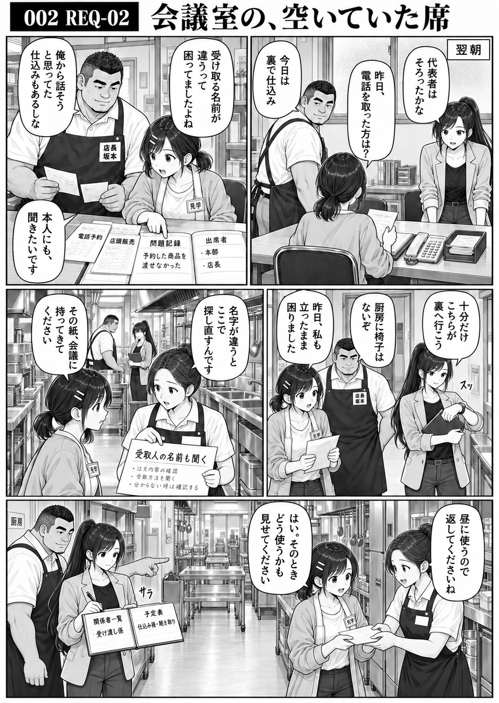
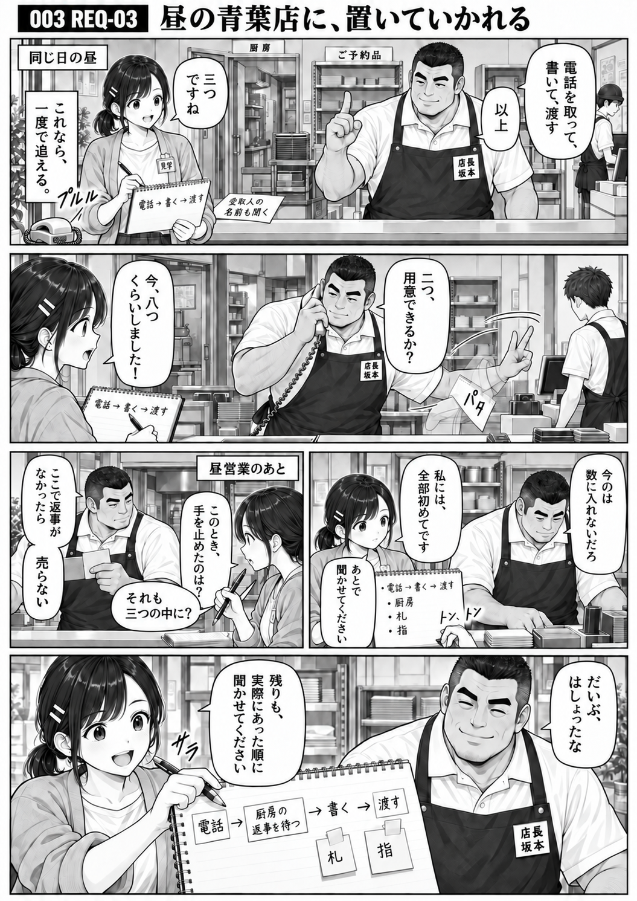
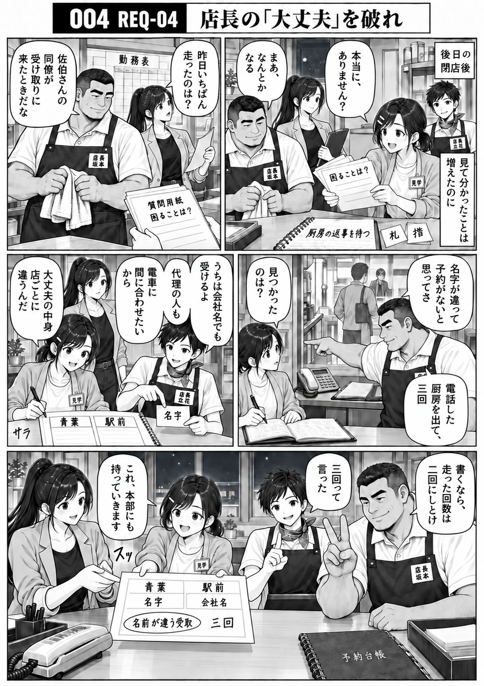
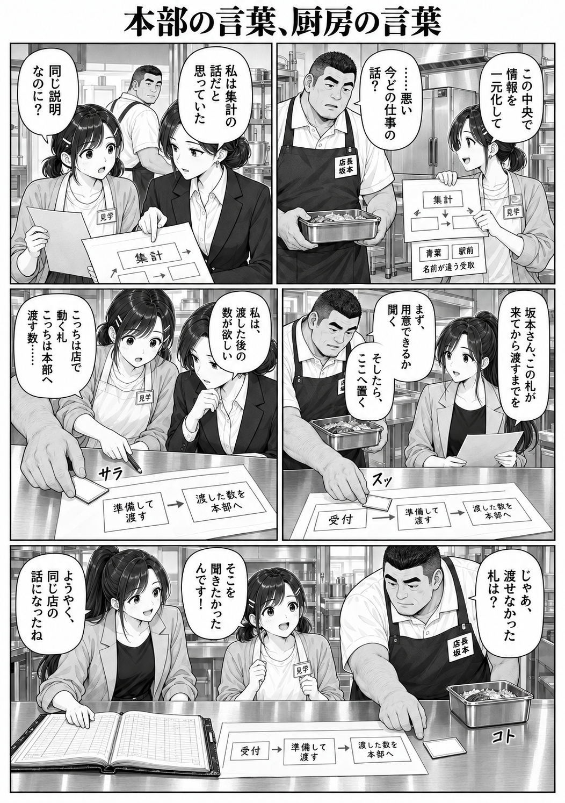
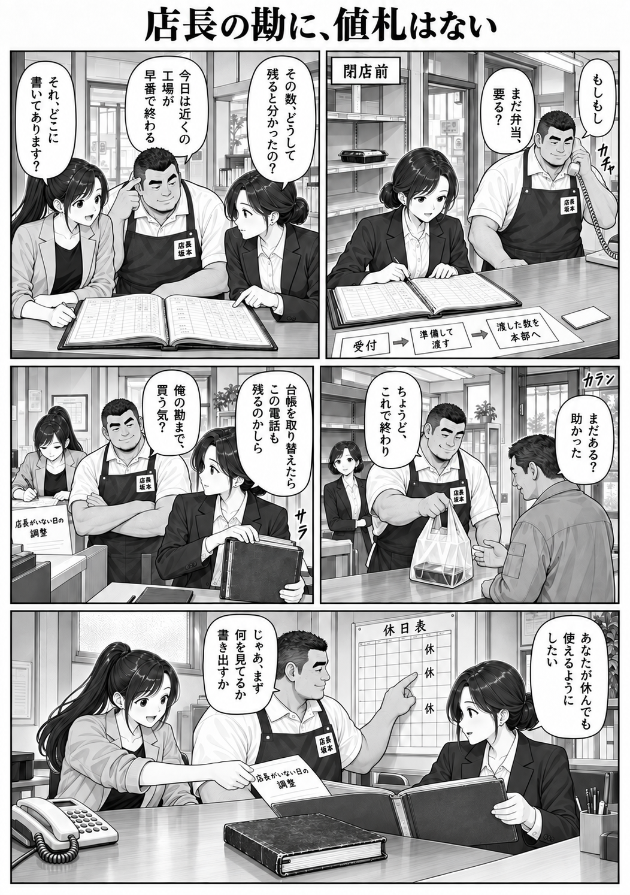
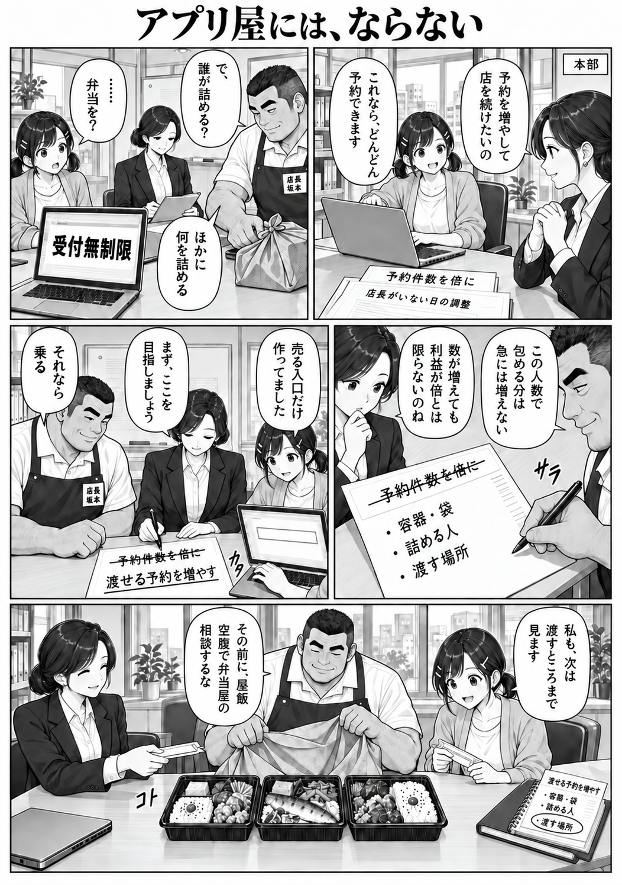
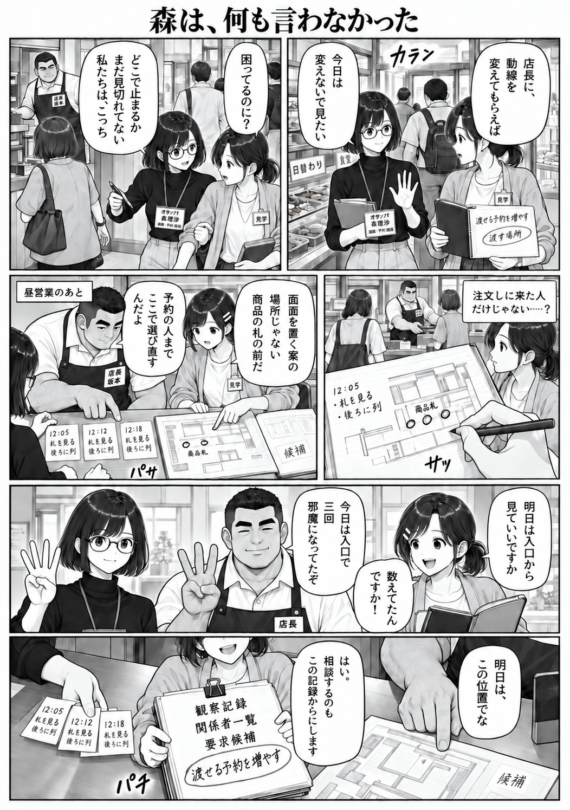

# 第1部「腹ぺこの約束」

扉から全8話を、上から順に読めます。各ページのコマは右上から左下へ読み進めてください。

[漫画の目録](../README.md) · [美術設定](../../docs/art/README.md)

## 扉

## 001 — REQ-01：その一食を、取り戻せ

[台本](../../script/part-01.md#episode-req-01) · [ネーム](names/001-REQ-01.md)

## 002 — REQ-02：会議室の、空いていた席

[台本](../../script/part-01.md#episode-req-02) · [ネーム](names/002-REQ-02.md)

## 003 — REQ-03：昼の青葉店に、置いていかれる

[台本](../../script/part-01.md#episode-req-03) · [ネーム](names/003-REQ-03.md)

## 004 — REQ-04：店長の「大丈夫」を破れ

[台本](../../script/part-01.md#episode-req-04) · [ネーム](names/004-REQ-04.md)

## 005 — PRO-20：本部の言葉、厨房の言葉

[台本](../../script/part-01.md#episode-pro-20) · [ネーム](names/005-PRO-20.md)

## 006 — ECO-05：店長の勘に、値札はない

[台本](../../script/part-01.md#episode-eco-05) · [ネーム](names/006-ECO-05.md)

## 007 — ECO-06：アプリ屋には、ならない

[台本](../../script/part-01.md#episode-eco-06) · [ネーム](names/007-ECO-06.md)

## 008 — ENG-08：森は、何も言わなかった

[台本](../../script/part-01.md#episode-eng-08) · [ネーム](names/008-ENG-08.md)

## 制作方法

[美術設定（docs/art/）](../../docs/art/README.md)を基準に、そこで案内する人物・背景・小道具などの設定画像を参照画像として組み込み `image_gen` に渡し、扉と本文を生成しました。本文では共通の人物設定画や既存漫画も参照し、各話の台本をもとにネームでコマ割りと台詞を整理しています。

生成結果は目視確認し、修正も `image_gen` による再生成で行いました。採用PNGは生成元からそのままコピーし、外部ツールによる描画・合成・文字の後付け・リサイズは行っていません。各試行のプロンプト・参照画像・採否は制作ログに記録しています。

- 001〜004：[log-a.json](log-a.json)
- 005〜008：[log-b.json](log-b.json)
- 扉：[log-c.json](log-c.json)

## 既知の不具合・台本や設定との差

以下は上記3つの制作ログの `remaining_issues` を集めた一覧です。修正済みの不具合は含めていません。画像内の補足文字や作画上の差は、台本や美術設定の変更を意味しません。

001〜004には、吹き出しの分割指示が生成画像で連結され、ネームより一つの吹き出しが長くなった箇所もあります（log-a の総括）。

### 扉（log-c）

- 遥の見学証は「見学」を判読できるが、下段の所属・氏名の細字に生成の字形の揺れがある。
- 坂本の名札は役職・姓が二段で、横長一行の小道具基準と文字組が異なる。
- カウンターの電話は背景参照由来の有線表現が残り、文書で整理したコードレス子機と一致しない。
- 題材は第1話の袋詰め前だが、表紙として三人を見せる構図。台帳は閉じ、坂本の表情はやや笑顔、弁当は袋の左上にある。本文のコマ4の厳密な再現ではない。
- 背景の「厨房」「事務」、台帳の「ご予約台帳」は生成で残った場所・物品ラベル。新しい事件・注文番号・時期は示さない。

### 001 — REQ-01（log-a）

- コマ2：遥の白ピン2本が本人の左こめかみ側。コマ6は右側。
- コマ6：開いた台帳の右側が紙の罫線でなく布表紙のように描かれる。

### 002 — REQ-02（log-a）

- コマ4：注意書きに指定外の小さな補足3行（注文内容の確認等）が生成されている。台本の確定手順にはしない。
- コマ5：手渡し中の紙が寝ているため「受取人の名前も聞く」の文字は見えにくい。主文はコマ4で明瞭。

### 003 — REQ-03（log-a）

制作ログに記載された残存不具合はありません。

### 004 — REQ-04（log-a）

- コマ5：遥の白ピン2本のうち1本が小さく不明瞭。

### 005 — PRO-20（log-b）

- コマ1・3・4・5の一部で、指定した短い吹き出しが連結または一つにまとまり約15字を超える。文字は可読。
- コマ5の小野寺は画角外。台詞・図と札・台帳の受渡しは保持。
- コマ4で遥の白ピン2本が本人の左側に見える（正面基準の左右差）。

### 006 — ECO-05（log-b）

- コマ2・4・5の一部で短い吹き出しの分割指定が一つにまとまり約15字を超えるが、台詞は可読。
- コマ1・3の背景は厨房口・事務口の位置を同時に確認できる構図になっていない。
- コマ5の資料フォルダが設定より厚めに見える。机の擦れた台帳とは別物として描かれている。

### 007 — ECO-06（log-b）

- コマ1・3・5の一部で短い吹き出し分割がまとまり、約15字を超える。文字は可読。
- コマ3で「予約件数を倍に」の取消線が、台本のコマ4より一コマ早く描かれている。
- コマ5の中央の魚弁当は切り身の輪郭がやや丸魚に近い。献立は台本では未指定。
- コマ4・5で遥の白ピン2本が本人の左側に見える（正面基準の左右差）。

### 008 — ENG-08（log-b）

- コマ4の遥の白ピン2本は本人の左側に見える。コマ5は修正済み。
- コマ1・2の森の見学証の会社名・役割の細字に字形の揺れが残る。
- コマ1・2・4・5・6の一部で台詞の分割指定が一つにまとまり、約15字を超えるが主要台詞は可読。
- コマ6で三種の見出しが資料束の表紙にまとめて表示され、個々の紙の見出しをずらして見せる構図とは差がある。紙束と一個のクリップは明瞭。
- コマ6では三人の顔全体より手元を大きく見せる構図になった。
