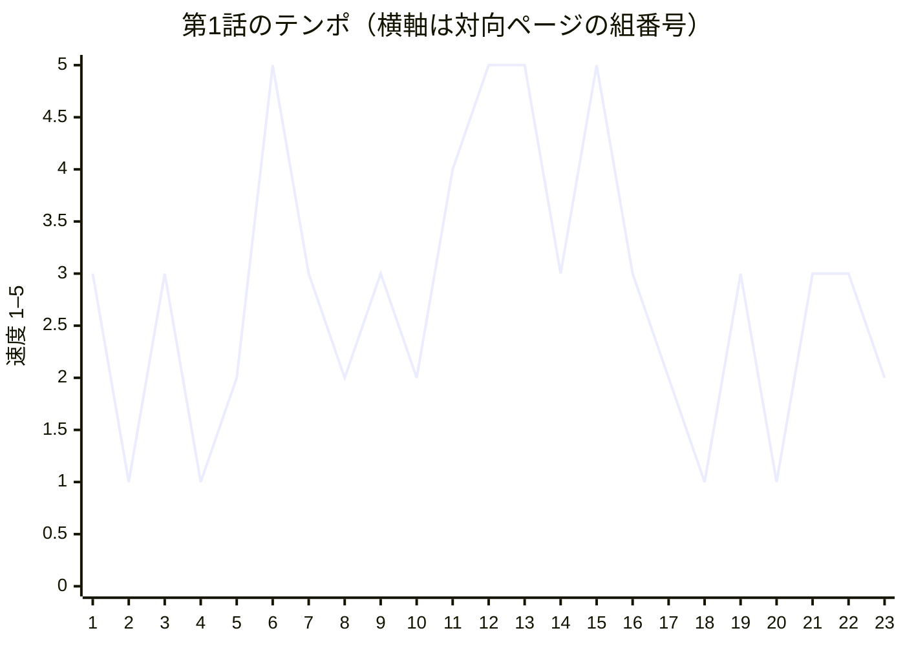

# 連載版第1話 ネーム

本文46ページ／44ページファイル／157コマ。見開きはP23–24とP35–36をそれぞれ一枚絵・1コマ・1ファイルとして数える。画風は **E 39ページ、F 7ページ**（ファイル単位ではE 38、F 6）。P01が右、P02が左の23組。本文中に扉・広告を入れない。シナリオの本文外おまけ2頁は、この本文台割には含めない。

確定シナリオは [ch01.md](../../../../docs/serial/ch01.md)。[最新査読R4](../../../../docs/serial/review-r4.md) §5の残すべき点を継承した。R4の旧48頁稿の「受領P37–38」「食事P40」「任命P41」「登場P47」等は、確定46頁稿のP35–36／P38／P39／P45へ対応する。原稿を旧ページ番号へ戻していない。P28〜31は最後の箱の登場から停止・根拠・返答・販売中止まで4頁で進む。

参照した制作資料：[漫画技法](../../../../docs/craft/manga-technique.md)、[物語調査 §1.4〜1.5](../../../../docs/craft/story-research.md)、[v2画風仕様](../../../../docs/art/v2-style.md)、[間取り](../../../../docs/art/locations.md)、[表情ガイド](../../../../art/v2/characters/00-expression-guide.png)。研究資料の約19頁テンプレートは感情変化の順序として適用し、46頁の確定台割を19頁へ再配分しない。

## 作画担当への渡し方

各PNN.mdは単独で使える。コマ位置・面積・枠・カメラ・人物の向き・各人の表情8分類と眉／目／口／汗／姿勢・小道具・背景・吹き出しの位置と読む順・描き文字を記した。末尾の「画像生成用プロンプト（完成形）」は共通画風全文で始まり、同頁の全コマ指定まで含む。共通文の人物例だけはv2仕様の指示に従い当該人物へ差し替えた。

1. 各ファイルの「実生成に渡すreferenced_image_paths」の画像を開き、リポジトリルートからの相対パスを実パスへ解決して添付する。全頁で表情ガイドを含め、入力は5枚以内。
2. 参照画像リストは確認用の全候補。添付上限から外れる人物の小さな姿・背景の断片は本文の外見・配置指定を使う。画像の役割は個人の同一性／配置／演技／線と強調量に分けてある。
3. 完成プロンプトのtextブロックをそのまま渡す。見開きは横長1枚で生成し、左右を別々に生成しない。旧art/characters、旧art/backgrounds、manga以下の画像を参照入力にしない。
4. 生成後は顔・指の接点・袋・文字、吹き出し順、時計、箱数をPNGで確認する。ここでのチェックはネームの文書検査であり、未生成のPNGの合格を宣言していない。

各コマは「今写っている一瞬」を配置欄で特定した。元シナリオの複合動作は動作欄で因果を残し、P01の残り1→0、P22の手洗い→着衣、P38の一口→箸を下ろす等は、同一人物や物を二重に描かず前後のコマと最終状態で示す。

## 台割・ページ目的・コマ数・見せ場

コマ数バーは各ページ側の記載数。見開きの「1共有」は左右合わせて1コマ。最大面積は枠間を差し引く前の目安。右頁末→同じ組の左頁は視線誘導、左頁末→次組の右頁が物理的なめくり。

| 頁／ファイル | 面 | ページの目的（感情） | コマ数 | E/F | 最大コマ・見開き／出口 |
| --- | --- | --- | --- | --- | --- |
| [P01](P01.md) | 右 | 作る速さと、任されたい欲を先に好きにさせる。 | 6 ▮▮▮▮▮▮ | E | 最大30%／同じ組の左頁へ |
| [P02](P02.md) | 左 | 時計と空棚だけで問題を立てる。 | 3 ▮▮▮ | E | 最大50%／次の右頁へ |
| [P03](P03.md) | 右 | 善意と職能が、相手の今を外す。 | 2 ▮▮ | E | 最大67%／同じ組の左頁へ |
| [P04](P04.md) | 左 | 固まった後、自分から今できる行為を選ぶ。 | 2 ▮▮ | E | 最大67%／次の右頁へ |
| [P05](P05.md) | 右 | 代替への了承を得て、二人の手が動く。 | 5 ▮▮▮▮▮ | E | 最大26%／同じ組の左頁へ |
| [P06](P06.md) | 左 | 再来店を、佐伯自身の好みで選ばせる。 | 5 ▮▮▮▮▮ | E | 最大28%／次の右頁へ |
| [P07](P07.md) | 右 | 二分を、失われた昼食の時間にする。 | 2 ▮▮ | E | 最大50%／同じ組の左頁へ |
| [P08](P08.md) | 左 | 悔しさを、観察する行動に変える。 | 3 ▮▮▮ | E | 最大42%／次の右頁へ |
| [P09](P09.md) | 右 | 見るだけでも追いつけない予感。 | 3 ▮▮▮ | E | 最大40%／同じ組の左頁へ |
| [P10](P10.md) | 左 | 熟練者の簡単という言葉を、挑戦状にする。 | 2 ▮▮ | E | 最大75%／★重点めくり |
| [P11](P11.md) | 右 | 坂本の動きに置いていかれる快感。 | 7 ▮▮▮▮▮▮▮ | F | 最大34%／同じ組の左頁へ |
| [P12](P12.md) | 左 | 三つと八つの落差で笑い、止まった指だけを拾う。 | 5 ▮▮▮▮▮ | F | 最大27%／次の右頁へ |
| [P13](P13.md) | 右 | 通路の笑いを一ページで収める。 | 5 ▮▮▮▮▮ | E | 最大30%／同じ組の左頁へ |
| [P14](P14.md) | 左 | 後の逆転のため、置き場と用途のずれを見せる。 | 5 ▮▮▮▮▮ | E | 最大35%／次の右頁へ |
| [P15](P15.md) | 右 | 返事と箱の印を、同時に見て覚える。 | 2 ▮▮ | E | 最大60%／同じ組の左頁へ |
| [P16](P16.md) | 左 | 答えを急ぐ癖が、当事者の手に止められる。 | 2 ▮▮ | E | 最大55%／次の右頁へ |
| [P17](P17.md) | 右 | 二人が違う物を見ていたと、遥の再現を崩す。 | 5 ▮▮▮▮▮ | E | 最大30%／同じ組の左頁へ |
| [P18](P18.md) | 左 | 明日ほしい役を、自分の手で取りに行く。 | 3 ▮▮▮ | E | 最大40%／次の右頁へ |
| [P19](P19.md) | 右 | 提案・拒否・役割を短い応酬に凝縮する。 | 6 ▮▮▮▮▮▮ | E | 最大22%／同じ組の左頁へ |
| [P20](P20.md) | 左 | 賭け金を仕事の席にし、相手にも予定を持たせる。 | 2 ▮▮ | E | 最大67%／次の右頁へ |
| [P21](P21.md) | 右 | 工作と食事を一ページで進め、徹夜で勝たせない。 | 6 ▮▮▮▮▮▮ | E | 最大25%／同じ組の左頁へ |
| [P22](P22.md) | 左 | 予行と直前の緊張を一ページにまとめる。 | 6 ▮▮▮▮▮▮ | E | 最大30%／◆見開きへのめくり |
| [P23](P23-24.md) | 右 | 正午の圧力を、見開きで浴びせる。 | 1共有 ▮ | F | 一枚絵見開き／同じ組の左頁へ |
| [P24](P23-24.md) | 左 | 観客だった遥が、仕事の流れに入る。 | 1共有 ▮ | F | 一枚絵見開き／次の右頁へ |
| [P25](P25.md) | 右 | 一つ通る喜びを、次の電話が追い越す。 | 5 ▮▮▮▮▮ | E | 最大27.5%／同じ組の左頁へ |
| [P26](P26.md) | 左 | 短いコマで音と手を詰め、取り違えの寸前まで走る。 | 6 ▮▮▮▮▮▮ | F | 最大20%／★重点めくり |
| [P27](P27.md) | 右 | 聞こえなかったことを、ごまかさず自分で止める。 | 2 ▮▮ | E | 最大67%／同じ組の左頁へ |
| [P28](P28.md) | 左 | 箱の進路を、棚ではなく持つ手で追わせる。 | 4 ▮▮▮▮ | E | 最大30%／次の右頁へ |
| [P29](P29.md) | 右 | 用途の声が消え、遥の呼びかけを追い越して箱が会計へ届く。 | 5 ▮▮▮▮▮ | E | 最大30%／同じ組の左頁へ |
| [P30](P30.md) | 左 | 紙の角を見た、その一拍で自分の声を出す。 | 2 ▮▮ | F | 最大75%／★重点めくり |
| [P31](P31.md) | 右 | 発見・返答・判断を一息で通し、待つ頁を作らない。 | 5 ▮▮▮▮▮ | E | 最大27.5%／同じ組の左頁へ |
| [P32](P32.md) | 左 | 二つの12:30が、中村の選択を決める。 | 3 ▮▮▮ | E | 最大42%／次の右頁へ |
| [P33](P33.md) | 右 | 中村の昼は救えなかった。背中だけを残す。 | 2 ▮▮ | E | 最大75%／同じ組の左頁へ |
| [P34](P34.md) | 左 | 守った本人へ、渡す役が届く。 | 4 ▮▮▮▮ | E | 最大45%／◆見開きへのめくり |
| [P35](P35-36.md) | 右 | 二日間の選択が、物の重さになる。 | 1共有 ▮ | E | 一枚絵見開き／同じ組の左頁へ |
| [P36](P35-36.md) | 左 | 昼食に間に合うという小さな到達。 | 1共有 ▮ | E | 一枚絵見開き／次の右頁へ |
| [P37](P37.md) | 右 | 「次」の一言で、喜びを日常の仕事へつなぐ。 | 5 ▮▮▮▮▮ | E | 最大25%／同じ組の左頁へ |
| [P38](P38.md) | 左 | 椅子に落ち着き、一口を味わう時間を返す。 | 2 ▮▮ | E | 最大70%／次の右頁へ |
| [P39](P39.md) | 右 | 片付ける手へ翌日の札、同じ頁で笑顔を返す。 | 2 ▮▮ | E | 最大75%／同じ組の左頁へ |
| [P40](P40.md) | 左 | 「不在」を人の願いへ戻す。 | 2 ▮▮ | E | 最大75%／次の右頁へ |
| [P41](P41.md) | 右 | 二人の昼食から、新しい相手へ渡す。 | 4 ▮▮▮▮ | E | 最大40%／同じ組の左頁へ |
| [P42](P42.md) | 左 | 遥の半日と、蓮の三十分をぶつける。 | 6 ▮▮▮▮▮▮ | E | 最大25%／次の右頁へ |
| [P43](P43.md) | 右 | 任されたばかりの手に、別の一席を取りたい欲が生まれる。 | 3 ▮▮▮ | E | 最大45%／同じ組の左頁へ |
| [P44](P44.md) | 左 | 相手も店を早く助けたい。軽口に本気を残す。 | 3 ▮▮▮ | E | 最大45%／★重点めくり |
| [P45](P45.md) | 右 | 蓮の登場で、仕事の空気を勝負へ変える。 | 1 ▮ | F | 最大100%／同じ組の左頁へ |
| [P46](P46.md) | 左 | 挑戦した瞬間、挑まれる側へ返す。視線と指で切る。 | 2 ▮▮ | E | 最大75%／★話末：試用要求 |

## コマ数の波とテンポ曲線

数字は各頁のコマ数、連続する`1* → 1*`は一枚絵の左右を指す。本文全体の実コマ数には見開きを二重加算しない。

```text

P01–10: 6 → 3 → 2 → 2 → 5 → 5 → 2 → 3 → 3 → 2
P11–20: 7 → 5 → 5 → 5 → 2 → 2 → 5 → 3 → 6 → 2
P21–30: 6 → 6 → 1* → 1* → 5 → 6 → 2 → 4 → 5 → 2
P31–40: 5 → 3 → 2 → 4 → 1* → 1* → 5 → 2 → 2 → 2
P41–46: 4 → 6 → 3 → 3 → 1 → 2
```

| 1生成単位あたりのコマ数 | ファイル数 |
| --- | --- |
| 1 | 3 |
| 2 | 14 |
| 3 | 7 |
| 4 | 3 |
| 5 | 10 |
| 6 | 6 |
| 7 | 1 |

P12〜14は5コマが3頁続くが、ノート20%＋表情45%段、通路30%＋四本指の下段、全景35%＋紙角の中段へ焦点と段高を変える。P38〜40の2コマ連続は意図的な余韻で、一口の70%→任命の笑顔75%→不在への応答75%と感情を変える。P11の7拍、P26の6拍を、P27の2コマとP30の大ゴマで受ける。

次の曲線は演出上の相対値で、読む秒数や実測効果を表さない。速度は1＝滞留、5＝速い手の連続。感情の山は1＝小、5＝大で、悲しさ・安堵・喜びも含む。**受領P35–36は速度1／感情5**とし、静けさを低い価値として扱わない。

| 同時に見る組 | 速度 | 感情の山 | 主なリズム |
| --- | --- | --- | --- |
| P01–02 | 3 ▮▮▮ | 3 ▮▮▮ | 自信から欠品へ |
| P03–04 | 1 ▮ | 4 ▮▮▮▮ | 問いと停止 |
| P05–06 | 3 ▮▮▮ | 3 ▮▮▮ | 代替と好み |
| P07–08 | 1 ▮ | 4 ▮▮▮▮ | 失われた食事から観察へ |
| P09–10 | 2 ▮▮ | 3 ▮▮▮ | 三枠の誤算を予告 |
| P11–12 | 5 ▮▮▮▮▮ | 4 ▮▮▮▮ | 7拍と八つの笑い |
| P13–14 | 3 ▮▮▮ | 3 ▮▮▮ | 四本指から紙角へ |
| P15–16 | 2 ▮▮ | 3 ▮▮▮ | 印の発見から朝の未確認へ |
| P17–18 | 3 ▮▮▮ | 4 ▮▮▮▮ | 未知を残して席を求める |
| P19–20 | 2 ▮▮ | 4 ▮▮▮▮ | 拒否・条件・父の願い |
| P21–22 | 4 ▮▮▮▮ | 3 ▮▮▮ | 工作・睡眠・予行 |
| P23–24 | 5 ▮▮▮▮▮ | 4 ▮▮▮▮ | 正午の動線を一望 |
| P25–26 | 5 ▮▮▮▮▮ | 4 ▮▮▮▮ | 成功を電話が追い越す |
| P27–28 | 3 ▮▮▮ | 4 ▮▮▮▮ | 自制から別の箱の移動へ |
| P29–30 | 5 ▮▮▮▮▮ | 5 ▮▮▮▮▮ | 用途が消え、遥が止める |
| P31–32 | 3 ▮▮▮ | 4 ▮▮▮▮ | 根拠と救えない客 |
| P33–34 | 2 ▮▮ | 3 ▮▮▮ | 空の手から渡す役へ |
| P35–36 | 1 ▮ | 5 ▮▮▮▮▮ | 袋の重みと安堵 |
| P37–38 | 3 ▮▮▮ | 4 ▮▮▮▮ | 次の仕事から佐伯の一口 |
| P39–40 | 1 ▮ | 5 ▮▮▮▮▮ | 任命の笑顔から不在へ |
| P41–42 | 3 ▮▮▮ | 4 ▮▮▮▮ | 昼飯の安堵から三十分へ |
| P43–44 | 3 ▮▮▮ | 4 ▮▮▮▮ | 別の席を求めて椅子を寄せる |
| P45–46 | 2 ▮▮ | 5 ▮▮▮▮▮ | 登場から試用要求で切る |



## 見開き・大ゴマ・めくり

| 境界 | めくる前に残すもの | 次の右頁で返す絵 |
| --- | --- | --- |
| **P10→11** | 「一度で追える」の自信 | 受話器から始まる7拍、遥の鉛筆が遅れる |
| P22→23–24 | 汗の掌と「来るぞ」 | 全店の足と手を見渡すFの一枚絵 |
| **P26→27** | 札が確保済みへ越えかける | 自分で戻す指を上2/3に |
| **P30→31** | 「その一食、まだ渡せません」 | 紙片と札の一致→係の返答→坂本の販売中止 |
| P34→35–36 | から揚げ入りの袋を差し出す両手 | 同一の持ち手へ同時に触れるEの受領 |
| **P44→45** | 顔を見せない手と、座り直す遥 | 椅子から乗り出して二画面を開く蓮の全身 |
| P46→第2話 | 蓮の「君のを貸して」と締まる遥の指 | 比較二日前の相互試用へ（第2話確定稿に従う） |

ほかの偶数頁の出口も各ファイルに記載。P02→03は画面を出す善意、P04→05は袋の仕事、P06→07は失われた食事、P08→09は観察位置、P12→13は観察中の通路、P14→15は箱の用途、P16→17は違う手掛かり、P18→19は役の拒否、P20→21は欲が先走る工作、P24→25は一件の成功、P28→29は別の手への箱、P32→33は手ぶらの背、P36→37は「次」、P38→39は翌日の札、P40→41は昼食、P42→43は比較枠を返す。全てを謎解きのサプライズにはせず、行為・満足・次の条件へつなぐ。

主な大ゴマはP03の静かな問い67%、P04の停止67%、P10の熟練者75%、P27の自制67%、P30の声75%、P33の中村の背75%、P38の一口70%、P39の笑顔75%、P40の正直な応答75%、P45の全身100%、P46の対峙75%。記録の文字量を面積の理由にしない。

P35–36では両者の身体がつながる一瞬を一枚で描くため、ノド下部は床、上部は遥の前腕の無地部分だけにした。シナリオの「中央は床」を重要情報のない下部で実現する構図調整で、顔・指の接点・袋・台詞はノドの外。全高を床だけの帯にして左右を別場面に分離しない。

## 全ページの表情・感情の自己点検

表情ガイドの8分類は、通常／笑い／怒り・悔しさ／驚き／困惑・焦り／真剣・集中／悲しみ・落ち込み／ギャグ顔デフォルメ。謝罪は「真剣・集中」の演技として内眉・視線・閉じる口・低い重心を指定。手だけ・背中・画外の人物にも内面の分類は記すが、顔を描き足さない。次表は各頁の全コマをシナリオと照合した**ネーム上の自己点検済み**一覧であり、PNGの検査結果ではない。

| ページ | 感情と表情の照合・笑顔の範囲 |
| --- | --- |
| [P01](P01.md) | 遥の自信の笑い→驚き。坂本は仕事顔、水野は通常。椅子の落差だけで笑いを作る。 |
| [P02](P02.md) | 坂本・係は集中、佐伯は困惑・焦り。財布を持つ手と内眉を強め、来店を笑顔にしない。 |
| [P03](P03.md) | 坂本は謝罪の集中、遥は集中→焦り、佐伯は静かな困惑。問いに叫びや怒りマークなし。 |
| [P04](P04.md) | 遥の焦りと固い肩→口を結ぶ集中。佐伯は画外の切迫した声。PCを閉じるまで笑わない。 |
| [P05](P05.md) | 佐伯の了承は困惑→通常、口角は水平。坂本と遥は謝罪・集中。袋を渡しても前日の損は消さない。 |
| [P06](P06.md) | 謝罪の坂本、急ぐ佐伯。生姜の好みを言う1コマだけ小さな笑い。遥は落ち込みで見送る。 |
| [P07](P07.md) | 佐伯の焦り→落ちた肩。立ち食いも空椅子も笑顔なし。同僚の声は通常で責めない。 |
| [P08](P08.md) | 遥の自分への悔しさ→落ち込み→集中。仕事を続ける坂本と客は通常。 |
| [P09](P09.md) | 遥の集中→自信の笑い。森は真剣・集中で閉口。坂本は指示の集中、客は通常。 |
| [P10](P10.md) | 坂本は集中した自信、遥は片口角の笑い。内語の誤算を次の7拍で破る。 |
| [P11](P11.md) | 坂本・厨房係の集中した手、遥の驚き。速さを手の魔法や多腕にせず、止まる指は無線。 |
| [P12](P12.md) | 遥の焦り→ギャグ顔→集中。坂本は片眉だけ、森は閉口の集中。Fの変顔はコマ2だけ。 |
| [P13](P13.md) | 遥は観察→驚き→誠実な謝罪→落ち込み→驚き。森は静かに四本指。謝罪中には笑わない。 |
| [P14](P14.md) | 係・坂本・遥は集中。紙角を追う目で発見を進め、誰も悪人顔にしない。 |
| [P15](P15.md) | 厨房係の返答、坂本の移動、遥の記憶は全て集中。理解を大笑いで締めない。 |
| [P16](P16.md) | 遥の集中→驚き。両係は記憶の訂正を淡々と、水野は通常の時間管理。詰問顔なし。 |
| [P17](P17.md) | 二係は集中→困惑、遥は焦り→集中。汗なしの首傾げを認め、朝の原因を埋めない。 |
| [P18](P18.md) | 遥と坂本は集中。明日の席への欲を同じ札を持つ指で示し、合意の笑顔を先取りしない。 |
| [P19](P19.md) | 遥の自信の笑い→困惑→集中。坂本は終始集中。拒否に対する笑みはコマ3で消える。 |
| [P20](P20.md) | 二人の条件交渉は集中。坂本は写真でだけ願いの小さな笑い、遥は通常へ緩む。 |
| [P21](P21.md) | 遥の先走る笑い→腹への驚き→工作の集中→眠る通常。坂本の笑いは食事の誘いだけ。 |
| [P22](P22.md) | 予行は集中、11:59だけ遥の汗と焦り。最後は入口への集中。坂本と係も集中。 |
| [P23-24](P23-24.md) | 遥・坂本・両係は仕事の集中、客は通常。Fは手と動線へ限定し、恐怖や威嚇の顔にしない。 |
| [P25](P25.md) | 遥の集中→小さな笑い→着信への驚き。受領する客と坂本は通常。 |
| [P26](P26.md) | 遥の集中→困惑・焦り。瞳を残し口角を下げる。迷う客も小さな困惑、変顔なし。 |
| [P27](P27.md) | 遥は汗を残した集中へ戻る。自己制止と聞き直す掌で選択を見せ、厨房係は集中。 |
| [P28](P28.md) | 遥・二係は集中、中村は通常の期待。紙角の発見顔を前倒ししない。 |
| [P29](P29.md) | 遥は届かない呼びかけの焦り。二係と坂本は集中、中村は食べたい通常顔。 |
| [P30](P30.md) | 遥の驚き→集中した発声。坂本・中村は驚き。決め顔を笑顔や怒り顔にしない。 |
| [P31](P31.md) | 遥の集中→中村への焦り。係は返答の集中、坂本は謝罪、中村は困惑。救済の万歳なし。 |
| [P32](P32.md) | 坂本は謝罪の集中、中村は落ち込み、遥は焦り→箱を戻す集中。代替を約束しない。 |
| [P33](P33.md) | 遥は謝罪→落ち込み。中村は落ちた肩と空いた手で示す。笑顔・ギャグ・強い効果線なし。 |
| [P34](P34.md) | 遥の集中→任される驚き→集中。佐伯はまだ少し不安のある通常、坂本は仕事の集中。 |
| [P35-36](P35-36.md) | 遥は内眉を上げた集中から緩みかける口、汗なし。佐伯は安堵の笑い。坂本は背中の集中。 |
| [P37](P37.md) | 佐伯と遥の笑い→遥の集中。坂本の「次」は通常の仕事の強さ、喜びを嘲笑で落とさない。 |
| [P38](P38.md) | 佐伯の通常→笑い。閉じた口で一口を噛み、肩を背もたれへ。時計を重ねて急がせない。 |
| [P39](P39.md) | 遥の集中→歯を見せた笑いを最大に。坂本は休日へ目だけ向ける小さな笑い。 |
| [P40](P40.md) | 遥は不確かさを認める集中、坂本は集中→静かな通常。笑顔で即答にしない。 |
| [P41](P41.md) | 食卓の遥・坂本は安堵の笑い。頬を膨らませた遥は通常、接続後は集中。水野は通常。 |
| [P42](P42.md) | 小野寺・担当・水野に異なる驚き。蓮は手の集中で顔非表示。遥は笑みが消え競争心の悔しさ。 |
| [P43](P43.md) | 水野は集中、蓮は軽い手、遥は自信の笑い。任された札を捨てず自作を出す。 |
| [P44](P44.md) | 蓮の依頼票への集中→軽い通常の手。遥は集中して座り直す。蓮の顔は反射にも出さない。 |
| [P45](P45.md) | 蓮は片眉と片口角の笑い、目は真剣。三人は関心、遥は小さな輪郭。嘲笑や邪悪な影なし。 |
| [P46](P46.md) | 両者の自信の笑いを同じ大きさで対置。遥の握る指が緊張を示し、笑みは引かない。 |

## 技法チェック31項目の番号対応と確認範囲

原資料§7には番号がないため、掲載順に **#01〜#31** を割り当てた。A=#01–04、B=#05–11、C=#12–17、D=#18–24、E=#25–31。下表の項目は原文に対応する。完成画像を必要とする#29・31は未実施、#05・30は文書上の検査まで。

| 番号 | チェック項目 | このネームでの確認／残る工程 |
| --- | --- | --- |
| #01 | この場面で読者に感じてほしいものを一つ言える（焦り、圧倒、悔しさ、発見、安堵など）。 | 各頁の目的欄。 |
| #02 | 遥など視点人物の欲求、障害、自分で選ぶ行動、結果がある。 | P04・18〜20・27・30・39・46。欲しい役と選ぶ手を残す。 |
| #03 | 決めゴマにする行動を先に決めた。「最後のコマだから」という理由だけで大きくしていない。 | P03・04・30・39は問い・停止・声・笑顔を面積で決める。 |
| #04 | 学習用のまとめと、物語上の決着を区別した。未確認のことを解決済みにしていない。 | P17の朝・未確認、P32〜33の中村、P40の不在。 |
| #05 | コマと吹き出しの順番が、初見で一通りに読める。 | 全頁に枠座標・段図・B順と吹き出し座標。第三者の初読試験は未実施。 |
| #06 | 右・左ページと、同時に見えるページを指定した。 | P01右から23組を台割表に明記。 |
| #07 | めくり前の問いに、次の右ページ頭の絵が応えている。 | めくり対応表。重点4境界を維持。 |
| #08 | 見開きの答えが前ページから先に見えない。重要な顔・札・文字をノドへ置いていない。 | 両見開きの顔・手の接点・文字をノド外。前頁に受領完了や蓮の顔を出さない。 |
| #09 | 大小の差が感情の差に対応している。資料の文字量だけで大きさを決めていない。 | 大ゴマ表。書類の拡大だけで山を作らない。 |
| #10 | 無言コマの前後で、視線・判断・物の状態のどれかが変化する。 | P04・17・27・37、視線と手と札の状態が変化。 |
| #11 | 断ち切り・変形ゴマには目的があり、読み順を壊していない。 | P23–24・30・45の断ち切り、P26コマ5だけ浅い台形。 |
| #12 | 現場の問題を理解するための引きがある。入口・商品札・厨房など必要な位置が分かる。 | P02・13・16・23–24・28・29・42に全身と家具の引き。 |
| #13 | 大切な感情の変化を読める顔の大きさがある。 | P03・04・30・38・39・46の顔に面積。 |
| #14 | 手・物・背中のコマが、発話の内容や関係を進めている。 | P05の袋、P18の同じ紙、P33の空いた手、P44の椅子。 |
| #15 | 位置関係・視線方向・動きの方向がつながる。軸を越える場合は配置を示し直した。 | 各頁の空間欄。P18・23–24・25・29・35–36・37で位置を示し直す。 |
| #16 | 同じ構図の反復は意図的である。単なる顔と紙の並列になっていない。 | P05→34の袋底、P07→38の椅子、P01→44の椅子を意図的に反復。 |
| #17 | 一コマに複数の時間の動作を入れる場合、残像・動作線・物の状態で区別できる。 | 前後の状態で分割。P35–36の持ち手は同時接触のみ。 |
| #18 | 各重要コマの「きっかけ→感情→体の反応」を書いた。 | 全コマの動作／表情、全頁の感情照合表。 |
| #19 | 眉・目・口・汗・頬・肩が、同じ演技を支えている。 | 8分類＋眉・目・口・汗・姿勢、装飾的赤面を省く。 |
| #20 | 台詞と表情がずれるなら、強がり等の意図が前後から伝わる。 | P46の自信の笑みと締まる指は挑戦を引かない強がり。 |
| #21 | 接客の微笑、自信の笑顔、安堵の笑顔を描き分けた。 | P01の自信、P06の好み、P35–36の安堵、P39の歓喜を区別。 |
| #22 | 被害や失敗を見せる前にギャグ顔で軽くしていない。誇張の強さが出来事に合う。 | 謝罪・損失にギャグなし。FギャグはP12コマ2。 |
| #23 | 森の沈黙を常時にこやかな説明顔へ変えていない。 | 森の目と閉じた口、黒鉛筆、四本指。 |
| #24 | モノローグは見えている動作の重複説明ではなく、期待や誤認等を加える。 | 「作れたのに」「一度で追える」「私も、渡したい」等を保持。 |
| #25 | 集中線・スピード線・ベタフラ・トーンの用途を説明できる。 | 技法欄で目的を指定。P45はFでも効果線なし。 |
| #26 | 描き文字は音源と動きに対応し、読むべき順番と焦点を妨げない。 | 各音を発生源・位置・幅比率で指定。 |
| #27 | 発話等の字数と、紙・画面上の読ませる文字を別々に点検した。 | 発話の実文字数と紙・画面・時計の文字を別欄。全吹き出し15字以内。 |
| #28 | 長台詞を分割した結果、吹き出しで表情や手が隠れていない。 | 原台詞は全て15字以内のため不要な分割なし。B座標と白場を指定。 |
| #29 | 掲載サイズで文字と手の本数が読める。文字の縮小だけで収めていない。 | 作画後に実寸で検査する。ネームの面積だけで合格にしない。 |
| #30 | 台詞を隠しても、その場面の失敗・発見・変化が読み取れる。 | 無言の手・箱・視線の状態差で設計。画像での台詞マスク試読は作画後。 |
| #31 | 仕上げ後も「ネーム通り」と思い込まず、感情・コマ順・物の状態をPNGから再確認した。 | PNG未生成。完成後に顔・順序・物の状態を再検査する。 |

## 連続性と検査記録

- ファイルは本文P01〜46を重複・欠落なく被覆。P23.md／P24.md、P35.md／P36.mdは作らず、それぞれ結合ファイル。全157コマの数と各頁の台詞を確定シナリオと照合した。
- 全生成単位の枠面積は100%（枠間前）。図と表の読む順は一致。各頁の参照入力は5枚以内で、列挙したPNGの実在を確認した。
- 全吹き出しは句読点を含め15字以内。確定シナリオの台詞が既に上限内なので語意を変える省略は行わず、紙面上の配置で整理した。P29の聞こえない用途は読める新台詞を作らない。札・画面文字は発話と別枠で制限した。
- 初日の仮置きの障害は返却トレー、翌日は人から人への持ち替え。P28以降のから揚げは一箱だけ。遥が止め、厨房係が答え、坂本が販売を判断する。中村の退店を救済成功へ変えない。
- 佐伯の時計は本人左腕。12:20の時計は長針4・短針12と1の間の1/3。参照背景02の余分な針を継承しない。台帳原本は一冊、同時に二室へ置かない。
- 遥のピンは本人右、坂本の名札は本人左胸「店長 坂本」。遥はP22コマ4で見学証から生成りエプロンへ切り替える。森は黒鉛筆。蓮の髪は薄い網点、顔の公開はP45。
- 佐伯の職場と遥の自宅は専用v2背景がないため、文章による限定した美術補完。中村・二係・本部担当も本文内の外見補完を固定した。存在しない参照ファイルを指定していない。

この納品はMarkdownネーム。PNG生成、印刷実寸での判読、第三者の初読試験は作画工程で行う。変更範囲は `manga/serial/ch01/names/` のみ。git commitは行わない。
